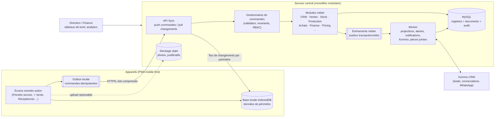
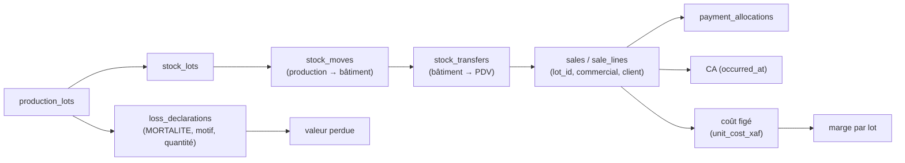

# Vision système, hypothèses et limites

> Sections 2 et 3 du format final (PM §48). L'executive summary (section 1) est dans [`03-executive-summary.md`](03-executive-summary.md).

---

## 1. Vision système

### 1.1 Énoncé

GIC AGROPELC construit un **système nerveux opérationnel** (CM §61). C'est une application intégrée unique, dans laquelle chaque opération réelle est enregistrée **une seule fois**, au plus près du terrain, même sans réseau. Cette opération produit de manière cohérente :

- ses effets **physiques**, dans le registre des mouvements de stock ;
- ses effets **financiers**, dans les documents financiers et les registres de caisse et de coûts ;
- ses effets de **responsabilité** : auteur, validateur, appareil, lieu, heure réelle, état de synchronisation, journal d'audit.

La direction interroge ensuite **une seule vérité** pour savoir ce qui entre, ce qui est produit, ce qui existe, où, sous la responsabilité de qui, ce qui est vendu, ce qui est perdu et où est passé l'argent (CM §64).

### 1.2 Principes directeurs (dérivés des sources)

| # | Principe | Traduction architecturale | Source | Statut |
|---|---|---|---|---|
| P1 | Application métier intégrée | Un seul produit, un seul modèle de données partagé, découpé en modules aux frontières explicites (monolithe modulaire, ADR-011) | CM §1, §4 ; PM §2, §34 | C / D |
| P2 | Interface simple, moteur rigoureux | L'utilisateur déclare un **fait métier** (« j'ai vendu 3 poulets ») ; le moteur en dérive tous les effets (mouvements, créance, attribution, audit) | CM §3, §64 | C |
| P3 | Offline-first | Chaque écriture est une **commande** idempotente créée sur l'appareil avec un UUID, placée dans une outbox locale, rejouée sans risque sur le serveur (ADR-001, ADR-007) | CM §37 ; PM §5 | C |
| P4 | Temps métier ≠ temps technique | `occurred_at` (réel), `client_created_at` (appareil), `received_at` (serveur), `applied_at` (application) sont distincts (ADR-016) | CM §38 | C |
| P5 | Stock dérivé de mouvements | Registre `stock_moves` en ajout seul, en partie double (emplacement source → emplacement destination) ; les soldes sont des projections reconstructibles (ADR-003) | CM §21 ; PM §6 | C / D |
| P6 | Pas de double consommation hors ligne | Stock mobile exclusif et quotas d'allocation liés à un couple (utilisateur, appareil) (ADR-004) | CM §39 ; PM §6 | C / D |
| P7 | Rien ne disparaît | Annulation par contre-écriture ; journal d'audit en ajout seul, chaîné par hachage (ADR-006) | CM §40, §41 ; PM §8, §18 | C / D |
| P8 | Historique préservé | Prix, attributions, coûts et libellés sont figés dans les transactions ; les référentiels sont versionnés ou audités (ADR-005) | CM §30 ; PM §7 | C |
| P9 | Trois registres cohérents | Chaque document métier relie quantité, valeur et responsable (voir §1.4) | CM §5, §32 ; PM §4 | C |
| P10 | Source de vérité unique | Chaque table a un module propriétaire ; chaque donnée partagée avec Kommo a un propriétaire déclaré (ADR-009) | CM §59 ; PM §16, §35 | C |
| P11 | Le client n'est jamais une autorité | Le serveur revalide permissions, prix, stock et invariants à la réception de chaque commande | PM §37 | C |
| P12 | Contrôle proportionné au risque | Politiques de contrôle paramétrables (photo, validation, justification) selon catégorie, quantité et valeur (ADR-018) | CM §24, §42 | C / D |
| P13 | Évolutif sans usine à gaz | Référentiels configurables, modules activables ; pas de microservices, d'event sourcing complet ni de composants d'infrastructure superflus | CM §55, §63.10 ; PM §33, §34 | C / D |

### 1.3 Vue d'ensemble

### 1.4 Les trois registres et leurs supports

| Registre | Question | Supports de vérité (tables propriétaires) | Projections dérivées |
|---|---|---|---|
| **Physique** | Qu'avons-nous, combien, où, de quel lot, transféré, vendu ou perdu où ? | `inventory.stock_moves` (registre), documents sources (ventes, réceptions, transferts, pertes, inventaires, collectes d'œufs, incubations) | `inventory.stock_balances`, effectifs de lots, disponibilités par zone |
| **Financier** | Combien cela a coûté, rapporté, encaissé ? Reste à recevoir ? Marge ? Perte financière ? | `sales.sales`, `sales.customer_payments`, `sales.payment_allocations`, `finance.expenses`, `finance.supplier_invoices`, `finance.supplier_payments`, `finance.cash_movements` (registre de caisse), `inventory.cost_entries` (registre de coûts), coût unitaire figé sur chaque `stock_move` | Créances, dettes fournisseurs, soldes de caisse, marges, valorisation du stock |
| **Responsabilité** | Qui a créé, qui a validé, quand réellement, sur quel appareil, en ligne ou non, depuis où ? | Colonnes standard de chaque transaction (`created_by`, `created_device_id`, `occurred_at`, `captured_offline`, `command_id`), `approvals.approval_requests`, `audit.audit_log`, `sync.command_inbox`, `fieldwork.work_sessions` | Tableaux de responsabilité, anomalies, alertes |

**Chaîne de cohérence de référence** (CM §58), portée par les clés étrangères :

### 1.5 Ce que l'utilisateur voit, ce que le moteur fait

| L'utilisateur fait | Le moteur produit (sans action supplémentaire de l'utilisateur) |
|---|---|
| « + Nouvelle vente : 3 poulets, client X, payé 13 500 espèces » | Prix résolu et figé ; lot choisi automatiquement (FIFO) ; mouvement emplacement → client ; consommation d'allocation ; encaissement + mouvement de caisse ; statut de paiement ; attribution au commercial titulaire ; conversion prospect → client si première vente ; événement `SaleRecorded` ; audit ; tableaux de bord mis à jour après synchronisation. |
| « Déclarer une perte : 12 œufs cassés » | Contrôle de politique (photo ou validation selon seuil) ; mouvement vers l'emplacement virtuel `V_LOSS` (perte reconnue) ou `V_PENDING_LOSS` (perte en attente de validation) ; valorisation au coût courant ; alerte si anormal. |
| « Réceptionner : 98 livrés, 3 rejetés » | 95 acceptés en stock au coût d'achat ; reliquat de la commande calculé ; mise à jour du CMUP ; alerte « réception incomplète ». |
| « Saisie du jour » (lot de chair) | Mortalité (perte catégorie `MORTALITE` rattachée au lot), consommation d'aliment (sortie de stock imputée au coût du lot), pesée éventuelle ; effectif et coût par tête recalculés. |

---

## 2. Hypothèses (DÉDUIT)

Chaque hypothèse est retenue pour avancer. Si elle est fausse, l'impact est indiqué et le point est rattaché au registre À VALIDER quand une décision métier est nécessaire.

| ID | Hypothèse | Justification | Impact si fausse | Réf. |
|---|---|---|---|---|
| H-01 | L'activité se déroule au Cameroun ; fuseau horaire métier `Africa/Douala` (UTC+1, sans heure d'été). | CM §29 cite Douala et Yaoundé ; CM §30 cite le FCFA. | Calcul des journées métier et des rapports à adapter (paramètre système). | ADR-016 |
| H-02 | Une seule entité juridique (GIC AGROPELC) ; pas de multi-entreprise (multi-tenant). | Le CM décrit une seule organisation. | Ajout d'une dimension `organization_id` sur toutes les tables. Coût élevé si découvert tard, d'où cette mention explicite. | — |
| H-03 | Une seule devise : franc CFA BEAC (`XAF`), sans subdivision. | CM §30 (« 4 500 FCFA »). | Ajout d'une colonne devise et de taux de change. | ADR-013, AV-041 |
| H-04 | Les utilisateurs terrain disposent d'un smartphone Android avec un navigateur Chromium récent ; certains appareils sont partagés. | PM §36 ; CM §12 (plusieurs vendeurs par point de vente). | Cible de compatibilité à revoir. | AV-007, AV-075 |
| H-05 | La plupart des appareils retrouvent du réseau au moins une fois par jour ; des coupures de plusieurs jours restent possibles. | CM §36–§37 (« intermittente », « temporairement inexistante »). | Durée d'autonomie à ajuster. | AV-009 |
| H-06 | Volumétrie cible à 3 ans : ≤ 150 utilisateurs, ≤ 40 sites et points de vente, ≤ 5 000 lignes de vente par jour, ≤ 20 000 clients et prospects, ≤ 200 lots actifs. | Croissance annoncée (CM §1, §55), sans chiffres. | Dimensionnement des projections analytiques et des partitions. | AV-086 |
| H-07 | Pas d'obligation de facturation fiscale normalisée au MVP. | CM §31, §56 (pas de comptabilité réglementaire complète). | Numérotation et mentions légales des factures à ajouter. | AV-041 |
| H-08 | Kommo est ou sera utilisé pour les leads digitaux et WhatsApp ; GIC n'embarque aucune messagerie WhatsApp. | CM §44. | Si Kommo est abandonné, le canal digital se réduit à une source de prospect. | ADR-009 |
| H-09 | Interface en français au lancement. | Langue des sources. | Traductions (architecture i18n prévue dès le départ). | AV-079 |
| H-10 | Une petite équipe de développement exploite le système ; les services managés sont préférés aux composants auto-hébergés complexes. | CM §63.10 ; PM §34 (simplicité opérationnelle). | Choix d'infrastructure à revoir. | AV-084 |
| H-11 | Les animaux sont suivis par lot (effectif) et non individuellement au MVP. | CM §19 ; PM §10. | Table `animals` à activer (prévue en extension). | — |
| H-12 | Les données existantes (Excel, cahiers) sont reprises par import et par un inventaire d'ouverture. | CM §1 (gestion manuelle actuelle). | Plan de reprise à adapter. | AV-072 |

---

## 3. Limites assumées

| ID | Limite | Pourquoi | Mesure compensatoire |
|---|---|---|---|
| L-01 | Hors ligne, la direction ne voit une opération qu'après synchronisation. | Physique du réseau (CM §36 : « la promesse métier correcte »). | Indicateur de fraîcheur par appareil (« dernière synchro il y a 3 h ») sur les tableaux de bord ; alerte `SYNC_STALE`. |
| L-02 | Une PWA ne peut pas détecter de manière fiable une position GPS falsifiée (application de faux GPS, appareil rooté). | Pas d'accès aux API natives d'intégrité. | Contrôles de cohérence côté serveur (vitesse de déplacement impossible, précision anormalement parfaite, répétition de coordonnées) ; enveloppe native possible plus tard (Capacitor). |
| L-03 | Le système ne garantit pas l'absence totale de survente hors ligne. Il la rend **impossible sans contournement** dans le fonctionnement nominal (allocations) et **détectable** sinon. | CM §39 (« autant que possible »). | Allocations, blocage sur l'appareil, conflit `STOCK_NEGATIVE` avec résolution tracée. |
| L-04 | Pas de comptabilité générale en partie double ni d'états financiers réglementaires au MVP. | CM §31, §56. | Documents financiers structurés et exports, prêts pour un logiciel comptable (ADR-010). |
| L-05 | Les données stockées localement sur un appareil compromis (rooté, volé et déverrouillé) peuvent être lues. | Limites du navigateur. | Périmètre local minimal, verrouillage par PIN, révocation, expiration de l'autonomie, pas de données financières globales hors ligne. |
| L-06 | L'horloge d'un appareil peut être fausse. | Appareil hors de contrôle. | Mesure de l'écart d'horloge à chaque synchronisation, marquage des opérations suspectes, jamais de correction silencieuse (ADR-016). |
| L-07 | La traçabilité par lot est **statistique** pour les produits mélangés (affectation FIFO automatique), et non unitaire. | CM §58 (« contribuer statistiquement »). | Identification individuelle en extension future. |
| L-08 | Les conversations WhatsApp et les leads digitaux ne sont pas consultables dans GIC. | CM §44 (pas de copie de Kommo). | Lien direct vers le lead ou contact Kommo depuis la fiche client. |
