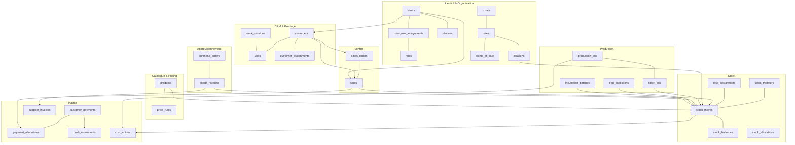
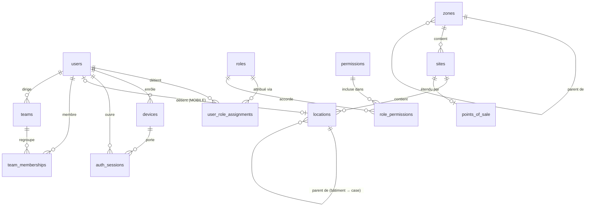
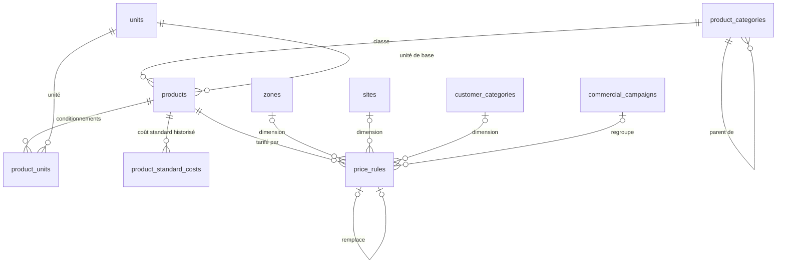
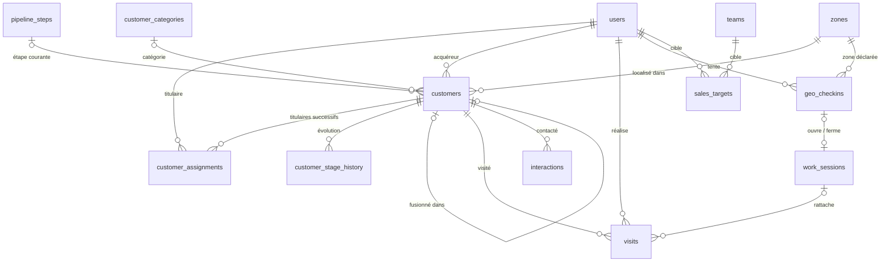
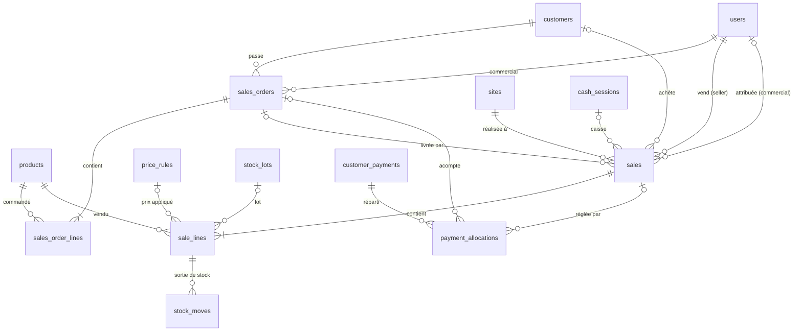
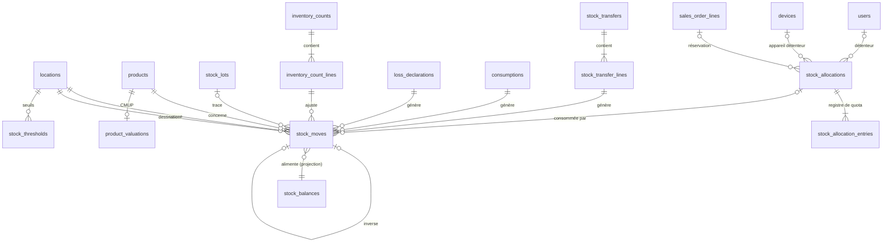
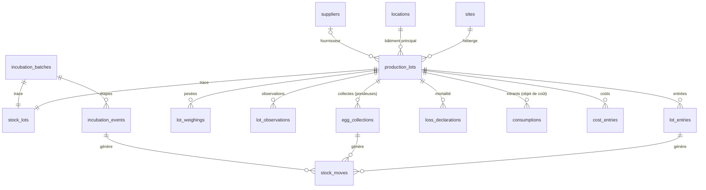
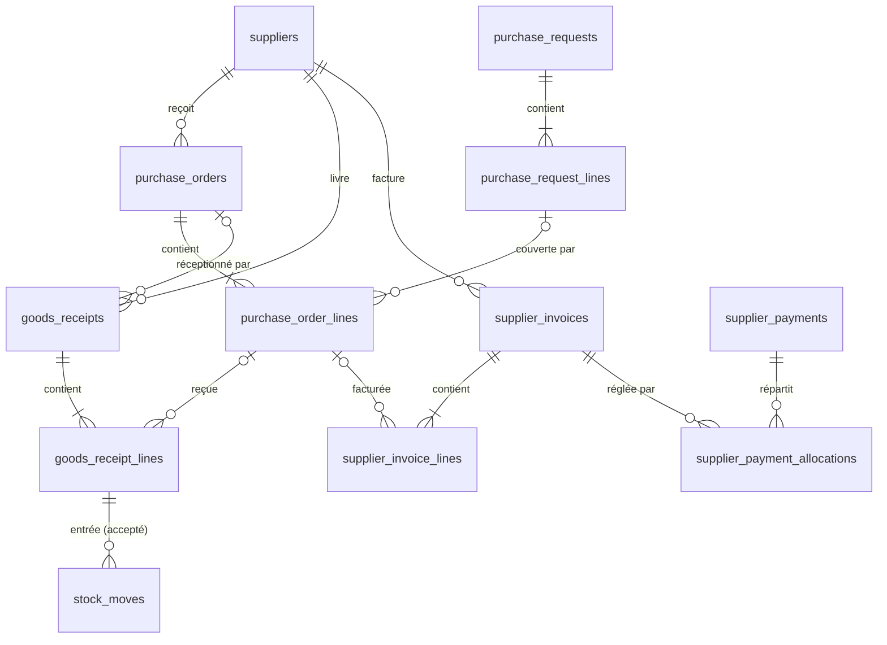
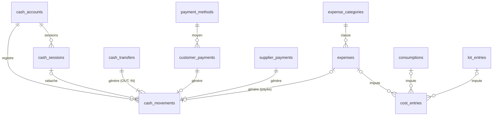
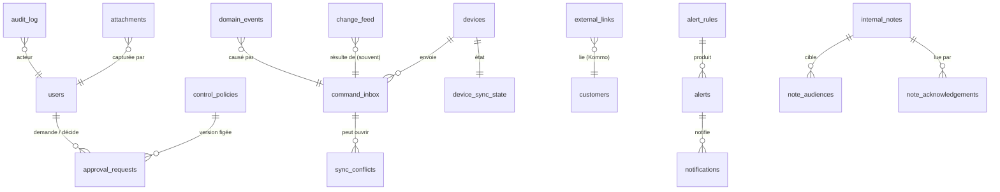

# Modèle conceptuel de données et ERD

> Sections 12 et 13 du format final (PM §48). Démarche imposée (PM §25) : **domaines → entités métier → relations → cardinalités → invariants → tables**.
> Le modèle relationnel détaillé (tables, colonnes, contraintes) est dans [`../03-data/02-modele-relationnel.md`](../03-data/02-modele-relationnel.md) et le dictionnaire dans [`../03-data/dictionnaire/`](../03-data/dictionnaire/README.md).

---

## 1. Entités métier par domaine

| Domaine | Entités métier | Nature |
|---|---|---|
| Identité | Utilisateur, Rôle, Permission, Affectation de rôle, Appareil, Session d'authentification | Master data, référentiel |
| Organisation | Zone, Site, Point de vente, Emplacement, Équipe, Appartenance d'équipe, Paramètre | Référentiel |
| Catalogue | Catégorie de produit, Unité, Produit, Unité de conditionnement, Code motif, Coût standard | Référentiel |
| Tarification | Règle tarifaire, Campagne commerciale | Référentiel versionné |
| CRM | Compte client, Affectation de titulaire, Historique de stade, Étape de pipeline, Visite, Interaction, Objectif, Catégorie de client, Source, Canal | Master data + transactions |
| Pointage | Tentative de pointage, Session de travail | Transactions |
| Ventes | Commande client, Ligne de commande, Vente, Ligne de vente | Transactions |
| Stock | Lot de traçabilité, Mouvement de stock, Solde, Transfert, Ligne de transfert, Allocation, Entrée d'allocation, Déclaration de perte, Consommation, Inventaire, Ligne d'inventaire, Seuil, Valorisation produit | Registre + transactions + projections |
| Production | Lot de production, Entrée de lot, Pesée, Observation, Collecte d'œufs, Lot d'incubation, Étape d'incubation | Transactions |
| Approvisionnement | Fournisseur, Demande d'achat (+ lignes), Bon de commande (+ lignes), Réception (+ lignes) | Master data + transactions |
| Finance | Moyen de paiement, Compte de trésorerie, Session de caisse, Mouvement de trésorerie, Remise de fonds, Encaissement, Affectation de paiement, Catégorie de dépense, Dépense, Facture fournisseur (+ lignes), Paiement fournisseur (+ affectations), Écriture de coût | Registres + transactions |
| Contrôle | Politique de contrôle, Demande de validation, Pièce justificative | Transactions |
| Communication | Règle d'alerte, Alerte, Notification, Abonnement push, Note (+ audience, accusés) | Transactions |
| Audit, synchronisation, intégration | Entrée d'audit, Commande reçue, Conflit, Flux de changements, État de synchronisation, Lien externe, Messages d'intégration entrants et sortants | Journaux techniques et métier |
| Plateforme | Événement métier, Position de consommateur, Séquence documentaire | Infrastructure |
| Analytics | Vue sauvegardée, Export, Instantané d'indicateurs | Support |

## 2. Relations structurantes et cardinalités

| # | Relation | Cardinalité | Commentaire / invariant |
|---|---|---|---|
| R1 | Utilisateur — Affectation de rôle — Rôle | 1 utilisateur : 0..N affectations ; 1 rôle : 0..N affectations | Rôles multiples (CM §6) ; périmètre optionnel par affectation |
| R2 | Rôle — Permission | N : M (via rôle-permission, avec portée maximale) | PM §17 |
| R3 | Utilisateur — Appareil | Un appareil est enregistré par 1 utilisateur ; il est utilisé par 1..N utilisateurs via les sessions | Appareils partagés (AV-007) |
| R4 | Zone — Zone (parent) | 0..1 parent : 0..N enfants | Arbre sans cycle |
| R5 | Site — Zone | N : 1 | Chaque site est dans une zone |
| R6 | Site — Emplacement | 1 : 1..N (physiques) ; virtuels sans site | BR-ADM-009 |
| R7 | Emplacement `MOBILE` — Utilisateur (détenteur) | 0..1 : 1 | INV-ADM-05 |
| R8 | Site `POINT_DE_VENTE` — Point de vente | 1 : 1 | Extension de site |
| R9 | Compte client — Affectation de titulaire — Utilisateur | 1 compte : 0..N affectations (≤ 1 active) | INV-CRM-02 |
| R10 | Compte client — Utilisateur (acquéreur) | N : 1 | Immuable (INV-CRM-01) |
| R11 | Compte client — Visite | 1 : 0..N | — |
| R12 | Visite — Session de travail | N : 0..1 | Rattachement automatique |
| R13 | Commande — Ligne de commande | 1 : 1..N | — |
| R14 | Commande — Vente (livraisons) | 1 : 0..N | Livraisons partielles |
| R15 | Vente — Ligne de vente | 1 : 1..N | — |
| R16 | Ligne de vente — Mouvement de stock | 1 : 0..N (0 pour un service ; N si plusieurs lots) | INV-VEN-08 |
| R17 | Mouvement — Emplacement source / destination | N : 1 / N : 1 | Partie double |
| R18 | Mouvement — Lot de traçabilité | N : 0..1 | INV-STK-13 |
| R19 | Mouvement — Mouvement inversé | 0..1 : 0..1 | INV-STK-04 |
| R20 | Mouvement — Document source | N : 1 (polymorphe typé : vente, transfert, perte, réception, consommation, inventaire, collecte, incubation, entrée de lot) | Clés étrangères nullables exclusives (voir le modèle relationnel §4) |
| R21 | Lot de production — Lot de traçabilité | 1 : 1 | BR-PRD-002 |
| R22 | Lot d'incubation — Lot de traçabilité | 1 : 1 | BR-INC-001 |
| R23 | Transfert — Ligne de transfert | 1 : 1..N | — |
| R24 | Allocation — Entrée d'allocation | 1 : 1..N | Registre de quota |
| R25 | Allocation (réservation) — Ligne de commande | N : 1 | — |
| R26 | Encaissement — Affectation — Vente ou Commande | 1 encaissement : 0..N affectations ; 1 vente : 0..N | INV-FIN-04, INV-VEN-06 |
| R27 | Compte de trésorerie — Mouvement de trésorerie | 1 : 0..N | INV-FIN-02 |
| R28 | Session de caisse — Compte de trésorerie | N : 1 (≤ 1 ouverte) | INV-FIN-06 |
| R29 | Demande d'achat — BC | N : M (via les lignes) | — |
| R30 | BC — Réception | 1 : 0..N | Reliquats |
| R31 | Ligne de réception — Ligne de BC | N : 0..1 (0 pour une réception sans BC) | — |
| R32 | Facture fournisseur — Lignes — Lignes de BC / réception | 1 : 1..N ; N : 0..1 | Rapprochement |
| R33 | Paiement fournisseur — Affectation — Facture | 1 : 0..N | INV-FIN-07 |
| R34 | Écriture de coût — Objet de coût (lot de production, lot d'incubation, site) | N : 1 | Registre de coûts |
| R35 | Document — Demande de validation | 1 : 0..N (historique des demandes) | Une seule `PENDING` à la fois par document |
| R36 | Document — Pièce justificative | 1 : 0..N | — |
| R37 | Entité GIC — Lien externe (Kommo) | 1 : 0..N | INV-KOM-01 |
| R38 | Commande reçue (sync) — Document créé | 1 : 0..N | `command_id` porté par le document |

## 3. ERD global (vue des agrégats)

## 4. ERD par domaine

### 4.1 Identité et organisation

### 4.2 Catalogue et tarification

### 4.3 CRM et pointage

### 4.4 Ventes et encaissements

### 4.5 Stock

### 4.6 Production

### 4.7 Approvisionnement et dettes

### 4.8 Trésorerie, dépenses, coûts

### 4.9 Transverses

Les associations polymorphes (pièce justificative → document ; demande de validation → document ; alerte → objet concerné ; audit → entité) utilisent le couple (`subject_type`, `subject_id`) **sans** clé étrangère. C'est justifié parce que ces tables transverses doivent référencer des documents de tous les modules sans créer de dépendance de schéma. L'intégrité est assurée par l'API interne du module propriétaire (TX) et contrôlée par un job de réconciliation.

## 5. Invariants attachés au modèle

Les invariants sont définis dans [`01-invariants.md`](01-invariants.md). Les plus structurants pour le modèle :

- partie double et conservation du stock (INV-STK-02, INV-STK-03) ;
- immuabilité des transactions (INV-GLO-01, INV-STK-04, INV-VEN-02) ;
- idempotence (INV-SYN-01) ;
- historisation des titulaires (INV-CRM-02) ;
- unicités métier (INV-CRM-03, INV-FIN-03, INV-KOM-01).

## 6. Extensions prévues, non créées

| Entité future | Raison | Point d'accroche |
|---|---|---|
| `production.animals` | Identification individuelle (CM §19) | Un animal peut devenir un `stock_lot` d'une seule unité ; aucune modification du registre |
| `sales.sales_returns`, `sales.sales_return_lines` | Retours clients (AV-029) | Type de mouvement `CUSTOMER_RETURN` déjà défini |
| `procurement.supplier_returns` | Retours fournisseurs | Type `SUPPLIER_RETURN` déjà défini |
| `production.transformations` | Abattage, transformation (AV-032) | Types `PRODUCTION_INPUT` / `PRODUCTION_OUTPUT` |
| `finance.accounting_exports` | Intégration comptable (AV-059) | Documents financiers typés et immuables |
