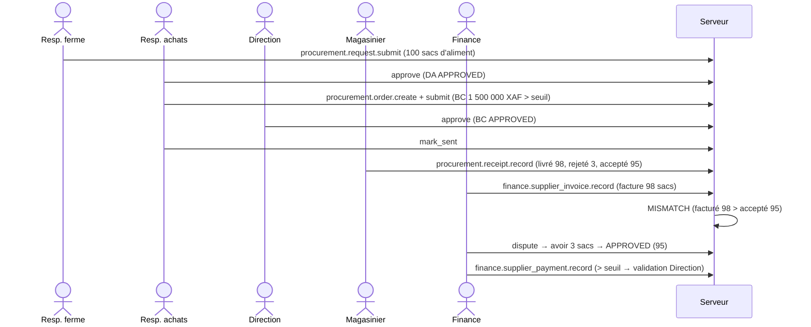
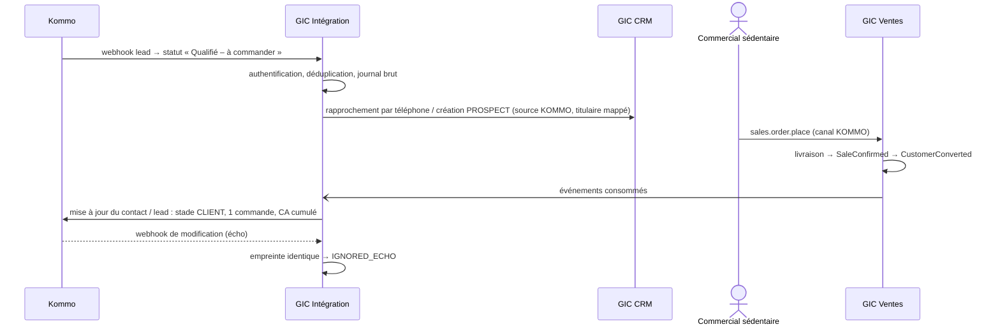

# Workflows interdomaines (Livrable n°4, partie 1)

> Section 8 du format final (PM §48). Chaque workflow montre les **effets sur le stock, la finance, l'audit et la synchronisation** (PM §49).
> Les parcours de journée par rôle (`WF-J1` à `WF-J8`) sont dans [`../01-functional/03-parcours-et-ecrans.md`](../01-functional/03-parcours-et-ecrans.md). Les machines à états sont dans [`machines-a-etats/`](machines-a-etats/README.md).

Légende des effets :

- **Stock** : mouvements du registre (type, source → destination).
- **Finance** : documents et registres financiers.
- **Audit** : entrées `audit_log` (toujours dans la transaction).
- **Sync** : commandes envoyées et comportement hors ligne.

| ID | Workflow | Domaines |
|---|---|---|
| WF-01 | Vente directe au point de vente, hors ligne | VEN, STK, FIN, DIS, SYN |
| WF-02 | Commande → livraison → vente → encaissement | VEN, STK, FIN, CRM |
| WF-03 | Règlement d'une créance | FIN, VEN |
| WF-04 | Annulation d'une vente | VEN, STK, FIN, ADM |
| WF-05 | Réapprovisionnement d'un PDV avec écart de transfert | STK, DIS, ADM |
| WF-06 | Affectation de stock à un commercial, vente terrain, retour | STK, VEN, FIN, TER |
| WF-07 | Déclaration de perte avec validation | STK, ADM, NOT |
| WF-08 | Inventaire avec rapprochement tardif | STK, SYN |
| WF-09 | Achat complet : besoin → paiement | APP, STK, FIN |
| WF-10 | Cycle d'un lot de poulets de chair jusqu'à la marge | PRD, STK, VEN, FIN |
| WF-11 | Collecte d'œufs → vente en plateau | PRD, STK, VEN |
| WF-12 | Incubation → poussins → mise en place | PRD, STK |
| WF-13 | Prospection terrain → conversion | TER, CRM, VEN |
| WF-14 | Changement de prix à date d'effet future avec appareils hors ligne | PRX, VEN, SYN, NOT |
| WF-15 | Session de caisse et remise de fonds | FIN, DIS |
| WF-16 | Reconnexion après plusieurs jours hors ligne | SYN, tous |
| WF-17 | Lead Kommo → client → commande → enrichissement Kommo | KOM, CRM, VEN, FIN |
| WF-18 | Allocations dans un PDV partagé (plusieurs appareils) | STK, DIS, SYN |

---

## WF-01 — Vente directe au point de vente, hors ligne

**Déclencheur** : un client se présente au PDV ; le réseau est coupé. **Acteur** : vendeur. **Préconditions** : appareil `ACTIVE`, session de caisse ouverte, emplacement du PDV `EXCLUSIVE_DEVICE` (ou allocation en mode `SHARED`), règles de prix téléchargées.

```mermaid
sequenceDiagram
  actor V as Vendeur
  participant A as Appareil (PWA)
  participant S as Serveur
  V->>A: + NOUVELLE VENTE : 3 poulets, payé 13 500 espèces
  A->>A: prix local (moteur partagé) = 4 500 ; contrôle du solde local ≥ 3
  A->>A: vente CONFIRMED locale, référence PDV2-000184, reçu affiché
  A->>A: outbox : sales.sale.record (command_id, device_seq, occurred_at 11:47)
  Note over A: réseau absent jusqu'à 14:22
  A->>S: POST /sync/push (lot)
  S->>S: idempotence, RBAC à occurred_at, validations, prix recalculé à 11:47
  S->>S: transaction : vente + mouvements + encaissement + trésorerie + audit + événements + flux
  S-->>A: APPLIED, n° VTE-PDV2-2026-000731
  S-)S: worker : conversion CRM, alertes stock, projections, Kommo
```

| Effet | Détail |
|---|---|
| Stock | `SALE` : emplacement PDV → `V_CUSTOMER`, 3 têtes, lot choisi par FIFO serveur, coût unitaire figé ; consommation d'allocation si mode `SHARED`. |
| Finance | Vente 13 500 XAF (`occurred_at` 11:47) ; encaissement `ESPECES` affecté ; mouvement de trésorerie `IN` sur `CAISSE_PDV`, rattaché à la session ; `payment_status = PAID`. |
| Audit | `sales.sale.record` (auteur, appareil, capture hors ligne, délai de synchronisation 2 h 35) ; `finance.payment.record`. |
| Sync | Une commande (le paiement est inclus). Hors ligne : effet local immédiat ; `SYNCED` à 14:23. |
| Échecs | Stock serveur insuffisant → appliquée, conflit `STOCK_NEGATIVE`. Prix serveur différent → appliquée, `PRICE_MISMATCH`. Appareil révoqué avant 11:47 → `CONFLICT` (quarantaine). |

---

## WF-02 — Commande → livraison → vente → encaissement

**Déclencheur** : un client commande 20 plateaux pour vendredi. **Acteurs** : commercial terrain, magasinier, livreur (commercial).

```mermaid
sequenceDiagram
  actor C as Commercial
  participant S as Serveur
  actor M as Magasinier
  C->>S: sales.order.place (20 plateaux, prix convenu)
  S->>S: CONFIRMED ; réservation de 600 œufs au magasin (FULL)
  S-->>M: notification « commande à préparer »
  M->>S: inventory.transfer.dispatch magasin → stock mobile du commercial (réf. commande)
  S->>S: réservation transférée vers le stock mobile
  C->>S: sales.order.fulfil (20 plateaux remis, 10 000 XAF payés)
  S->>S: vente ORDER_FULFILMENT ; commande FULFILLED
```

| Étape | Stock | Finance | Audit | Sync |
|---|---|---|---|---|
| Commande | Réservation `ORDER_RESERVATION` (aucun mouvement) | — (acompte possible) | `sales.order.place` | Hors ligne possible ; réservation effective à la synchronisation |
| Préparation | `TRANSFER_DISPATCH` magasin → `V_TRANSIT` ; `TRANSFER_RECEIPT` → stock mobile (réception par le commercial) | — | `inventory.transfer.*` | Hors ligne possible |
| Livraison | `SALE` stock mobile → `V_CUSTOMER` ; réservation consommée | Vente au prix convenu (BR-VEN-007) ; encaissement 10 000 XAF ; créance du reste avec échéance ; acomptes éventuels transférés | `sales.order.fulfil` | Hors ligne possible (stock exclusif) |
| Échecs | Commande modifiée pendant la livraison → la livraison fait foi (fait physique) ; la modification est en conflit `VERSION_CONFLICT`. Double livraison → vente directe excédentaire + conflit. | | | |

---

## WF-03 — Règlement d'une créance

1. Le commercial ouvre la fiche client (ECR-CRM-03) et voit les créances.
2. Il saisit ENCAISSER : 25 000 XAF par `MOBILE_MONEY_MTN`, référence `MP2609...`.
3. Commande `finance.payment.record`. Le serveur affecte l'encaissement aux ventes impayées les plus anciennes (BR-FIN-004).

| Effet | Détail |
|---|---|
| Stock | Aucun. |
| Finance | Encaissement `RECORDED` ; affectations ; `payment_status` des ventes recalculé ; mouvement `IN` sur le compte `MOBILE_MONEY`. Référence en doublon → `SUSPECT_DUPLICATE`, sans effet (SM-CUSTOMER-PAYMENT). |
| Audit | `finance.payment.record`. |
| Sync | Hors ligne possible ; l'unicité de la référence est contrôlée par le serveur. |

---

## WF-04 — Annulation d'une vente

| Cas | Parcours | Stock | Finance | Audit |
|---|---|---|---|---|
| Erreur immédiate (≤ 15 min, caisse ouverte, auteur) | `sales.sale.cancel` | Inverses des `SALE` : `V_CUSTOMER` → emplacement d'origine, même lot, même coût ; allocation restituée | Affectations désactivées ; remboursement `REFUND` (espèces rendues) | `sales.sale.cancel` + motif |
| Au-delà | `sales.sale.request_cancellation` → file du responsable → approbation | Idem, **à l'approbation** | Idem ; remboursement ou crédit client, au choix de l'approbateur | Demande + décision |
| Vente de livraison | Idem | Idem ; la commande revient à `PARTIALLY_FULFILLED` ou `CONFIRMED` sans réservation automatique | Idem ; acomptes redeviennent du crédit client | Idem |

CA : contre-écriture datée de l'annulation (BR-FIN-042). Sync : la demande est possible hors ligne ; la décision est en ligne.

---

## WF-05 — Réapprovisionnement d'un PDV avec écart de transfert

```mermaid
sequenceDiagram
  actor V as Vendeur PDV
  actor M as Magasinier
  participant S as Serveur
  S-->>V: alerte POS_REPLENISH (suggestion 60 plateaux)
  V->>S: inventory.transfer.request (60 plateaux)
  M->>S: inventory.transfer.dispatch (58 plateaux, transporteur X)
  V->>S: inventory.transfer.receive (57 reçus, 1 cassé en route)
  S->>S: DISCREPANCY_PENDING ; 1 plateau → V_PENDING_LOSS
  S-->>M: demande de validation TRANSFER_DISCREPANCY
  M->>S: approve (perte confirmée, catégorie ECART_TRANSFERT)
```

| Effet | Détail |
|---|---|
| Stock | `TRANSFER_DISPATCH` 1 740 œufs magasin → `V_TRANSIT` ; `TRANSFER_RECEIPT` 1 710 → PDV ; `TRANSFER_DISCREPANCY` 30 → `V_PENDING_LOSS` ; `LOSS_CONFIRMATION` 30 → `V_LOSS`. Conservation vérifiée : 1 740 = 1 710 + 30. |
| Finance | Valeur de la perte = 30 × coût figé ; tableau de distribution : envoyé 58, reçu 57, perdu 1. |
| Audit | Expédition, réception, décision. |
| Sync | Tout hors ligne sauf la décision. Si le PDV reçoit avant d'avoir téléchargé le transfert : réception sans document (BR-STK-024), rapprochée à la synchronisation. |

---

## WF-06 — Affectation de stock à un commercial, vente terrain, retour

1. Le magasinier TRANSFÈRE 50 poulets vers le stock mobile de Paul (CM §23).
2. Paul RECOIT : il en devient responsable.
3. Paul prend service, puis vend 44 poulets en journée, hors ligne, depuis son stock exclusif.
4. 2 poulets meurent : il DÉCLARE UNE PERTE (`MORTALITE`, photo si la politique l'exige).
5. Le soir, il RETOURNE 4 poulets au magasin et REMET les espèces.

| Effet | Détail |
|---|---|
| Stock | Magasin → `V_TRANSIT` → mobile (50) ; mobile → `V_CUSTOMER` (44) ; mobile → `V_LOSS` ou `V_PENDING_LOSS` (2) ; mobile → `V_TRANSIT` → magasin (4). Solde mobile = 0 : responsabilité soldée. Un écart découvert plus tard se traite par inventaire du stock mobile. |
| Finance | 44 ventes ; encaissements sur `CAISSE_UTILISATEUR` de Paul ; remise de fonds `CAISSE_UTILISATEUR` → `CAISSE_CENTRALE` ; écart de remise éventuel. |
| Audit | Chaque opération, avec l'appareil de Paul et la session de travail. |
| Sync | Journée entière hors ligne possible ; le stock mobile n'est utilisable que sur l'appareil principal de Paul (BR-STK-016). |

---

## WF-07 — Déclaration de perte avec validation

1. Le magasinier déclare 40 sacs d'aliment détériorés (valeur 600 000 XAF).
2. La politique exige une photo et une validation (AV-037).
3. Le mouvement `LOSS_PENDING` rend la quantité indisponible immédiatement.
4. Le Resp. ferme valide : `LOSS_CONFIRMATION`. En cas de rejet :
   - `ERREUR_DECLARATION` → `LOSS_RELEASE` vers l'emplacement ;
   - `PERTE_NON_JUSTIFIEE` → `V_LOSS` avec la catégorie `INEXPLIQUEE`, imputée.

| Effet | Détail |
|---|---|
| Stock | Voir SM-LOSS. |
| Finance | Valeur perdue au coût figé (CMUP de l'aliment). |
| Audit | Déclaration, pièce, décision (approbateur ≠ déclarant). |
| Sync | Déclaration hors ligne ; photo en upload reprenable ; l'approbateur ne peut pas décider avant réception de la photo. |
| Alertes | `HIGH_LOSS` levée dès la réception de la déclaration, sans attendre la validation. |

---

## WF-08 — Inventaire avec rapprochement tardif

Chronologie : à 10:00, une vente hors ligne d'1 unité (synchronisée à 15:00). Comptage à 12:00 : 94. Soumission à 14:00.

| Heure | Événement | Théorique à 12:00 connu du serveur | Ajustement |
|---|---|---|---|
| 14:00 | Soumission : compté 94 | 97 (la vente de 10:00 est inconnue) | `INVENTORY_LOSS` 3, daté de 12:00 |
| 15:00 | Réception de la vente de 10:00 : `SALE` 1 | 96 − 3 = 93 ≠ 94 compté | Rapprochement (BR-STK-044) : `INVENTORY_GAIN` 1, daté de 12:00, lié à l'inventaire ; écart net de l'inventaire = −2 |

Résultat : solde à 12:00 = 94 (vérité physique) ; écart réellement inexpliqué = 2 ; historique complet conservé. Audit : soumission, validation éventuelle, rapprochement `system`. Recommandation UX : avant de compter, l'écran affiche les appareils de l'emplacement dont la synchronisation date de plus d'1 h.

---

## WF-09 — Achat complet : besoin → paiement



| Étape | Stock | Finance | Audit |
|---|---|---|---|
| DA, BC | — | Engagement | Création, validations |
| Réception | `PURCHASE_RECEIPT` 95 sacs `V_SUPPLIER` → magasin de ferme ; CMUP recalculé ; reliquat 5 (BC `PARTIALLY_RECEIVED`) | Valeur d'entrée 95 × prix du BC | Réception, photo du BL |
| Facture | — | Rapprochement : écart de quantité → `MISMATCH` → contestation → approuvée à 95 | Décision Finance |
| Paiement | — | Validation préalable (> seuil), décaissement, dette soldée | Décision Direction |

Distinction assurée : commandé 100 ≠ livré 98 ≠ accepté 95 ≠ facturé (98 puis 95) ≠ payé.

---

## WF-10 — Cycle d'un lot de poulets de chair jusqu'à la marge

| Étape | Commande | Stock | Finance (registre de coûts) |
|---|---|---|---|
| Création L-2026-014 (2 400 prévus) | `production.lot.create` | — | Objet de coût |
| Mise en place (achat direct de 2 400 poussins à 450 XAF) | `production.lot.record_entry` + réception | `PURCHASE_RECEIPT` poussins → B2 ; `PRODUCTION_INPUT` poussins ; `PRODUCTION_OUTPUT` « Poulet de chair vif » → B2 (lot L-2026-014) | `ANIMAUX` 1 080 000 |
| Saisies du jour (42 jours) | `production.mortality.record`, `production.input.record`, `production.weighing.record` | Mortalités B2 → `V_LOSS` (90 têtes cumulées) ; aliment magasin de ferme → `V_CONSUMPTION` | `ALIMENT` au CMUP ; coût par tête = coût cumulé ÷ effectif |
| Prêt à la vente | `production.lot.set_status SELLING` | — | — |
| Sortie vers commercialisation (1 000 → PDV) | `inventory.transfer.dispatch` / `receive` | B2 → `V_TRANSIT` → PDV (lot conservé, coût par tête figé) | — |
| Ventes au PDV et à la ferme | `sales.sale.record` | → `V_CUSTOMER` (lot par FIFO) | CA attribué au lot ; coût des ventes |
| Clôture (effectif non vendu = 0) | `production.lot.close` | — | Marge du lot = CA − coût total ; mortalité : 90 têtes, valeur économique indicative |

Ce workflow est la **chaîne de cohérence** du CM §58 : Lot → production → disponibilité → transfert → PDV → vente → client → commercial → paiement → CA → marge ; et Lot → mortalité → motif → quantité → coût.

---

## WF-11 — Collecte d'œufs → vente en plateau

1. SAISIE DU JOUR du lot de pondeuses P-2026-003 : collectés 1 850 = cassés 25 + non conformes 15 + commercialisables 1 690 + à couver 120.
2. Stock : `PRODUCTION_OUTPUT` de 1 690 « Œuf de consommation » et de 120 « Œuf à couver » vers le magasin de ferme. Les œufs cassés et non conformes ne sont que des indicateurs.
3. Transfert vers le PDV en plateaux (conversion 30 → base).
4. Vente de 5 plateaux = 150 œufs.
5. Finance : valorisation au coût standard ; CA ; lot de pondeuses crédité du CA si le lot suit les œufs (AV-036).

---

## WF-12 — Incubation → poussins → mise en place

Lancement de 600 œufs à couver :

- **Mirage J7** : 42 infertiles, 18 morts embryonnaires (`PRODUCTION_INPUT`).
- **Transfert J18** : 540 œufs vers l'éclosoir.
- **Éclosion J21** : 498 viables + 7 non viables + 35 non éclos.
- **Bilan** : 600 = 42 + 18 + 0 + 35 + 505 ✓.
- **Taux d'éclosion** : 498 / 600 = 83 %.
- **Poussins** : `PRODUCTION_OUTPUT` 498 « Poussin d'un jour » (lot INC-2026-007). Coût unitaire = (coût des œufs + intrants) ÷ 498.
- **Mise en place** d'un lot de chair à partir de ces poussins : reclassement (WF-10), coût porté.

---

## WF-13 — Prospection terrain → conversion

| Étape | Commande | Effets |
|---|---|---|
| PRENDRE SERVICE (zone Akwa, 180 m du centre, précision 25 m) | `fieldwork.checkin.record` | Session `OPEN` ; tentative auditée |
| + PROSPECT « Restaurant Chez Mama » | `crm.customer.create` | `PROSPECT` ; acquéreur = titulaire = commercial ; contrôle de doublon |
| + VISITE (résultat `INTERESSE`, relance le 15/10) | `crm.visit.record` | Visite rattachée à la session ; distance au compte |
| + COMMANDE | `sales.order.place` | Commande confirmée ; KPI « prospects ayant commandé » |
| Livraison (vente) | `sales.order.fulfil` | `SaleConfirmed` → `CustomerConverted` (AV-012) ; KPI nouveaux clients ; CA du portefeuille acquis |

Toutes ces étapes fonctionnent hors ligne ; la conversion est déterminée par le serveur à la synchronisation de la vente.

---

## WF-14 — Changement de prix à date d'effet future, appareils hors ligne

1. Le 18/09, le Resp. commercial prépare la règle « Poulet vif, Douala, 4 800 XAF à partir du 20/09 00:00 ». La Direction l'active ; l'ancienne règle (4 500) reçoit `valid_to = 20/09 00:00`.
2. Une note de direction est publiée automatiquement (CM §43).
3. L'appareil A (synchronisé le 19/09) détient les deux règles. Le 20/09, hors ligne, il applique 4 800 automatiquement (BR-PRX-011).
4. L'appareil B (hors ligne depuis le 17/09) vend à 4 500 le 20/09. À la synchronisation, sa vente est **acceptée à 4 500** (prix figé), avec l'anomalie `PRICE_MISMATCH` pour revue (AV-063).
5. La vente du 10/09 à 4 500 n'est jamais modifiée (CM §30).

---

## WF-15 — Session de caisse et remise de fonds

1. **Ouverture** : fonds compté 20 000 (= solde du compte, pas d'écart).
2. **Journée** : ventes espèces 180 000 ; remboursement 4 500 ; petite dépense 2 000 (sacs plastiques).
3. **Solde attendu** : 20 000 + 180 000 − 4 500 − 2 000 = 193 500. Compté : 193 000 → écart −500.
4. Mouvement `SESSION_VARIANCE` −500 ; session `PENDING_VALIDATION` ; alerte `CASH_VARIANCE`.
5. **Remise** : `CAISSE_PDV` → `CAISSE_CENTRALE`, 173 000 (fonds de 20 000 conservé) ; la Finance réceptionne 173 000 ; la session est validée avec motif.
6. **Audit** : chaque étape.
7. **Sync** : ouverture, clôture et envoi possibles hors ligne ; validation en ligne.

---

## WF-16 — Reconnexion après plusieurs jours hors ligne

Situation : un appareil hors ligne pendant 3 jours, avec 180 commandes en attente.

1. Au retour du réseau : authentification. Si le jeton d'accès est expiré, rafraîchissement ; si la session est révoquée, reconnexion obligatoire ; les commandes restent en outbox.
2. Push par lots de 50 commandes (≤ 256 Ko compressés), dans l'ordre de `device_seq`. Idempotence en cas de coupure.
3. Écart d'horloge mesuré au premier lot.
4. Résultats appliqués localement. Les rejets et conflits sont affichés en tête de l'écran ECR-SYN-01.
5. Upload des photos en attente (en arrière-plan, reprenable).
6. Pull incrémental de chaque jeu de données ; si le curseur est trop ancien (> 60 jours), chargement initial du jeu.
7. Serveur :
   - alertes éventuelles (stock négatif, prix, doublons) ;
   - fraîcheur de l'appareil mise à jour sur les tableaux de bord ;
   - si des opérations ont un `occurred_at` antérieur à des inventaires déjà comptabilisés, rapprochement (WF-08).

Au-delà de 7 jours sans synchronisation (AV-009), l'appareil était passé en lecture seule. Les opérations saisies avant cette échéance sont envoyées normalement.

---

## WF-17 — Lead Kommo → client → commande → enrichissement



---

## WF-18 — Allocations dans un PDV partagé

Situation : PDV Mboppi, 3 tablettes, emplacement `SHARED`, solde de 100 poulets.

1. À l'ouverture (en ligne), le responsable accorde : A 40, B 30, C 20. Il reste 10 non alloués, vendables seulement en ligne.
2. Journée hors ligne : A vend 38, B tente 31 (bloqué à 30), C vend 12.
3. Synchronisation : ventes appliquées ; allocations consommées.
4. Fin de journée : chaque tablette émet `inventory.allocation.release` pour son reste (A 2, C 8). Le solde se reconstitue.
5. Si B avait vendu 31 malgré le blocage (appareil modifié) : la vente est appliquée avec un solde qui reste positif ; l'anomalie `ALLOCATION_EXCEEDED` est ouverte pour enquête (fraude possible).
