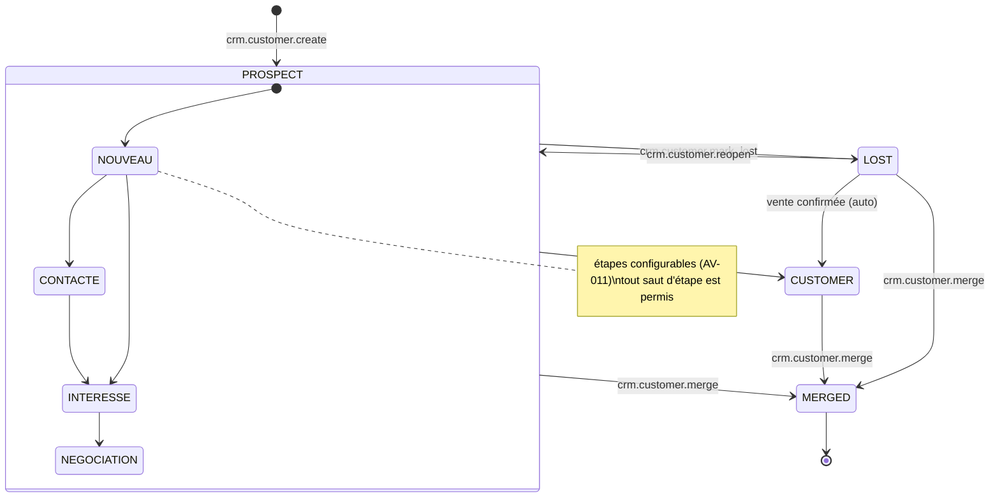
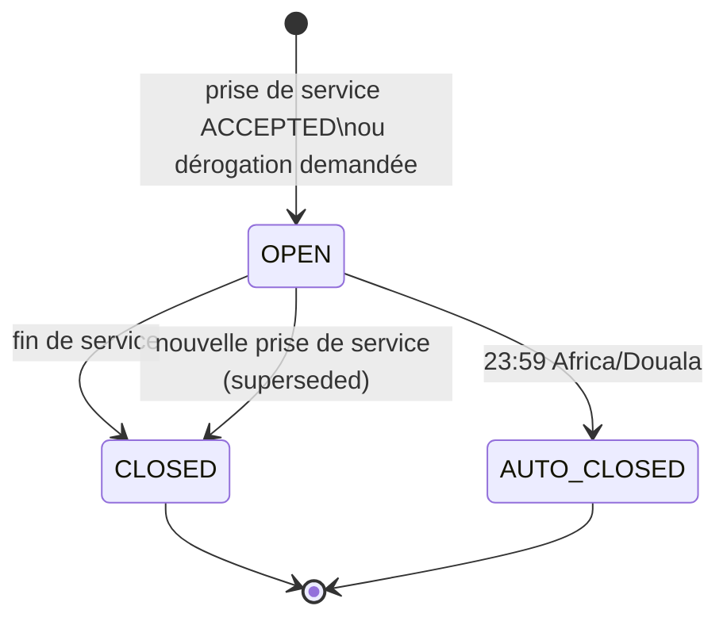
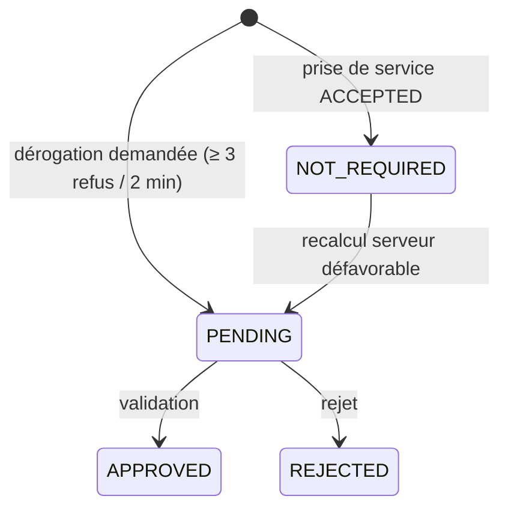
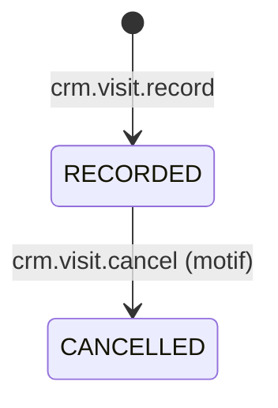

# Machines à états — Commercial

## SM-CUSTOMER — Compte client (prospect → client)

Le stade système (`stage`) est distinct de l'**étape de pipeline** (`pipeline_step_id`), qui est configurable et ne vaut qu'au stade `PROSPECT` (AV-011). La structure demandée au PM §24 (`PROSPECT → CONTACTÉ → INTÉRESSÉ → NÉGOCIATION → CLIENT / PERDU`) est rendue **configurable** pour ses étapes intermédiaires, et **fixe** pour ses terminaux (`CUSTOMER`, `LOST`), qui ont des effets système.

| État initial | Action | Condition | Nouvel état | Effets métier | Effets stock | Effets finance | Permission |
|---|---|---|---|---|---|---|---|
| `[*]` | `crm.customer.create` | BR-CRM-002 ; pas de doublon de téléphone (en ligne) | `PROSPECT` (première étape active) | Acquéreur et titulaire posés (BR-CRM-003) ; `customer_assignments` ouverte ; `ProspectCreated` | — | — | `crm.customer.create` |
| `PROSPECT` | `crm.customer.set_pipeline_step` | Étape cible active ; version à jour ou fusion automatique | `PROSPECT` (autre étape) | Historique de stade ; `ProspectStepChanged` | — | — | `crm.customer.update` |
| `PROSPECT` | Réaction à `SaleConfirmed` (première vente) | Vente non annulée | `CUSTOMER` | `converted_at`, `first_sale_id` ; historique ; `CustomerConverted` | — | — | `system` |
| `PROSPECT` | `crm.customer.mark_lost` | Code motif `PROSPECT_LOST` | `LOST` | Historique ; `ProspectLost` | — | — | `crm.customer.mark_lost` |
| `LOST` | `crm.customer.reopen` | — | `PROSPECT` (première étape) | Historique ; `ProspectReopened` | — | — | `crm.customer.mark_lost` |
| `LOST` | Réaction à `SaleConfirmed` | — | `CUSTOMER` | Comme la conversion ; l'historique garde le passage par `LOST` | — | — | `system` |
| `PROSPECT`, `CUSTOMER`, `LOST` | `crm.customer.merge` (compte absorbé) | Deux comptes distincts non `MERGED` | `MERGED` | `merged_into_id` ; liens externes rattachés au compte conservé ; acquéreur le plus ancien retenu ; `CustomerMerged` | — | Créances lues via la chaîne de fusion | `crm.customer.merge` |
| `CUSTOMER` | Réaction à `SaleCancelled` (seule vente annulée) | Plus aucune vente confirmée | `CUSTOMER` (inchangé) | Indicateur `conversion_reverted` (pas de retour silencieux) | — | — | `system` |

Réaffectation, modification des coordonnées et conditions de crédit ne changent pas le stade.

**Hors ligne** : création, changement d'étape, passage à `LOST` et réouverture sont possibles. La conversion et la fusion sont exclusivement serveur. Deux changements d'étape concurrents sont réconciliés en retenant l'étape de `occurred_at` le plus récent ; l'autre est conservée dans l'historique (matrice des conflits).

---

## SM-WORK-SESSION — Session de travail terrain

Deux dimensions indépendantes : le **cycle de vie** (`status`) et la **dérogation** (`override_status`).

| État initial | Action | Condition | Nouvel état | Effets métier | Effets stock | Effets finance | Permission |
|---|---|---|---|---|---|---|---|
| `[*]` | `fieldwork.checkin.record` (`START_SERVICE`) | Résultat `ACCEPTED` (BR-TER-002) ; zone autorisée | `OPEN` / `NOT_REQUIRED` | Tentative enregistrée ; `WorkSessionStarted` ; session précédente éventuelle clôturée (`superseded`) | — | — | `fieldwork.checkin.perform` |
| `[*]` | `fieldwork.checkin.record` | Résultat refusé | (aucune session) | Tentative conservée pour audit ; `CheckInRejected` | — | — | `fieldwork.checkin.perform` |
| `[*]` | `fieldwork.checkin.request_override` | ≥ 3 refus sur ≥ 2 min ; motif | `OPEN` / `PENDING` | Demande de validation `CHECKIN_OVERRIDE` ; activité autorisée et signalée | — | — | `fieldwork.checkin.perform` |
| `OPEN` / `NOT_REQUIRED` | Recalcul serveur refuse la tentative (BR-TER-003) | Divergence appareil / serveur | `OPEN` / `PENDING` | Dérogation demandée automatiquement ; notification au commercial | — | — | `system` |
| `PENDING` | `approvals.request.approve` | Approbateur ≠ demandeur | `APPROVED` | `override = true` | — | — | `fieldwork.checkin_override.approve` |
| `PENDING` | `approvals.request.reject` | — | `REJECTED` | Activités rattachées : indicateur `session_rejected` | — | — | `fieldwork.checkin_override.approve` |
| `OPEN` | `fieldwork.checkin.record` (`END_SERVICE`) | — | `CLOSED` | Position de fin enregistrée ; `WorkSessionEnded` | — | — | `fieldwork.checkin.perform` |
| `OPEN` | Horloge (23:59) | Session non clôturée | `AUTO_CLOSED` | `WorkSessionAutoClosed` | — | — | `system` |

**Hors ligne** : ouverture, demande de dérogation, fin et clôture automatique locale sont possibles. La décision de dérogation est en ligne. Si l'appareil a clôturé localement à 23:59 et que le serveur reçoit plus tard une fin de service antérieure à 23:59, c'est l'heure réelle la plus ancienne qui l'emporte.

---

## SM-VISIT — Visite

| État initial | Action | Condition | Nouvel état | Effets métier | Effets stock | Effets finance | Permission |
|---|---|---|---|---|---|---|---|
| `[*]` | `crm.visit.record` | Compte dans le périmètre ; résultat renseigné | `RECORDED` | Rattachement à la session ; indicateurs `out_of_session`, `far_from_customer` ; `VisitRecorded` | — | — | `crm.visit.record` |
| `RECORDED` | `crm.visit.cancel` | Auteur ou responsable ; motif | `CANCELLED` | Exclue des indicateurs ; `VisitCancelled` | — | — | `crm.visit.record` (auteur) / `crm.customer.reassign` (responsable) |

**Hors ligne** : les deux transitions sont possibles.
