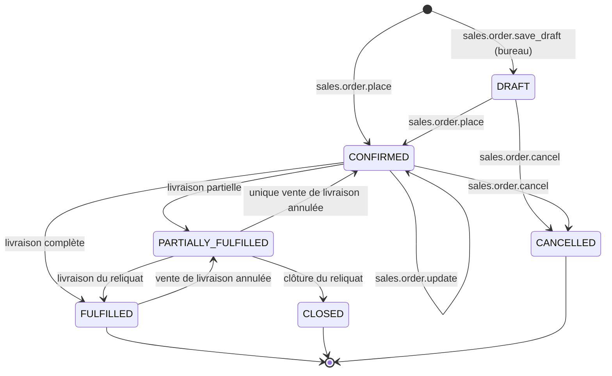
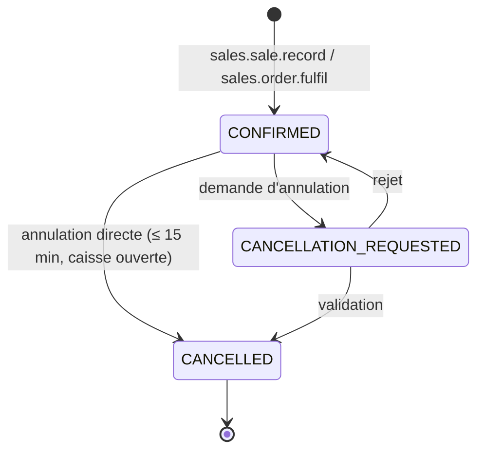
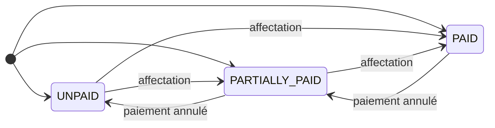
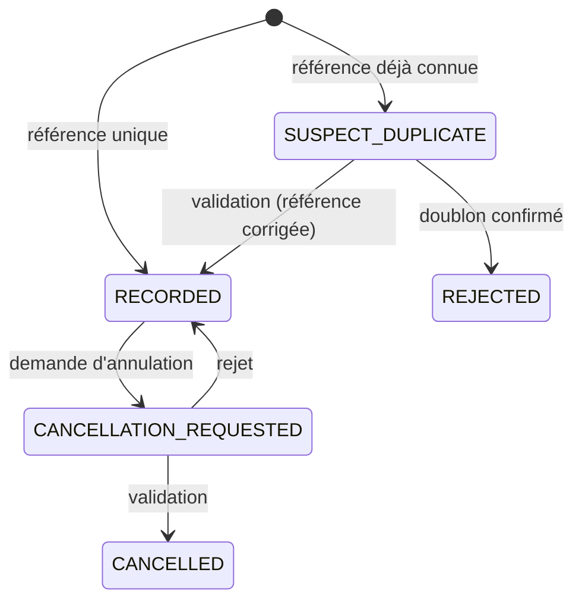
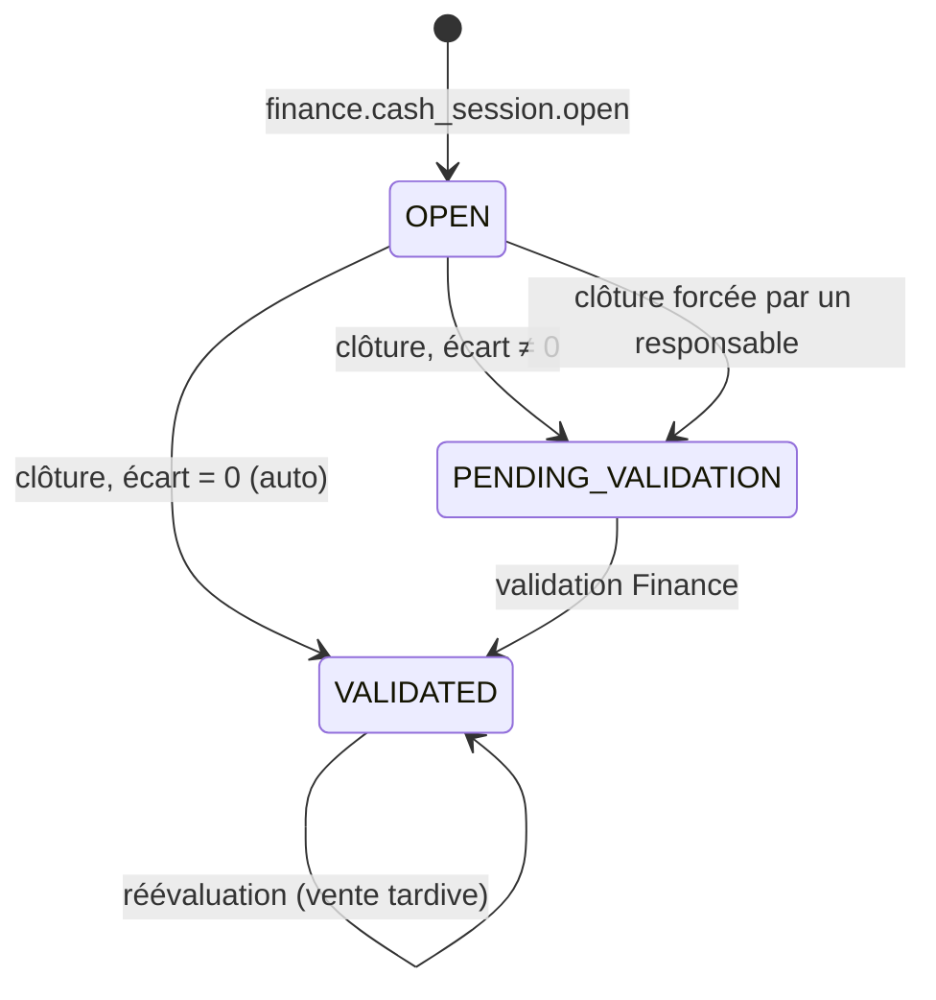
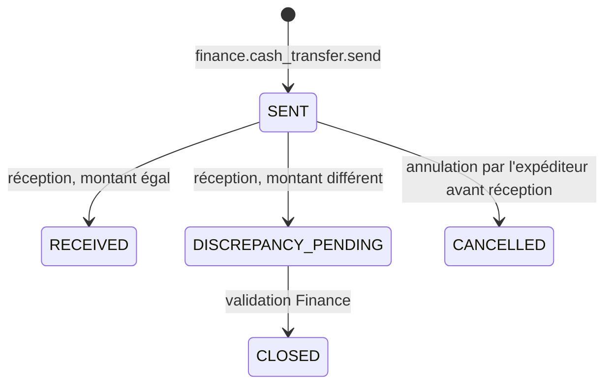

# Machines à états — Ventes, encaissements, caisse

## SM-ORDER — Commande client

Deux dimensions : le cycle de vie (`status`) et l'état de réservation (`reservation_status` : `NONE`, `PARTIAL`, `FULL`, `RELEASED`), recalculé par `inventory`.

| État initial | Action | Condition | Nouvel état | Effets métier | Effets stock | Effets finance | Permission |
|---|---|---|---|---|---|---|---|
| `[*]` | `sales.order.save_draft` | Client identifié | `DRAFT` | `OrderDrafted` | — | — | `sales.order.create` |
| `[*]`, `DRAFT` | `sales.order.place` | Client identifié (BR-VEN-001) ; ≥ 1 ligne ; prix résolus (BR-VEN-003) | `CONFIRMED` | Prix convenus figés ; numéro officiel ; `OrderConfirmed` | Réservation tentée sur l'emplacement de préparation (BR-VEN-004) | — | `sales.order.create` |
| `CONFIRMED` | `sales.order.update` | Aucune livraison ; `base_version` à jour (sinon conflit) | `CONFIRMED` | Nouvelle version ; `OrderUpdated` | Réservation recalculée | — | `sales.order.create` (auteur) / portée `TEAM` |
| `CONFIRMED`, `PARTIALLY_FULFILLED` | `sales.order.fulfil` (partiel) | Quantités ≤ reliquat (BR-VEN-008) | `PARTIALLY_FULFILLED` | Vente `ORDER_FULFILMENT` créée (SM-SALE) ; `OrderPartiallyFulfilled` | Réservation consommée ; mouvements `SALE` | CA, créance ; acomptes transférés à la vente (BR-FIN-008) | `sales.order.fulfil` |
| `CONFIRMED`, `PARTIALLY_FULFILLED` | `sales.order.fulfil` (solde) | Reliquat nul après livraison | `FULFILLED` | `OrderFulfilled` | Idem | Idem | `sales.order.fulfil` |
| `PARTIALLY_FULFILLED` | `sales.order.close_remaining` | Motif | `CLOSED` | `OrderClosed` | Réservation du reliquat libérée | Acomptes excédentaires → crédit client | `sales.order.cancel` |
| `DRAFT`, `CONFIRMED` | `sales.order.cancel` | Aucune livraison ; motif | `CANCELLED` | `OrderCancelled` | Réservation libérée | Acomptes → crédit client ou remboursement (BR-VEN-009) | `sales.order.cancel` |
| `FULFILLED`, `PARTIALLY_FULFILLED` | Réaction à `SaleCancelled` d'une vente de livraison | — | Recalculé depuis la quantité livrée | Quantités livrées recalculées | Réservation **non** recréée automatiquement (le stock est revenu à l'emplacement d'origine de la vente) | — | `system` |

**Hors ligne** : `place`, `update`, `cancel` et `fulfil` (depuis un stock exclusif ou dans la limite de la réservation téléchargée) sont possibles. Une modification concurrente est détectée par `base_version`. Une livraison concurrente au-delà du reliquat devient une vente directe (D04 §14).

---

## SM-SALE — Vente

Cycle de vie (`status`) et statut de paiement **dérivé** (`payment_status`) sont orthogonaux (tension C-05). Correspondance avec la liste indicative du PM §24 :

| Terme PM §24 | Représentation |
|---|---|
| brouillon | Panier local `LOCAL_ONLY`, jamais synchronisé (BR-VEN-011) |
| confirmée | `status = CONFIRMED` |
| payée partiellement | `payment_status = PARTIALLY_PAID` |
| payée | `payment_status = PAID` |
| annulée | `status = CANCELLED` |

| État initial | Action | Condition | Nouvel état | Effets métier | Effets stock | Effets finance | Permission |
|---|---|---|---|---|---|---|---|
| `[*]` | `sales.sale.record` | Validations D04 §8 ; disponibilité (en ligne) ou allocation (hors ligne) ; plafond de dérogation | `CONFIRMED` | Prix figés ; attribution (BR-VEN-020) ; canal, zone ; numéro officiel ; conversion éventuelle du prospect ; `SaleConfirmed` | Un mouvement `SALE` (source → `V_CUSTOMER`) par ligne × lot ; consommation d'allocation ; coût unitaire figé | CA à `occurred_at` ; encaissements et affectations ; mouvements de trésorerie ; créance du reste, avec échéance | `sales.sale.record` (+ `sales.credit_sale.record` si reste dû ; + `sales.price.override` si dérogation) |
| `[*]` | `sales.order.fulfil` | SM-ORDER | `CONFIRMED` (`ORDER_FULFILMENT`) | Idem, prix = prix convenu | Idem + consommation de la réservation | Idem + transfert des acomptes | `sales.order.fulfil` |
| `CONFIRMED` | `sales.sale.cancel` (direct) | BR-VEN-028 : auteur, ≤ 15 min, session de caisse ouverte | `CANCELLED` | Motif ; `SaleCancelled` ; commande recalculée | Mouvements inverses `V_CUSTOMER` → emplacement d'origine (même lot, même coût) ; allocation restituée si active | CA négatif daté de l'annulation ; affectations désactivées ; remboursement (`REFUND`) ou crédit client | `sales.sale.cancel` |
| `CONFIRMED` | `sales.sale.request_cancellation` | Hors du délai direct ; motif | `CANCELLATION_REQUESTED` | Demande `SALE_CANCELLATION` ; `SaleCancellationRequested` | — | — | `sales.sale.cancel` |
| `CANCELLATION_REQUESTED` | `approvals.request.approve` | Approbateur ≠ demandeur | `CANCELLED` | Comme l'annulation directe ; décision tracée | Comme l'annulation directe | Comme l'annulation directe ; remboursement ou crédit au choix de l'approbateur | `sales.sale_cancel.approve` |
| `CANCELLATION_REQUESTED` | `approvals.request.reject` | — | `CONFIRMED` | Décision tracée | — | — | `sales.sale_cancel.approve` |
| (tout état non annulé) | Affectation / désaffectation de paiement | BR-FIN-003 | `payment_status` recalculé | `amount_paid_xaf`, `balance_due_xaf` mis à jour | — | — | `system` |

**Hors ligne** : l'enregistrement, l'annulation directe (délai calculé sur l'horloge de l'appareil, puis revérifié par le serveur avec l'écart d'horloge) et la demande d'annulation sont possibles. Si le serveur juge le délai dépassé pour une annulation directe hors ligne, la commande devient automatiquement une demande d'annulation (`APPLIED_WITH_WARNINGS`). Les effets d'une annulation (retour de stock et d'argent) sont alors appliqués **seulement** après validation, mais la demande est tracée dès réception.

---

## SM-CUSTOMER-PAYMENT — Encaissement client

| État initial | Action | Condition | Nouvel état | Effets métier | Effets stock | Effets finance | Permission |
|---|---|---|---|---|---|---|---|
| `[*]` | `sales.payment.record` (ou inclus dans la vente) | BR-FIN-001 ; (moyen, référence) unique | `RECORDED` | `PaymentReceived`, `PaymentAllocated` | — | Mouvement de trésorerie `IN` ; affectations (vente, commande, ou automatiques BR-FIN-004) ; créances recalculées | `sales.payment.record` |
| `[*]` | idem | Référence déjà connue (BR-FIN-005) | `SUSPECT_DUPLICATE` | `PaymentFlaggedDuplicate` ; demande de validation | — | **Aucun** mouvement ni affectation | `sales.payment.record` |
| `SUSPECT_DUPLICATE` | `approvals.request.approve` | Référence corrigée fournie | `RECORDED` | Tracé | — | Mouvement de trésorerie et affectations appliqués | `sales.payment.cancel` (FINANCE) |
| `SUSPECT_DUPLICATE` | `approvals.request.reject` | — | `REJECTED` | Tracé | — | Aucun | `sales.payment.cancel` |
| `RECORDED` | `sales.payment.request_cancellation` | Motif | `CANCELLATION_REQUESTED` | Demande `PAYMENT_CANCELLATION` | — | — | `sales.payment.record` |
| `CANCELLATION_REQUESTED` | `approvals.request.approve` | — | `CANCELLED` | `PaymentCancelled` | — | Mouvement de trésorerie inverse ; affectations désactivées ; créances rouvertes | `sales.payment.cancel` |
| `CANCELLATION_REQUESTED` | `approvals.request.reject` | — | `RECORDED` | Tracé | — | — | `sales.payment.cancel` |

**Hors ligne** : l'enregistrement est possible. Le contrôle d'unicité local porte seulement sur les références connues de l'appareil ; le contrôle serveur fait foi.

---

## SM-CASH-SESSION — Session de caisse

| État initial | Action | Condition | Nouvel état | Effets métier | Effets stock | Effets finance | Permission |
|---|---|---|---|---|---|---|---|
| `[*]` | `finance.cash_session.open` | Aucune session ouverte sur la caisse ; fonds compté ≥ 0 | `OPEN` | `CashSessionOpened` | — | Si fonds compté ≠ solde du compte : mouvement `SESSION_VARIANCE` et validation requise (BR-FIN-014) | `finance.cash_session.operate` |
| `OPEN` | `finance.cash_session.close` | Comptage saisi | `VALIDATED` si écart = 0, sinon `PENDING_VALIDATION` | Solde attendu calculé (BR-DIS-007) ; `CashSessionClosed` ; `CashVarianceDetected` si écart | — | Mouvement `SESSION_VARIANCE` de l'écart | `finance.cash_session.operate` |
| `OPEN` | `finance.cash_session.force_close` | Session ouverte depuis plus de 24 h ; comptage déclaré | `PENDING_VALIDATION` | Tracé | — | Idem | `finance.cash_session.validate` |
| `PENDING_VALIDATION` | `finance.cash_session.validate` | Motif si écart ; valideur ≠ vendeur | `VALIDATED` | `CashSessionValidated` | — | — | `finance.cash_session.validate` |
| `VALIDATED` | Réaction : opération tardive de `occurred_at` dans la session | — | `VALIDATED` | Solde attendu recalculé ; alerte à la Finance | — | Mouvement `SESSION_VARIANCE` compensatoire (BR-DIS-008) | `system` |

**Hors ligne** : ouverture et clôture sont possibles ; la validation est en ligne.

---

## SM-CASH-TRANSFER — Remise de fonds

| État initial | Action | Condition | Nouvel état | Effets métier | Effets stock | Effets finance | Permission |
|---|---|---|---|---|---|---|---|
| `[*]` | `finance.cash_transfer.send` | Solde du compte source suffisant (en ligne) | `SENT` | `CashTransferSent` | — | `TRANSFER_OUT` sur le compte source | `finance.cash_transfer.record` |
| `SENT` | `finance.cash_transfer.receive` | Montant reçu = envoyé | `RECEIVED` | `CashTransferReceived` | — | `TRANSFER_IN` sur le compte destination | `finance.cash_transfer.record` |
| `SENT` | `finance.cash_transfer.receive` | Montant reçu ≠ envoyé | `DISCREPANCY_PENDING` | `CashTransferDiscrepancyDetected` ; validation | — | `TRANSFER_IN` du montant reçu | `finance.cash_transfer.record` |
| `DISCREPANCY_PENDING` | `approvals.request.approve` | Motif | `CLOSED` | Écart imputé (expéditeur ou transporteur) | — | Écart tracé comme `SESSION_VARIANCE` du compte source | `finance.cash_session.validate` |
| `SENT` | `finance.cash_transfer.cancel` | Pas de réception | `CANCELLED` | Tracé | — | Mouvement inverse sur le compte source | `finance.cash_transfer.record` (expéditeur) |

**Hors ligne** : envoi et annulation sont possibles hors ligne ; la réception se fait en général en ligne (Finance), mais reste possible hors ligne.
