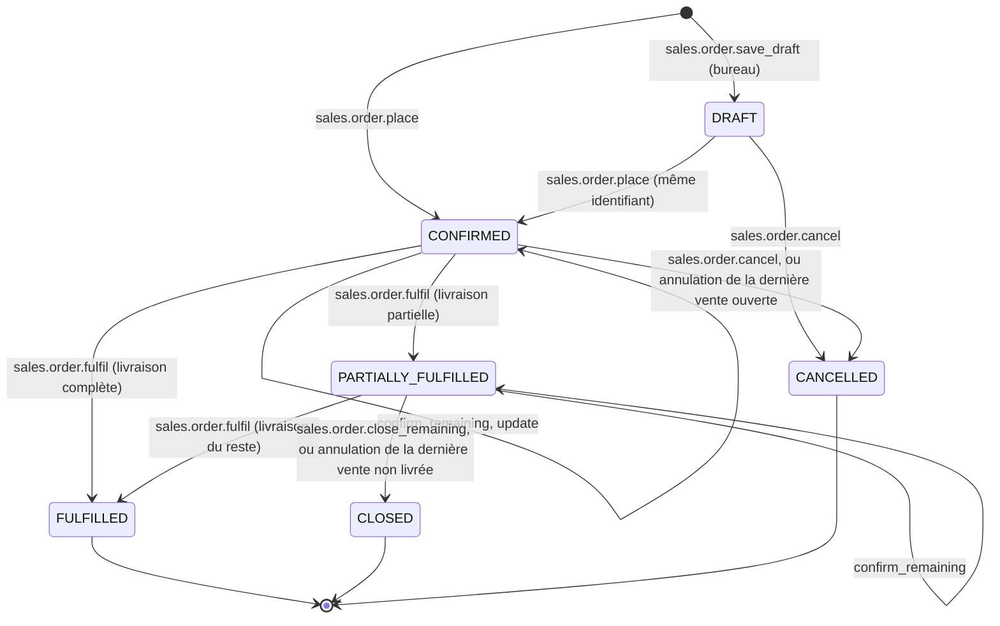
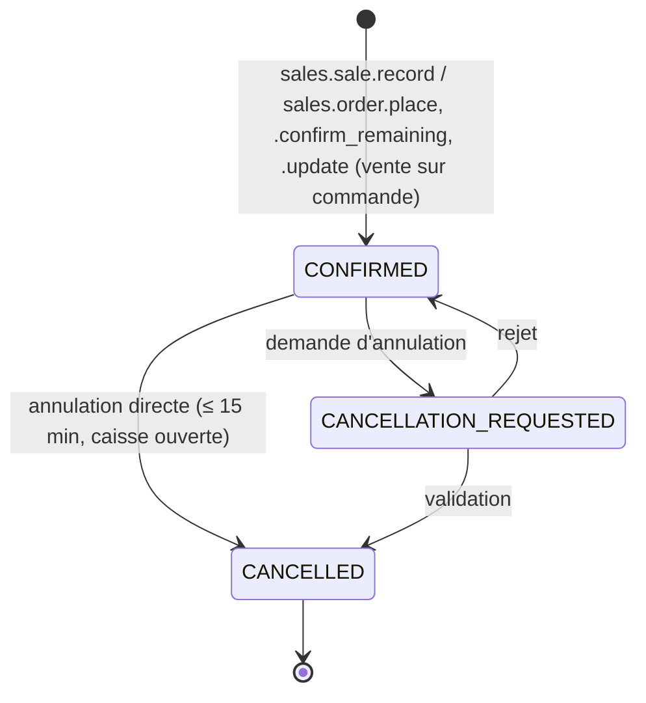
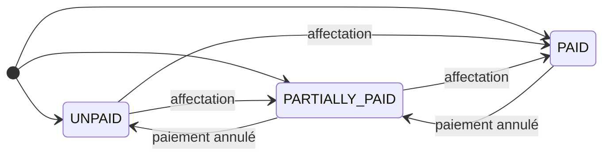
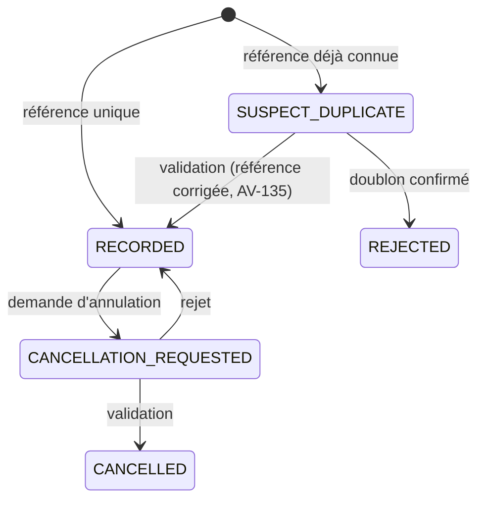
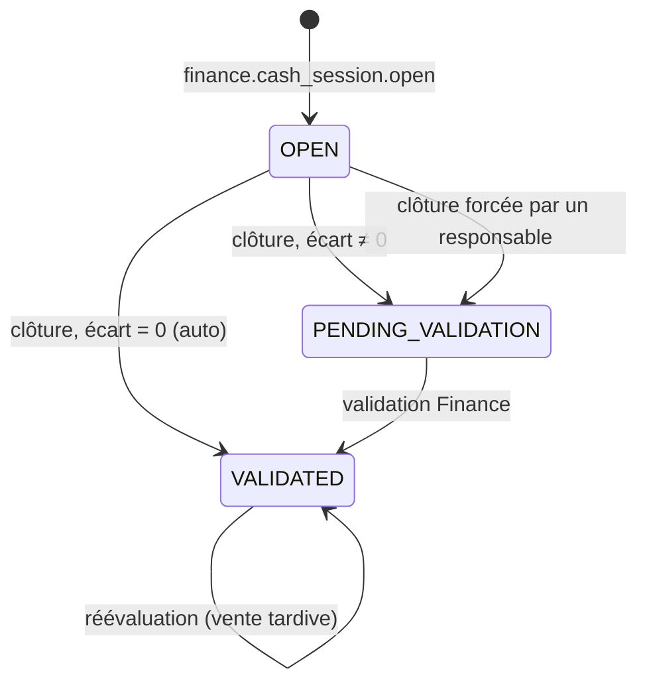
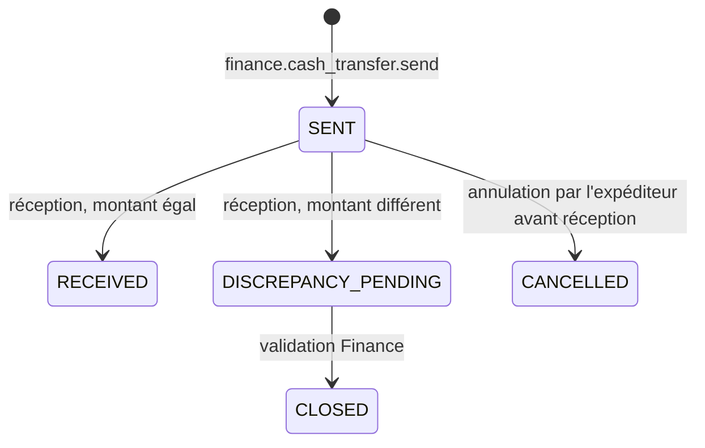

# Machines à états — Ventes, encaissements, caisse

## SM-ORDER — Commande client

Une seule dimension : le cycle de vie (`status`). Le statut est **dérivé des lignes** (`salesOrderStatusFromLines`, `packages/domain`), sauf `DRAFT` ; il n'y a ni réservation ni état de réservation (ADR-028 §4). Chaque ligne porte quatre quantités en unité de base — commandé en vigueur, vendu net des annulations, livré, retiré — d'où se dérivent « en attente » (commandé − vendu) et « à livrer » (vendu − livré), avec 0 ≤ livré ≤ vendu ≤ commandé (INV-VEN-04). Règles : [D04](../../01-functional/domaines/D04-VEN-commandes-ventes.md) §7.1 et §15.

| Statut | Dérivation |
|---|---|
| `DRAFT` | Brouillon de bureau (`save_draft`) : aucun effet de stock ni de chiffre d'affaires |
| `CONFIRMED` | Une quantité reste en attente ou à livrer, et rien n'a été livré |
| `PARTIALLY_FULFILLED` | Une quantité reste en attente ou à livrer, et une livraison a eu lieu |
| `FULFILLED` | Plus rien en attente ni à livrer ; une livraison a eu lieu |
| `CLOSED` | Plus rien en attente ni à livrer parce que le reste a été annulé (`close_remaining`, ou annulation de la dernière vente non livrée) ; une part a été livrée |
| `CANCELLED` | Plus rien en attente ni à livrer, et rien n'a été livré (annulation, ou annulation de la dernière vente ouverte) |

```mermaid
stateDiagram-v2
  [*] --> DRAFT : sales.order.save_draft (bureau)
  [*] --> CONFIRMED : sales.order.place
  DRAFT --> CONFIRMED : sales.order.place (même identifiant)
  DRAFT --> CANCELLED : sales.order.cancel
  CONFIRMED --> CONFIRMED : confirm_remaining, update
  PARTIALLY_FULFILLED --> PARTIALLY_FULFILLED : confirm_remaining
  CONFIRMED --> CANCELLED : sales.order.cancel, ou annulation de la dernière vente ouverte
  CONFIRMED --> PARTIALLY_FULFILLED : sales.order.fulfil (livraison partielle)
  CONFIRMED --> FULFILLED : sales.order.fulfil (livraison complète)
  PARTIALLY_FULFILLED --> FULFILLED : sales.order.fulfil (livraison du reste)
  PARTIALLY_FULFILLED --> CLOSED : sales.order.close_remaining, ou annulation de la dernière vente non livrée
  FULFILLED --> [*]
  CLOSED --> [*]
  CANCELLED --> [*]
```

| État initial | Action | Condition | Nouvel état | Effets métier | Effets stock | Effets finance | Permission |
|---|---|---|---|---|---|---|---|
| `[*]` | `sales.order.save_draft` | En ligne ; client identifié ; ≥ 1 ligne ; prix résolus et figés à la saisie (BR-VEN-003, AV-148) | `DRAFT` | Numéro `CMD` ; `OrderDrafted` | — | — | `sales.order.create` |
| `[*]`, `DRAFT` | `sales.order.place` | Client identifié (BR-VEN-001) ; ≥ 1 ligne (celles du brouillon s'il existe) ; ni remise ni produit vendu au poids ; prix résolus (BR-VEN-003) ; crédit si reste dû (BR-VEN-025) | `CONFIRMED` | Numéro `CMD` (commande neuve) ; prix convenus figés ; brouillon confirmé : version +1 ; `OrderConfirmed` ; **vente du disponible** (BR-VEN-004), la commande n'est jamais refusée pour manque de stock | Pour le disponible : `SALE` de l'emplacement de préparation vers « à livrer », coût figé (SM-SALE) ; le reste demeure en attente, sans réservation | Acomptes joints encaissés et affectés à la commande, puis passés à la vente créée (`ORDER_CONFIRMED`) ; CA à `occurred_at` ; créance du reste dû, échéance depuis la confirmation | `sales.order.create` |
| `CONFIRMED`, `PARTIALLY_FULFILLED` | `sales.order.confirm_remaining` | Quantité en attente > 0 (sinon aucune vente) ; crédit si reste dû | inchangé (statut recalculé) | Nouvelle vente `ORDER` du disponible, au prix convenu ; `SaleConfirmed` ; la version ne bouge pas | `SALE` vers « à livrer » pour ce qui est devenu disponible | CA, créance ; l'acompte encore affecté à la commande passe à la nouvelle vente | `sales.order.create` |
| `CONFIRMED` | `sales.order.update` | Aucune livraison (sinon rejet `ORDER_NOT_MODIFIABLE`) ; `base_version` à jour (sinon quarantaine `VERSION_CONFLICT`) ; ≥ 1 changement ; commande jamais vidée (`ORDER_EMPTY`) | `CONFIRMED` | Version +1 ; audit avant / après ; `OrderUpdated` | Baisse : retrait de l'attente, puis `CUSTOMER_RETURN` de « à livrer » vers l'emplacement de préparation pour le vendu non livré ; hausse ou ligne ajoutée : `SALE` du disponible | Baisse : document `ANV` (cause `ORDER_ADJUSTMENT`) par vente touchée, CA négatif, argent payé libéré en crédit client ou remboursement ; hausse : vente complémentaire au prix convenu, CA, créance | `sales.order.create` (auteur ; portée `TEAM`) |
| `DRAFT`, `CONFIRMED` | `sales.order.cancel` | Aucune livraison (sinon `CANCELLATION_EXCEEDS_UNDELIVERED` : clôturer le reste) ; motif (`REASON_REQUIRED`) ; sans validation (AV-128) | `CANCELLED` | Version +1 ; `cancelled_at`, `cancelled_by`, motif ; `OrderCancelled` | Retour de tout le vendu : « à livrer » vers l'emplacement de préparation | Documents `ANV` (cause `ORDER_CANCELLATION`), CA négatif ; acompte et part payée libérés en crédit client ou remboursement (BR-VEN-009), sort consigné sur la commande | `sales.order.cancel` (auteur, Resp. commercial) |
| `PARTIALLY_FULFILLED` | `sales.order.close_remaining` | Motif (`REASON_REQUIRED`) ; hors de ce statut : `ORDER_STATUS_INVALID` ; sans validation (AV-128) | `CLOSED` | Version +1 ; `closed_at`, `closed_by`, `closed_reason` ; commandé de chaque ligne = livré ; `OrderClosed` | Retour du vendu non livré | Documents `ANV` (cause `ORDER_CLOSURE`), CA négatif ; acompte restant et part payée libérés (BR-VEN-009) | `sales.order.cancel` |
| `CONFIRMED`, `PARTIALLY_FULFILLED` | `sales.order.fulfil` (bon de livraison `LIV`, P4-07) | Quantité de chaque ligne ≤ vendu non livré (INV-VEN-04 ; en ligne, sinon `ORDER_OVER_FULFILMENT` sans écriture) ; aucune demande d'annulation en cours sur les ventes servies (`SALE_CANCELLATION_PENDING`) ; hors de ces statuts, en ligne : `ORDER_STATUS_INVALID` | `PARTIALLY_FULFILLED` tant qu'il reste de l'attente ou du « à livrer », sinon `FULFILLED` ; la version ne bouge pas | Bon `LIV` en ajout seul ; livré réparti sur les ventes, la plus ancienne d'abord (D04 §15) | `DELIVERY` : « à livrer » → `V_CUSTOMER`, à la valeur figée de la vente (un mouvement par `SALE` servi, ADR-029) | Aucun effet sur le CA (déjà reconnu à la confirmation, ADR-025) ; aucune vente | `sales.order.fulfil` (commerciaux `OWN`/`TEAM`, Magasinier `SITE`) |
| `CONFIRMED`, `PARTIALLY_FULFILLED` | Réaction à l'annulation d'une vente sur commande (`sales.sale.cancel`, `.request_cancellation` une fois appliquée, décision `SALE_CANCELLATION`) | Le non-livré seulement (ADR-029 §10) | Inchangé, ou `CANCELLED` (rien livré) / `CLOSED` (une part livrée) quand plus rien n'est ouvert | Quantités annulées retirées de la commande : commandé et vendu net baissent, cumul retiré monte ; version +1 (AV-149) | Effets de SM-SALE | Effets de SM-SALE | `system` (suite de `sales.sale.cancel`) |

**Livraison hors ligne** (P4-07) : fait accompli, jamais refusé pour l'état de la commande ; la part rattachable l'est, le surplus devient une vente directe de régularisation avec un conflit `ORDER_OVER_FULFILMENT` (AV-133), même sur une commande annulée ou clôturée, qui n'est pas rouverte.

**Hors ligne** : `place` est une intention que le serveur confirme à la synchronisation, avec l'heure métier de la saisie (AV-126) : la vente du disponible, l'affectation des acomptes et le chiffre d'affaires n'existent qu'à ce moment. `update`, `cancel` et `close_remaining` sont possibles hors ligne comme intentions sur l'état partagé : une `base_version` périmée met la modification en quarantaine (`VERSION_CONFLICT`, commande inchangée) ; une commande devenue livrée, terminée ou annulée côté serveur rejette la modification (`ORDER_NOT_MODIFIABLE`) ; une annulation devenue impossible est rejetée (`CANCELLATION_EXCEEDS_UNDELIVERED` après une livraison, `ORDER_ALREADY_CANCELLED`). La livraison hors ligne, y compris au-delà du vendu non livré (D04 §14, AV-133), relève de P4-07 et n'est pas décrite ici.

---

## SM-SALE — Vente

Cycle de vie (`status`) et statut de paiement **dérivé** (`payment_status`) sont orthogonaux (tension C-05). Correspondance avec la liste indicative du PM §24 :

| Terme PM §24 | Représentation |
|---|---|
| brouillon | Panier local `LOCAL_ONLY`, jamais synchronisé (BR-VEN-011) |
| confirmée | `status = CONFIRMED` |
| payée partiellement | `payment_status = PARTIALLY_PAID` |
| payée | `payment_status = PAID` |
| annulée | `status = CANCELLED` |

```mermaid
stateDiagram-v2
  [*] --> CONFIRMED : sales.sale.record / sales.order.place, .confirm_remaining, .update (vente sur commande)
  CONFIRMED --> CANCELLED : annulation directe (≤ 15 min, caisse ouverte)
  CONFIRMED --> CANCELLATION_REQUESTED : demande d'annulation
  CANCELLATION_REQUESTED --> CANCELLED : validation
  CANCELLATION_REQUESTED --> CONFIRMED : rejet
  CANCELLED --> [*]
```

```mermaid
stateDiagram-v2
  direction LR
  [*] --> UNPAID
  [*] --> PARTIALLY_PAID
  [*] --> PAID
  UNPAID --> PARTIALLY_PAID : affectation
  UNPAID --> PAID : affectation
  PARTIALLY_PAID --> PAID : affectation
  PAID --> PARTIALLY_PAID : paiement annulé
  PARTIALLY_PAID --> UNPAID : paiement annulé
```

| État initial | Action | Condition | Nouvel état | Effets métier | Effets stock | Effets finance | Permission |
|---|---|---|---|---|---|---|---|
| `[*]` | `sales.sale.record` | Validations D04 §8 ; disponibilité (en ligne) ou allocation (hors ligne) ; plafond de dérogation | `CONFIRMED` | Prix figés ; attribution (BR-VEN-020) ; canal, zone ; numéro officiel ; conversion éventuelle du prospect ; `SaleConfirmed` | Un mouvement `SALE` (source → `V_CUSTOMER`) par ligne × lot ; consommation d'allocation ; coût unitaire figé | CA à `occurred_at` ; encaissements et affectations ; mouvements de trésorerie ; créance du reste, avec échéance | `sales.sale.record` (+ `sales.credit_sale.record` si reste dû ; + `sales.price.override` si dérogation) |
| `[*]` | `sales.order.place`, `sales.order.confirm_remaining`, `sales.order.update` (hausse ou ligne ajoutée) | SM-ORDER ; une quantité en attente et du stock disponible ; crédit si reste dû (BR-VEN-025) | `CONFIRMED` (type `ORDER`, une vente par confirmation) | Prix = prix convenu de la ligne de commande (`ORDER_QUOTE`, sans remise) ; commercial et canal de la commande ; échéance depuis la confirmation (AV-129) ; conversion éventuelle du prospect ; `SaleConfirmed` | Un mouvement `SALE` par ligne × lot, de l'emplacement de préparation vers « à livrer » (jamais de solde négatif), coût figé ; aucune réservation | CA à `occurred_at` ; l'acompte de la commande s'affecte à la vente (`ORDER_CONFIRMED`) ; créance du reste, avec échéance | `sales.order.create` |
| `CONFIRMED` | `sales.sale.cancel` (direct) | BR-VEN-028 : auteur, ≤ 15 min, session de caisse ouverte | `CANCELLED` | Motif ; `SaleCancelled` ; commande recalculée | Mouvements inverses `V_CUSTOMER` → emplacement d'origine (même lot, même coût) ; allocation restituée si active | CA négatif daté de l'annulation ; affectations désactivées ; remboursement (`REFUND`) ou crédit client | `sales.sale.cancel` |
| `CONFIRMED` | `sales.sale.request_cancellation` | Hors du délai direct ; motif | `CANCELLATION_REQUESTED` | Demande `SALE_CANCELLATION` ; `SaleCancellationRequested` | — | — | `sales.sale.cancel` |
| `CANCELLATION_REQUESTED` | `approvals.request.approve` | Approbateur ≠ demandeur | `CANCELLED` | Comme l'annulation directe ; décision tracée | Comme l'annulation directe | Comme l'annulation directe ; remboursement ou crédit au choix de l'approbateur | `sales.sale_cancel.approve` |
| `CANCELLATION_REQUESTED` | `approvals.request.reject` | — | `CONFIRMED` | Décision tracée | — | — | `sales.sale_cancel.approve` |
| (tout état non annulé) | Affectation / désaffectation de paiement | BR-FIN-003 | `payment_status` recalculé | `amount_paid_xaf`, `balance_due_xaf` mis à jour | — | — | `system` |

**Hors ligne** : l'enregistrement, l'annulation directe (délai calculé sur l'horloge de l'appareil, puis revérifié par le serveur avec l'écart d'horloge) et la demande d'annulation sont possibles. Si le serveur juge le délai dépassé pour une annulation directe hors ligne, la commande devient automatiquement une demande d'annulation (`APPLIED_WITH_WARNINGS`). Les effets d'une annulation (retour de stock et d'argent) sont alors appliqués **seulement** après validation, mais la demande est tracée dès réception.

---

## SM-CUSTOMER-PAYMENT — Encaissement client

```mermaid
stateDiagram-v2
  [*] --> RECORDED : référence unique
  [*] --> SUSPECT_DUPLICATE : référence déjà connue
  SUSPECT_DUPLICATE --> RECORDED : validation (référence corrigée, AV-135)
  SUSPECT_DUPLICATE --> REJECTED : doublon confirmé
  RECORDED --> CANCELLATION_REQUESTED : demande d'annulation
  CANCELLATION_REQUESTED --> CANCELLED : validation
  CANCELLATION_REQUESTED --> RECORDED : rejet
```

| État initial | Action | Condition | Nouvel état | Effets métier | Effets stock | Effets finance | Permission |
|---|---|---|---|---|---|---|---|
| `[*]` | `sales.payment.record` (ou inclus dans la vente) | BR-FIN-001 ; (moyen, référence) unique | `RECORDED` | `PaymentReceived`, `PaymentAllocated` | — | Mouvement de trésorerie `IN` ; affectations (vente, commande, ou automatiques BR-FIN-004) ; créances recalculées | `sales.payment.record` |
| `[*]` | idem | Référence déjà connue (BR-FIN-005) | `SUSPECT_DUPLICATE` | `PaymentFlaggedDuplicate` ; demande de validation | — | **Aucun** mouvement ni affectation | `sales.payment.record` |
| `SUSPECT_DUPLICATE` | `approvals.request.approve` | Référence corrigée fournie (AV-135 : seule exception à la référence figée) | `RECORDED` | Tracé | — | Mouvement de trésorerie et affectations appliqués | `sales.payment.cancel` (FINANCE) |
| `SUSPECT_DUPLICATE` | `approvals.request.reject` | — | `REJECTED` | Tracé | — | Aucun | `sales.payment.cancel` |
| `RECORDED` | `sales.payment.request_cancellation` | Motif | `CANCELLATION_REQUESTED` | Demande `PAYMENT_CANCELLATION` | — | — | `sales.payment.record` |
| `CANCELLATION_REQUESTED` | `approvals.request.approve` | — | `CANCELLED` | `PaymentCancelled` | — | Mouvement de trésorerie inverse ; affectations désactivées ; créances rouvertes | `sales.payment.cancel` |
| `CANCELLATION_REQUESTED` | `approvals.request.reject` | — | `RECORDED` | Tracé | — | — | `sales.payment.cancel` |

**Hors ligne** : l'enregistrement est possible. Le contrôle d'unicité local porte seulement sur les références connues de l'appareil ; le contrôle serveur fait foi.

---

## SM-CASH-SESSION — Session de caisse

```mermaid
stateDiagram-v2
  [*] --> OPEN : finance.cash_session.open
  OPEN --> VALIDATED : clôture, écart = 0 (auto)
  OPEN --> PENDING_VALIDATION : clôture, écart ≠ 0
  OPEN --> PENDING_VALIDATION : clôture forcée par un responsable
  PENDING_VALIDATION --> VALIDATED : validation Finance
  VALIDATED --> VALIDATED : réévaluation (vente tardive)
```

| État initial | Action | Condition | Nouvel état | Effets métier | Effets stock | Effets finance | Permission |
|---|---|---|---|---|---|---|---|
| `[*]` | `finance.cash_session.open` | Aucune session ouverte sur la caisse ; fonds compté ≥ 0 | `OPEN` | `CashSessionOpened` | — | Si fonds compté ≠ solde du compte : mouvement `SESSION_VARIANCE` et validation requise (BR-FIN-014) | `finance.cash_session.operate` |
| `OPEN` | `finance.cash_session.close` | Comptage saisi | `VALIDATED` si écart = 0, sinon `PENDING_VALIDATION` | Solde attendu calculé (BR-DIS-007) ; `CashSessionClosed` ; `CashVarianceDetected` si écart | — | Mouvement `SESSION_VARIANCE` de l'écart | `finance.cash_session.operate` |
| `OPEN` | `finance.cash_session.force_close` | Session ouverte depuis plus de 24 h ; comptage déclaré | `PENDING_VALIDATION` | Tracé | — | Idem | `finance.cash_session.validate` |
| `PENDING_VALIDATION` | `finance.cash_session.validate` | Motif si écart ; valideur ≠ vendeur | `VALIDATED` | `CashSessionValidated` | — | — | `finance.cash_session.validate` |
| `VALIDATED` | Réaction : opération tardive de `occurred_at` dans la session | — | `VALIDATED` | Solde attendu recalculé ; alerte à la Finance | — | Mouvement `SESSION_VARIANCE` compensatoire (BR-DIS-008) | `system` |

**Hors ligne** : ouverture et clôture sont possibles ; la validation est en ligne.

---

## SM-CASH-TRANSFER — Remise de fonds

```mermaid
stateDiagram-v2
  [*] --> SENT : finance.cash_transfer.send
  SENT --> RECEIVED : réception, montant égal
  SENT --> DISCREPANCY_PENDING : réception, montant différent
  DISCREPANCY_PENDING --> CLOSED : validation Finance
  SENT --> CANCELLED : annulation par l'expéditeur avant réception
```

| État initial | Action | Condition | Nouvel état | Effets métier | Effets stock | Effets finance | Permission |
|---|---|---|---|---|---|---|---|
| `[*]` | `finance.cash_transfer.send` | Solde du compte source suffisant (en ligne) | `SENT` | `CashTransferSent` | — | `TRANSFER_OUT` sur le compte source | `finance.cash_transfer.record` |
| `SENT` | `finance.cash_transfer.receive` | Montant reçu = envoyé | `RECEIVED` | `CashTransferReceived` | — | `TRANSFER_IN` sur le compte destination | `finance.cash_transfer.record` |
| `SENT` | `finance.cash_transfer.receive` | Montant reçu ≠ envoyé | `DISCREPANCY_PENDING` | `CashTransferDiscrepancyDetected` ; validation | — | `TRANSFER_IN` du montant reçu | `finance.cash_transfer.record` |
| `DISCREPANCY_PENDING` | `approvals.request.approve` | Motif | `CLOSED` | Écart imputé (expéditeur ou transporteur) | — | Écart tracé comme `SESSION_VARIANCE` du compte source | `finance.cash_session.validate` |
| `SENT` | `finance.cash_transfer.cancel` | Pas de réception | `CANCELLED` | Tracé | — | Mouvement inverse sur le compte source | `finance.cash_transfer.record` (expéditeur) |

**Hors ligne** : envoi et annulation sont possibles hors ligne ; la réception se fait en général en ligne (Finance), mais reste possible hors ligne.
