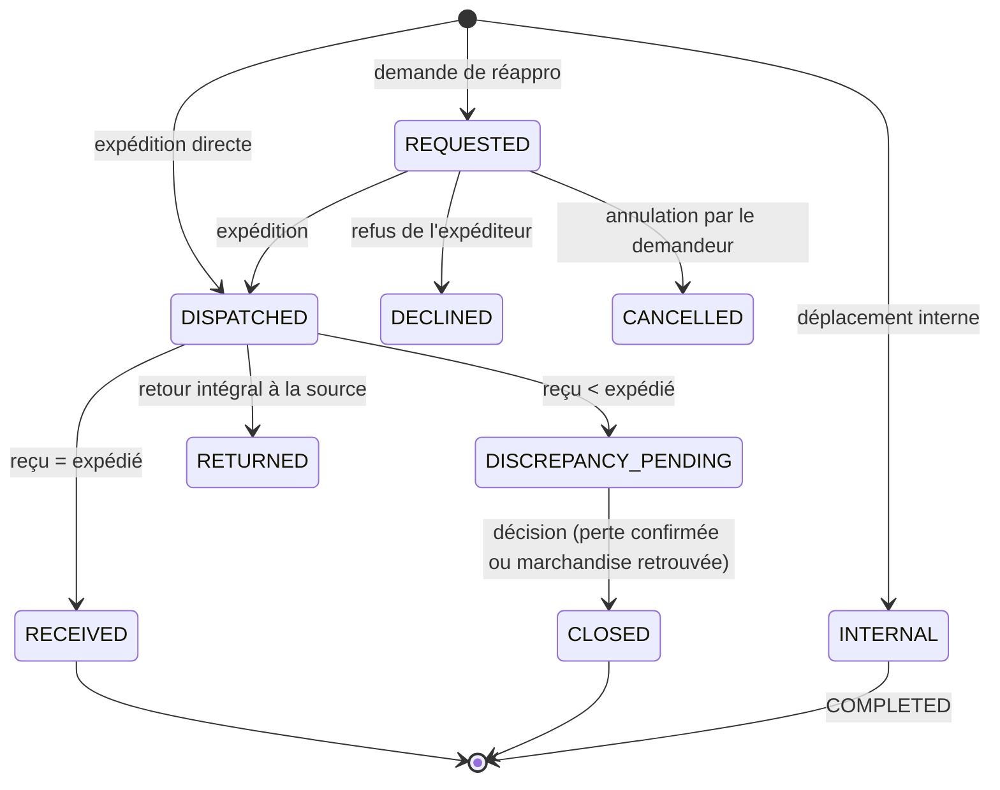
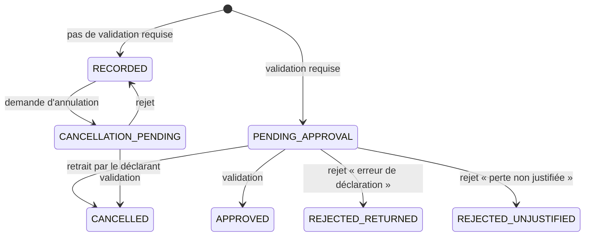
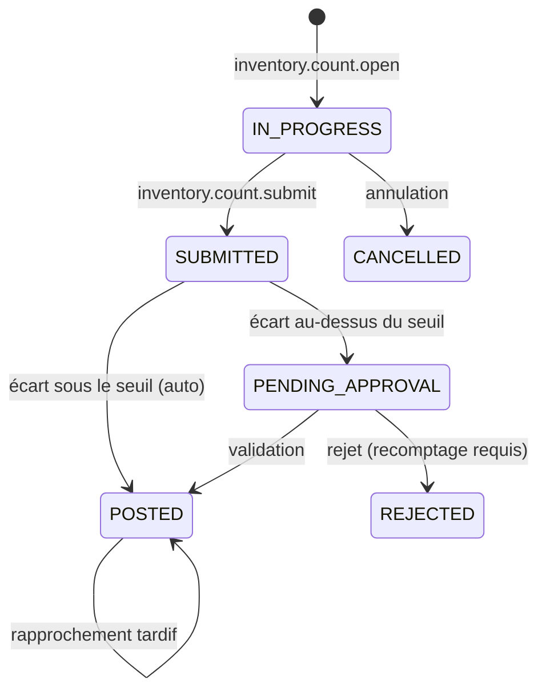
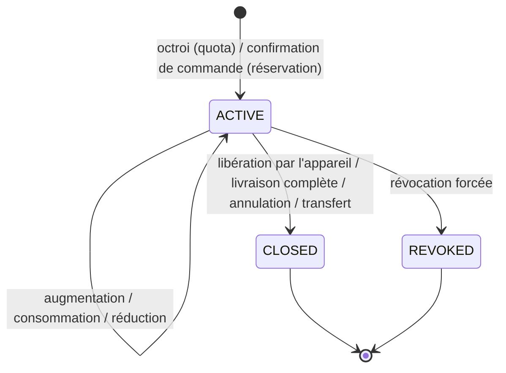

# Machines à états — Stock

## SM-TRANSFER — Transfert de stock

Trois natures (`transfer_kind`) : `STANDARD` (deux temps, avec transit), `INTERNAL` (immédiat, même site), `BLIND_RECEIPT` (réception sans document, BR-STK-024).

| État initial | Action | Condition | Nouvel état | Effets métier | Effets stock | Effets finance | Permission |
|---|---|---|---|---|---|---|---|
| `[*]` | `inventory.transfer.request` | Destination = emplacement du demandeur ; quantités > 0 | `REQUESTED` | `StockTransferRequested` ; notification à l'expéditeur | — | — | `inventory.transfer.request` |
| `REQUESTED` | `inventory.transfer.decline` | Motif | `DECLINED` | Notification au demandeur | — | — | `inventory.transfer.dispatch` |
| `REQUESTED` | `inventory.transfer.cancel` | Demandeur | `CANCELLED` | — | — | — | `inventory.transfer.request` |
| `[*]`, `REQUESTED` | `inventory.transfer.dispatch` | Disponible suffisant (en ligne) ou allocation / exclusif (hors ligne) ; source ≠ destination | `DISPATCHED` | Expéditeur, heure, transporteur éventuel ; `StockTransferDispatched` ; notification au destinataire | `TRANSFER_DISPATCH` source → `V_TRANSIT` (coût figé) ; réservation transférée si le transfert référence une commande (BR-VEN-010) | — (la valeur voyage avec le stock) | `inventory.transfer.dispatch` |
| `DISPATCHED` | `inventory.transfer.receive` | Quantités reçues = expédiées | `RECEIVED` | Réceptionnaire, heure ; `StockTransferReceived` | `TRANSFER_RECEIPT` `V_TRANSIT` → destination | — | `inventory.transfer.receive` |
| `DISPATCHED` | `inventory.transfer.receive` | Au moins une ligne reçue < expédiée ; motif | `DISCREPANCY_PENDING` | `StockTransferDiscrepancyDetected` ; demande `TRANSFER_DISCREPANCY` | `TRANSFER_RECEIPT` (reçu) + `TRANSFER_DISCREPANCY` `V_TRANSIT` → `V_PENDING_LOSS` (écart) | Valeur de l'écart visible | `inventory.transfer.receive` |
| `DISCREPANCY_PENDING` | `approvals.request.approve` (perte confirmée) | Approbateur ≠ réceptionnaire | `CLOSED` | Imputation au transfert ; `StockTransferDiscrepancyResolved` | `LOSS_CONFIRMATION` `V_PENDING_LOSS` → `V_LOSS` (catégorie `ECART_TRANSFERT`) | Valeur perdue | `inventory.transfer_discrepancy.approve` |
| `DISCREPANCY_PENDING` | `approvals.request.reject` (marchandise retrouvée) | Recomptage | `CLOSED` | Tracé | `LOSS_RELEASE` `V_PENDING_LOSS` → destination | — | `inventory.transfer_discrepancy.approve` |
| `DISPATCHED` | `inventory.transfer.return_to_source` | Aucune réception ; motif | `RETURNED` | Tracé | `V_TRANSIT` → source (mouvement inverse) | — | `inventory.transfer.dispatch` |
| `[*]` | `inventory.transfer.move_internal` | Même site ; disponible suffisant | `COMPLETED` | `StockTransferReceived` (interne) | `INTERNAL_MOVE` source → destination | — | `inventory.transfer.dispatch` |
| `[*]` | `inventory.transfer.receive` (sans document) | Destination exclusive ; source déclarée | `UNMATCHED` (`BLIND_RECEIPT`) | Recherche d'un transfert `DISPATCHED` correspondant | `TRANSFER_RECEIPT` `V_TRANSIT` → destination, transit non rapproché de la paire (source, destination) | — | `inventory.transfer.receive` |
| `UNMATCHED` | Rapprochement automatique (expédition trouvée) | Même source, destination et produits | `MATCHED` | Le transfert expédié passe `RECEIVED` ou `DISCREPANCY_PENDING` selon les quantités | Aucun nouveau mouvement de réception ; écart éventuel traité comme ci-dessus | — | `system` |
| `UNMATCHED` | Délai de 48 h dépassé | — | `UNMATCHED` | Conflit `TRANSFER_UNMATCHED` ; alerte | — | — | `system` |

**Hors ligne** : demande, expédition, réception (avec ou sans document), retour et déplacement interne sont possibles. Refus et décisions sur écart sont en ligne.

---

## SM-LOSS — Déclaration de perte

| État initial | Action | Condition | Nouvel état | Effets métier | Effets stock | Effets finance | Permission |
|---|---|---|---|---|---|---|---|
| `[*]` | `inventory.loss.declare` (ou `production.mortality.record`) | Politique : pas de validation (BR-STK-031) ; pièces et commentaire requis présents | `RECORDED` | `StockLossDeclared` (+ `MortalityRecorded`) ; alertes éventuelles | `LOSS` emplacement → `V_LOSS` ; allocation consommée si le déclarant en détient une | Valeur perdue = quantité × coût figé | `inventory.loss.declare` / `production.daily.record` |
| `[*]` | idem | Politique : validation requise | `PENDING_APPROVAL` | Demande `LOSS_DECLARATION` ou `MORTALITY` | `LOSS_PENDING` emplacement → `V_PENDING_LOSS` | Valeur en attente | idem |
| `PENDING_APPROVAL` | `approvals.request.approve` | Approbateur ≠ déclarant ; pièce reçue si requise | `APPROVED` | `StockLossApproved` | `LOSS_CONFIRMATION` `V_PENDING_LOSS` → `V_LOSS` | Valeur perdue reconnue | `inventory.loss.approve` / `production.mortality.approve` |
| `PENDING_APPROVAL` | `approvals.request.reject` (`ERREUR_DECLARATION`) | — | `REJECTED_RETURNED` | `StockLossRejected` | `LOSS_RELEASE` `V_PENDING_LOSS` → emplacement | — | idem |
| `PENDING_APPROVAL` | `approvals.request.reject` (`PERTE_NON_JUSTIFIEE`) | — | `REJECTED_UNJUSTIFIED` | Catégorie reclassée `INEXPLIQUEE` ; imputation au déclarant ou au lieu ; `StockLossRejected` | `LOSS_CONFIRMATION` `V_PENDING_LOSS` → `V_LOSS` | Valeur perdue (inexpliquée) | idem |
| `PENDING_APPROVAL` | `inventory.loss.withdraw` | Déclarant, avant décision | `CANCELLED` | Demande annulée | `LOSS_RELEASE` `V_PENDING_LOSS` → emplacement | — | `inventory.loss.declare` |
| `RECORDED` | `inventory.loss.request_cancellation` | Motif | `CANCELLATION_PENDING` | Demande `LOSS_CANCELLATION` | — | — | `inventory.loss.declare` |
| `CANCELLATION_PENDING` | `approvals.request.approve` | — | `CANCELLED` | Tracé | Inverse du `LOSS` : `V_LOSS` → emplacement | Valeur perdue annulée | `inventory.loss.approve` |
| `CANCELLATION_PENDING` | `approvals.request.reject` | — | `RECORDED` | Tracé | — | — | `inventory.loss.approve` |

**Hors ligne** : la déclaration et le retrait sont possibles hors ligne ; les décisions sont en ligne. La politique évaluée par l'appareil est indicative ; le serveur réévalue (BR-PRD-006). Si le serveur exige une validation non prévue localement, le mouvement appliqué est `LOSS_PENDING` au lieu de `LOSS`.

---

## SM-INVENTORY-COUNT — Inventaire

| État initial | Action | Condition | Nouvel état | Effets métier | Effets stock | Effets finance | Permission |
|---|---|---|---|---|---|---|---|
| `[*]` | `inventory.count.open` | Aucun inventaire ouvert sur l'emplacement | `IN_PROGRESS` | `InventoryCountOpened` | — (l'activité continue, BR-STK-041) | — | `inventory.count.perform` |
| `IN_PROGRESS` | `inventory.count.record_lines` | Quantités ≥ 0 | `IN_PROGRESS` | Lignes comptées, `counted_at` par ligne | — | — | `inventory.count.perform` |
| `IN_PROGRESS` | `inventory.count.submit` | ≥ 1 ligne | `SUBMITTED` puis immédiatement `POSTED` ou `PENDING_APPROVAL` | Théorique à `counted_at` (BR-STK-042) ; écarts ; `InventoryCountSubmitted` | — (tant que non comptabilisé) | Valeur des écarts calculée | `inventory.count.perform` |
| `SUBMITTED` | Évaluation de politique | \|valeur des écarts\| < seuil | `POSTED` | `InventoryAdjusted` | `INVENTORY_GAIN` / `INVENTORY_LOSS` datés de `counted_at` | Valeur des écarts | `system` |
| `SUBMITTED` | Évaluation de politique | ≥ seuil | `PENDING_APPROVAL` | Demande `INVENTORY_ADJUSTMENT` ; alerte `INVENTORY_VARIANCE` | — | — | `system` |
| `PENDING_APPROVAL` | `approvals.request.approve` | Motifs d'écart renseignés ; approbateur ≠ compteur | `POSTED` | `InventoryAdjusted` | Ajustements datés de `counted_at` | Valeur des écarts | `inventory.count.approve` |
| `PENDING_APPROVAL` | `approvals.request.reject` | — | `REJECTED` | Recomptage demandé (nouvel inventaire) | — | — | `inventory.count.approve` |
| `IN_PROGRESS` | `inventory.count.cancel` | — | `CANCELLED` | — | — | — | `inventory.count.perform` |
| `POSTED` | Réaction : mouvement tardif de `occurred_at` ≤ `counted_at` (BR-STK-044) | — | `POSTED` | Écart net mis à jour ; `InventoryCountReconciled` | Ajustement compensatoire rattaché | Valeur d'écart ajustée | `system` |

Inventaire d'ouverture (`count_type = OPENING`) : même machine ; théorique nul ; mouvements `OPENING_BALANCE` depuis `V_OPENING` ; toujours soumis à validation (`inventory.opening.post`).

**Hors ligne** : ouverture, comptage et soumission (mise en file) sont possibles. Le calcul du théorique et la comptabilisation sont serveur.

---

## SM-ALLOCATION — Allocation (quota) et réservation

| État initial | Action | Condition | Nouvel état | Effets métier | Effets stock | Effets finance | Permission |
|---|---|---|---|---|---|---|---|
| `[*]` | `inventory.allocation.grant` (`DEVICE_QUOTA`) | Emplacement `SHARED` ; appareil actif de l'utilisateur ; Σ allocations + réservations ≤ solde | `ACTIVE` | `StockAllocated` ; téléchargée par l'appareil détenteur | Aucun mouvement ; disponible des autres réduit | — | `inventory.allocation.manage` |
| `[*]` | Confirmation de commande (`ORDER_RESERVATION`) | BR-VEN-004 | `ACTIVE` | `StockReservationChanged` | Aucun mouvement ; disponible réduit | — | `system` (via `sales.order.place`) |
| `ACTIVE` | Consommation (vente, perte, transfert sortant, consommation) | Détenteur ; reste ≥ quantité (hors ligne) | `ACTIVE` | Entrée `CONSUME` | Le mouvement métier (`SALE`…) porte `allocation_id` | — | (permission de l'opération) |
| `ACTIVE` | `inventory.allocation.grant` (augmentation) | Disponible suffisant | `ACTIVE` | Entrée `INCREASE` | — | — | `inventory.allocation.manage` |
| `ACTIVE` | `inventory.allocation.release` | Commande émise par l'appareil détenteur (confirme le reste) | `CLOSED` | Entrée `RELEASE` du reste ; `StockAllocationReleased` | Disponible des autres augmenté | — | détenteur (implicite) |
| `ACTIVE` | Livraison complète, annulation ou clôture de commande | — | `CLOSED` | Entrées `CONSUME` / `RELEASE` | — | — | `system` |
| `ACTIVE` | Expédition d'un transfert pour commande | BR-VEN-010 | `CLOSED` (source) + nouvelle `ACTIVE` (destination) | Entrée `TRANSFER` | — | — | `system` |
| `ACTIVE` | `inventory.allocation.revoke` | Motif ; responsable | `REVOKED` | `StockAllocationRevoked` ; toute consommation ultérieure imputée ouvre `ALLOCATION_REVOKED_CONSUMED` | Disponible des autres augmenté | — | `inventory.allocation.manage` |

**Hors ligne** : seules la consommation (locale) et la demande de libération (commande en file) sont possibles hors ligne. Octroi, augmentation et révocation sont en ligne. Un quota atteint sa date `valid_until` : l'appareil cesse de l'utiliser localement et émet la libération à la synchronisation suivante.
