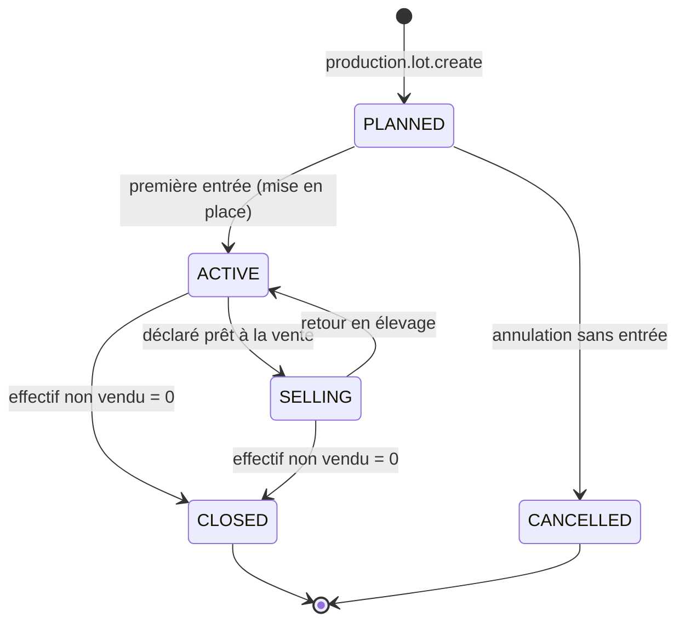
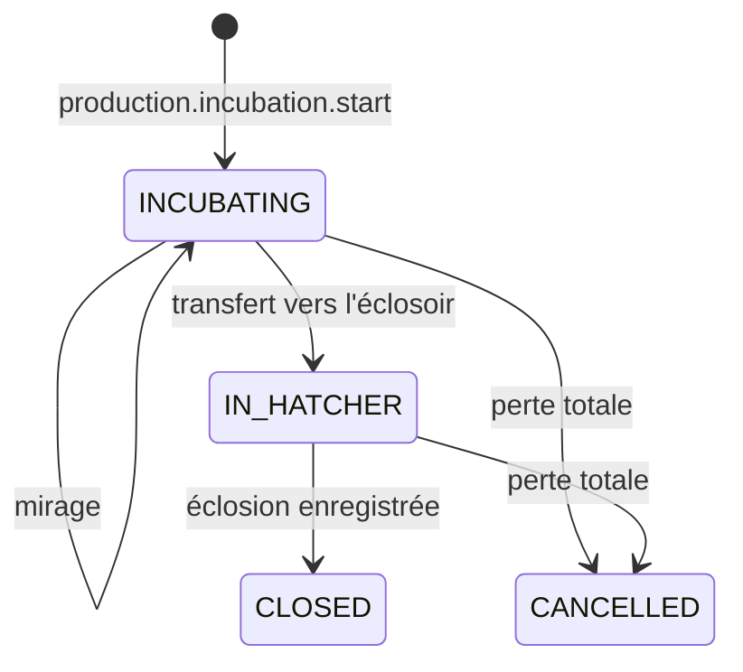
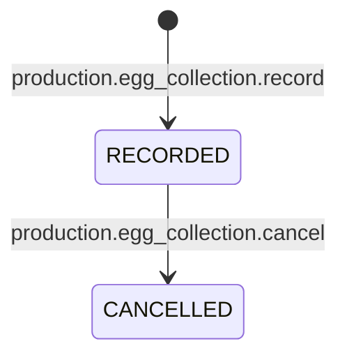

# Machines à états — Production

## SM-PRODUCTION-LOT — Lot de production

| État initial | Action | Condition | Nouvel état | Effets métier | Effets stock | Effets finance | Permission |
|---|---|---|---|---|---|---|---|
| `[*]` | `production.lot.create` | Type, site et bâtiment principal valides | `PLANNED` | Lot de traçabilité créé ; `ProductionLotCreated` | — | Objet de coût créé | `production.lot.manage` |
| `PLANNED` | `production.lot.record_entry` (`PLACEMENT`) | Quantité > 0 ; source disponible (poussins en stock) ou achat | `ACTIVE` | `effectif initial` = quantité de mise en place ; `LotEntryRecorded` | Reclassement : `PRODUCTION_INPUT` (poussins) + `PRODUCTION_OUTPUT` (produit du lot, vers le bâtiment) ; ou réception + reclassement | Écriture de coût `ANIMAUX` = valeur des animaux d'origine | `production.daily.record` |
| `ACTIVE`, `SELLING` | `production.lot.record_entry` (`BIRTH`, `TRANSFER_IN`) | Quantité > 0 | inchangé | `LotEntryRecorded` | `PRODUCTION_OUTPUT` (naissance) ou réception de transfert | Coût des animaux entrants (transfert : coût porté) | `production.daily.record` |
| `PLANNED` | `production.lot.cancel` | Aucune entrée | `CANCELLED` | — | — | — | `production.lot.manage` |
| `ACTIVE` | `production.lot.set_status` → `SELLING` | Effectif en élevage > 0 | `SELLING` | Vente directe depuis l'élevage autorisée (BR-PRD-010) ; `LotStatusChanged` | — | — | `production.lot.manage` |
| `SELLING` | `production.lot.set_status` → `ACTIVE` | — | `ACTIVE` | `LotStatusChanged` | — | — | `production.lot.manage` |
| `ACTIVE`, `SELLING` | Saisies quotidiennes (mortalité, consommation, pesée, observation, collecte) | Voir SM-LOSS et D07 | inchangé | Indicateurs mis à jour | Pertes et consommations | Coût du lot augmenté par les consommations | `production.daily.record` |
| `ACTIVE`, `SELLING` | `production.lot.close` | Effectif non vendu = 0 (BR-PRD-011) | `CLOSED` | Indicateurs finaux figés ; `ProductionLotClosed` | — | Coût total et marge figés | `production.lot.manage` |

**Hors ligne** : création, entrées, changement de statut et saisies quotidiennes sont possibles. La clôture exige l'état serveur (effectif exact) et se fait en ligne.

---

## SM-INCUBATION — Lot d'incubation

| État initial | Action | Condition | Nouvel état | Effets métier | Effets stock | Effets finance | Permission |
|---|---|---|---|---|---|---|---|
| `[*]` | `production.incubation.start` | Œufs à couver disponibles ; incubateur actif | `INCUBATING` | `eggs_set_qty` figé ; lot de traçabilité ; échéancier (BR-INC-008) ; `IncubationBatchStarted` | `INTERNAL_MOVE` stockage → incubateur | Objet de coût créé ; coût des œufs porté | `production.incubation.record` |
| `INCUBATING` | `production.incubation.record_candling` | Quantités ≤ œufs en incubateur | `INCUBATING` | Infertiles, mortalité embryonnaire ; `CandlingRecorded` | `PRODUCTION_INPUT` incubateur → `V_PRODUCTION` (motifs de rendement) | — | `production.incubation.record` |
| `INCUBATING` | `production.incubation.transfer_to_hatcher` | Éclosoir actif | `IN_HATCHER` | `HatcherTransferRecorded` | `INTERNAL_MOVE` incubateur → éclosoir | — | `production.incubation.record` |
| `IN_HATCHER` | `production.incubation.record_hatch` | Bilan BR-INC-006 | `CLOSED` | Taux d'éclosion ; `HatchRecorded`, `ProductionRecorded` | `PRODUCTION_INPUT` des œufs restants ; `PRODUCTION_OUTPUT` des poussins viables (vers l'éclosoir ou la poussinière) | Coût unitaire des poussins (BR-INC-009) | `production.incubation.record` |
| `INCUBATING`, `IN_HATCHER` | `production.incubation.cancel` | Tous les œufs sortis (pertes déclarées) | `CANCELLED` | Tracé | — | Coût du lot d'incubation = perte | `production.incubation.record` |

**Hors ligne** : toutes les transitions sont possibles.

---

## SM-EGG-COLLECTION — Collecte d'œufs

| État initial | Action | Condition | Nouvel état | Effets métier | Effets stock | Effets finance | Permission |
|---|---|---|---|---|---|---|---|
| `[*]` | `production.egg_collection.record` | Lot `PONDEUSE` actif ; égalité BR-OEU-001 ; pas d'autre collecte non annulée pour ce lot à cette date | `RECORDED` | `EggCollectionRecorded`, `ProductionRecorded` | `PRODUCTION_OUTPUT` des œufs commercialisables et à couver | Valorisation au coût standard (BR-OEU-007) | `production.daily.record` |
| `RECORDED` | `production.egg_collection.cancel` | Motif ; les œufs de cette collecte sont encore disponibles, sinon validation | `CANCELLED` | `EggCollectionCancelled` | Mouvements inverses | — | `production.daily.record` (+ validation si stock consommé) |

**Hors ligne** : les deux transitions sont possibles. Une annulation hors ligne dont le stock a déjà été consommé côté serveur est appliquée et produit `STOCK_NEGATIVE`.
