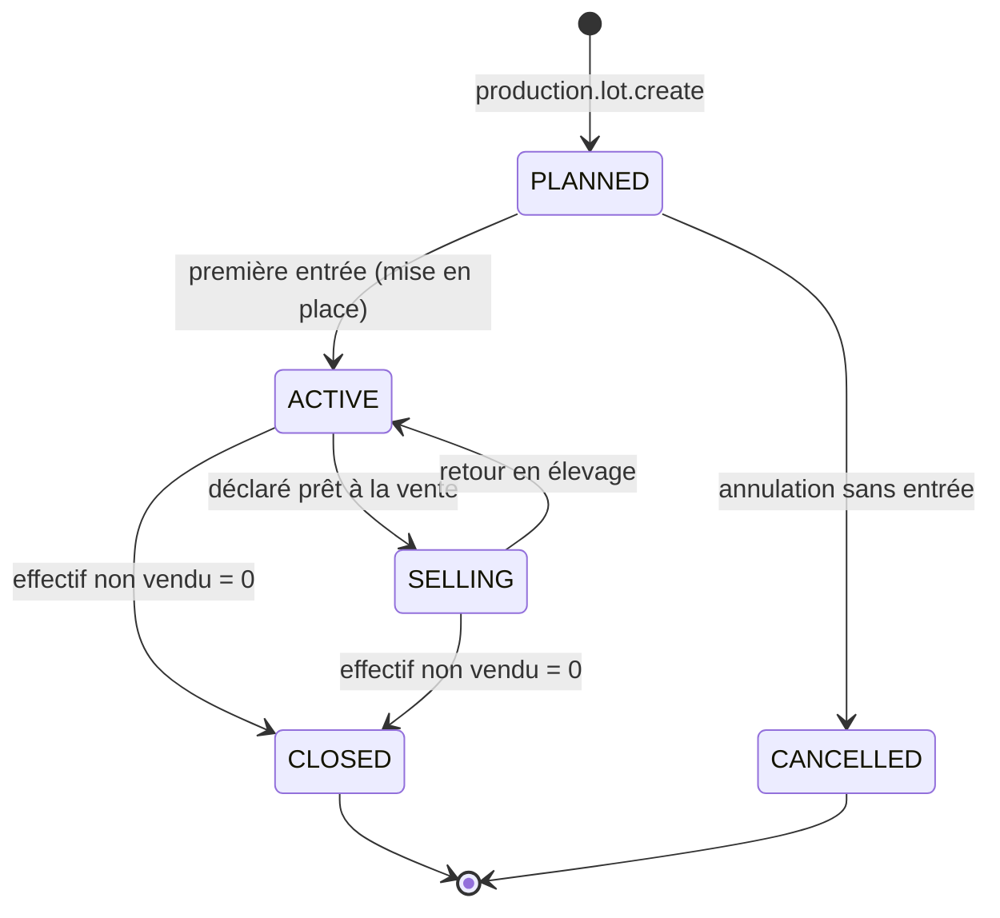
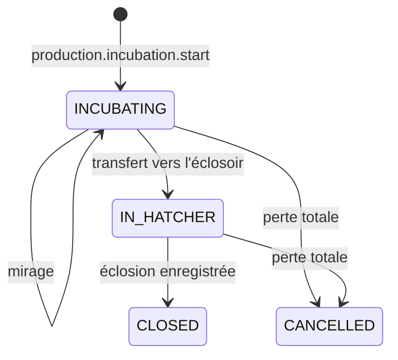
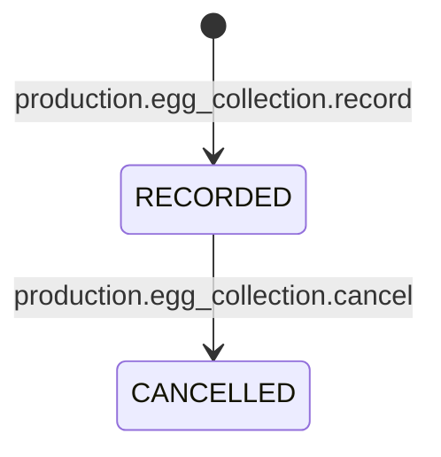

# Machines à états — Production

## SM-PRODUCTION-LOT — Lot de production

```mermaid
stateDiagram-v2
  [*] --> PLANNED : production.lot.create
  PLANNED --> ACTIVE : première entrée (mise en place)
  PLANNED --> CANCELLED : annulation sans entrée
  ACTIVE --> SELLING : déclaré prêt à la vente
  SELLING --> ACTIVE : retour en élevage
  ACTIVE --> CLOSED : effectif non vendu = 0
  SELLING --> CLOSED : effectif non vendu = 0
  CLOSED --> [*]
  CANCELLED --> [*]
```

| État initial | Action | Condition | Nouvel état | Effets métier | Effets stock | Effets finance | Permission |
|---|---|---|---|---|---|---|---|
| `[*]` | `production.lot.create` | Type, site et bâtiment principal valides | `PLANNED` | Lot de traçabilité créé ; `ProductionLotCreated` | — | Objet de coût créé | `production.lot.manage` |
| `PLANNED` | `production.lot.record_entry` (`PLACEMENT`) | Quantité > 0 ; source disponible (poussins en stock) ou achat | `ACTIVE` | `effectif initial` = quantité de mise en place ; `LotEntryRecorded` | Reclassement : `PRODUCTION_INPUT` (poussins) + `PRODUCTION_OUTPUT` (produit du lot, vers le bâtiment) ; ou réception + reclassement | Écriture de coût `ANIMAUX` = valeur des animaux d'origine | `production.daily.record` |
| `PLANNED`, `ACTIVE`, `SELLING` | `production.lot.record_entry` (`BIRTH`, `TRANSFER_IN`) | Quantité > 0 ; naissance : lot lié au lot de truies ; transfert ou sevrage : lot d'origine de la même espèce | `ACTIVE` (première entrée), sinon inchangé | `LotEntryRecorded` | `PRODUCTION_OUTPUT` (naissance) ou réception de transfert | Coût des animaux entrants (transfert : coût porté) | `production.daily.record` |
| `PLANNED` | `production.lot.cancel` | Aucune entrée | `CANCELLED` | — | — | — | `production.lot.manage` |
| `ACTIVE` | `production.lot.set_status` → `SELLING` | Effectif en élevage > 0 | `SELLING` | Vente directe depuis l'élevage autorisée (BR-PRD-010) ; `LotStatusChanged` | — | — | `production.lot.manage` |
| `SELLING` | `production.lot.set_status` → `ACTIVE` | — | `ACTIVE` | `LotStatusChanged` | — | — | `production.lot.manage` |
| `ACTIVE`, `SELLING` | Saisies quotidiennes (mortalité, consommation, pesée, observation, collecte) | Voir SM-LOSS et D07 | inchangé | Indicateurs mis à jour | Pertes et consommations | Coût du lot augmenté par les consommations | `production.daily.record` |
| `ACTIVE`, `SELLING` | `production.lot.close` | Effectif non vendu = 0 (BR-PRD-011) | `CLOSED` | Indicateurs finaux figés ; `ProductionLotClosed` | — | Coût total et marge figés | `production.lot.manage` |

| `ACTIVE`, `SELLING` | `production.lot.cancel_entry` | Animaux de l'entrée encore en stock (`STOCK_UNAVAILABLE` sinon, AV-120) | inchangé | Entrée `CANCELLED` ; effectif initial diminué | Mouvements inverses au coût d'origine | Écritures de coût contrepassées | `production.lot.manage` |

**Hors ligne** : création, entrées, changement de statut et saisies quotidiennes sont possibles ; une entrée sur un lot clôturé ou annulé est appliquée avec le conflit `LOT_CLOSED` (P7-05). La clôture exige l'état serveur (effectif exact) et se fait en ligne.

---

## SM-INCUBATION — Lot d'incubation

```mermaid
stateDiagram-v2
  [*] --> INCUBATING : production.incubation.start
  INCUBATING --> INCUBATING : mirage
  INCUBATING --> IN_HATCHER : transfert vers l'éclosoir
  IN_HATCHER --> CLOSED : éclosion enregistrée
  INCUBATING --> CANCELLED : perte totale
  IN_HATCHER --> CANCELLED : perte totale
```

| État initial | Action | Condition | Nouvel état | Effets métier | Effets stock | Effets finance | Permission |
|---|---|---|---|---|---|---|---|
| `[*]` | `production.incubation.start` | Œufs à couver disponibles ; incubateur actif ; espèce paramétrée | `INCUBATING` | `eggs_set_qty` figé ; lot de traçabilité ; échéancier (BR-INC-008) ; `IncubationBatchStarted` | Reclassement : `PRODUCTION_INPUT` des œufs de leur lot, `PRODUCTION_OUTPUT` dans l'incubateur sous le lot d'incubation | Écriture `OEUFS` au lot d'incubation | `production.incubation.record` |
| `INCUBATING` | `production.incubation.record_candling` | Quantités ≤ œufs restants (pertes accidentelles déduites) | `INCUBATING` | Infertiles, mortalité embryonnaire ; `CandlingRecorded` | `PRODUCTION_INPUT` incubateur → `V_PRODUCTION` au coût 0 (motifs de rendement) | Coût reporté sur les œufs restants | `production.incubation.record` |
| `INCUBATING` | `production.incubation.transfer_to_hatcher` | Éclosoir actif de la ferme | `IN_HATCHER` | `HatcherTransferRecorded` | `INTERNAL_MOVE` des œufs restants incubateur → éclosoir | — | `production.incubation.record` |
| `IN_HATCHER` | `production.incubation.record_hatch` | Bilan BR-INC-006 | `CLOSED` | Taux d'éclosion ; `HatchRecorded`, `ProductionRecorded` | `PRODUCTION_INPUT` des œufs restants au coût 0 ; `PRODUCTION_OUTPUT` des poussins viables sous le lot d'incubation (vers l'éclosoir ou la poussinière) | Coût du lot porté par les poussins viables (BR-INC-009) | `production.incubation.record` |
| `INCUBATING`, `IN_HATCHER` | `production.incubation.cancel` | Tous les œufs sortis (pertes déclarées), sinon `INCUBATION_NOT_EMPTY` | `CANCELLED` | Tracé | Lot de stock clos | Coût du lot d'incubation = perte | `production.incubation.record` |

**Hors ligne** : toutes les transitions sont possibles. Une étape reçue sur un lot déjà clos ou annulé est conservée en conflit `INCUBATION_CLOSED` sans effet ; une éclosion incomplète est complétée en œufs non éclos (`INCUBATION_BALANCE_ADJUSTED`, P7-08).

---

## SM-EGG-COLLECTION — Collecte d'œufs

```mermaid
stateDiagram-v2
  [*] --> RECORDED : production.egg_collection.record
  RECORDED --> CANCELLED : production.egg_collection.cancel
```

| État initial | Action | Condition | Nouvel état | Effets métier | Effets stock | Effets finance | Permission |
|---|---|---|---|---|---|---|---|
| `[*]` | `production.egg_collection.record` | Lot `PONDEUSE` ou `REPRODUCTEUR_VOLAILLE` actif ; égalité BR-OEU-001 ; calibres paramétrés ; plusieurs collectes par jour (AV-110) | `RECORDED` | `EggCollectionRecorded`, `ProductionRecorded` | `PRODUCTION_OUTPUT` des œufs commercialisables (par calibre) et à couver, dans le lot de stock propre de la collecte (AV-100) | Coût standard ; crédit du lot producteur (BR-OEU-007, AV-098) | `production.daily.record` |
| `RECORDED` | `production.egg_collection.cancel` | Commentaire ; les œufs de cette collecte sont encore disponibles, sinon refus en ligne (`STOCK_UNAVAILABLE`, défaut AV-120) | `CANCELLED` | `EggCollectionCancelled` | Mouvements inverses ; lot de stock de la collecte clôturé | Crédit du lot producteur contrepassé | `production.daily.record` |

**Hors ligne** : les deux transitions sont possibles. Une annulation hors ligne dont le stock a déjà été consommé côté serveur est appliquée et produit `STOCK_NEGATIVE`.
