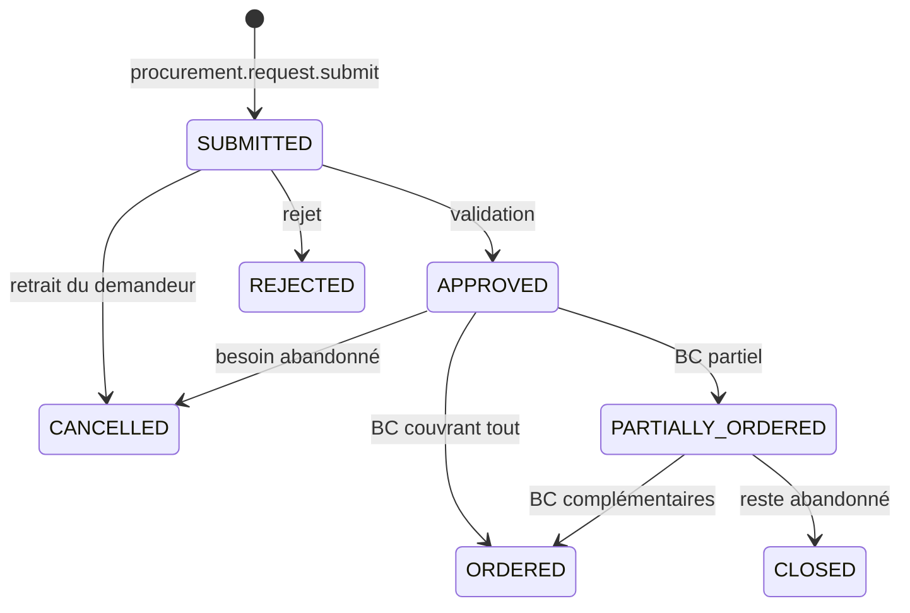
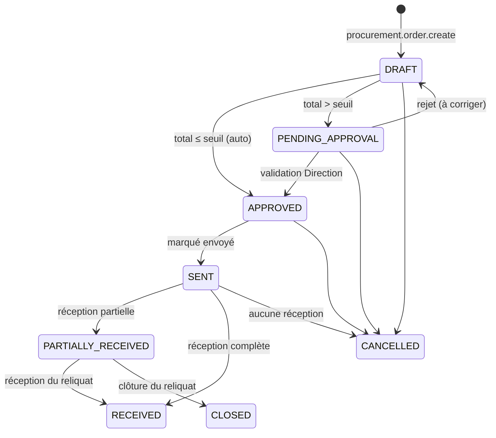
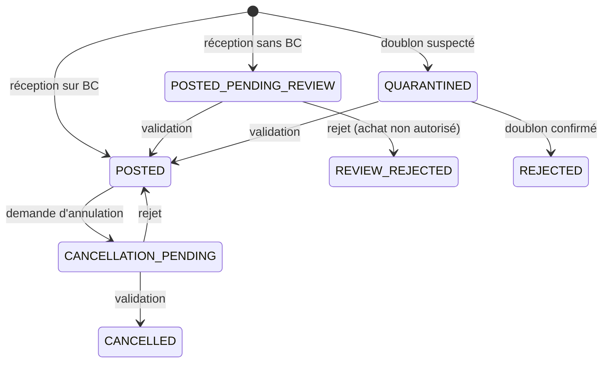
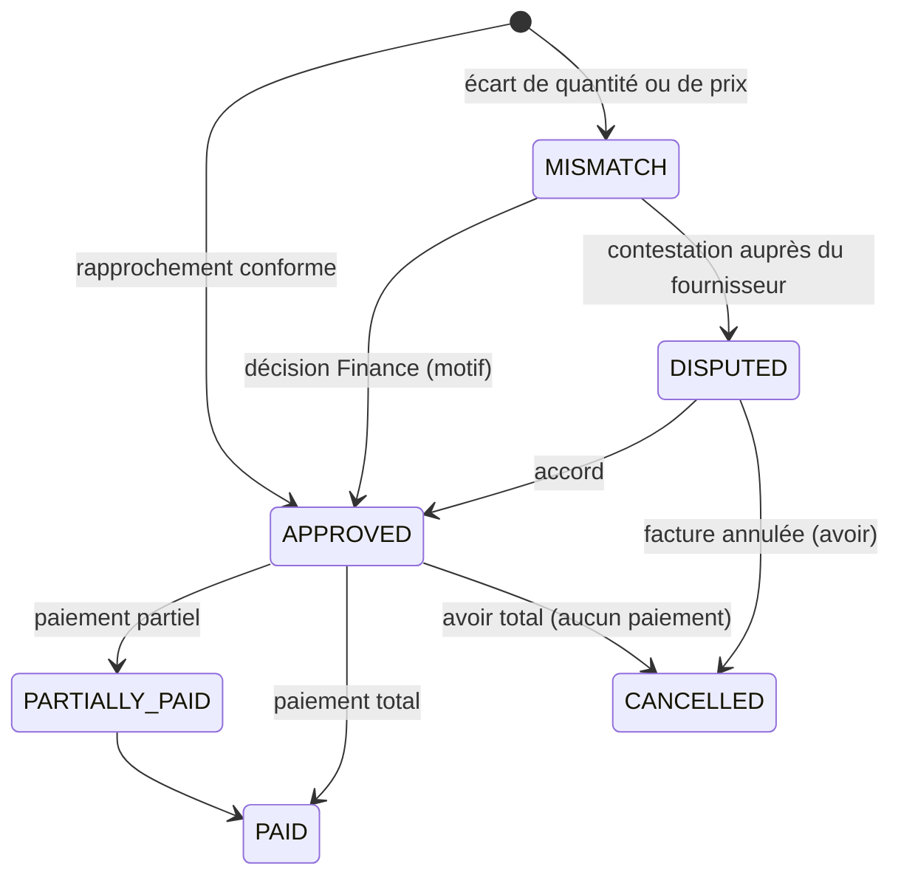
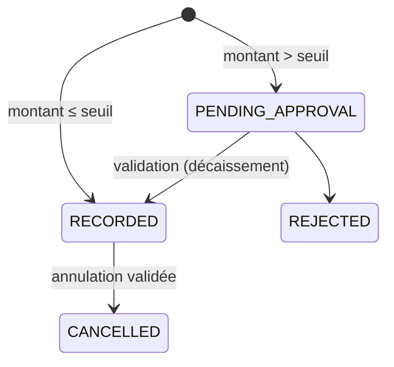
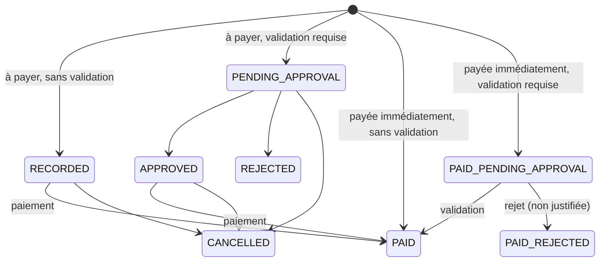

# Machines à états — Achats et finance

## SM-PURCHASE-REQUEST — Demande d'achat

| État initial | Action | Condition | Nouvel état | Effets métier | Effets stock | Effets finance | Permission |
|---|---|---|---|---|---|---|---|
| `[*]` | `procurement.request.submit` | ≥ 1 ligne ; produits achetables ; justification | `SUBMITTED` | Demande `PURCHASE_REQUEST` ; `PurchaseRequestSubmitted` | — | Montant estimé (informatif) | `procurement.request.create` |
| `SUBMITTED` | `approvals.request.approve` | Approbateur ≠ demandeur (AV-010) | `APPROVED` | `PurchaseRequestApproved` | — | — | `procurement.request.approve` |
| `SUBMITTED` | `approvals.request.reject` | Motif | `REJECTED` | `PurchaseRequestRejected` | — | — | `procurement.request.approve` |
| `SUBMITTED` | `procurement.request.cancel` | Demandeur | `CANCELLED` | `PurchaseRequestCancelled` | — | — | `procurement.request.create` |
| `APPROVED`, `PARTIALLY_ORDERED` | Création d'un BC référençant les lignes | Quantités ≤ reste à commander | `PARTIALLY_ORDERED` / `ORDERED` | Suivi des quantités commandées | — | — | `procurement.order.manage` |
| `APPROVED` | `procurement.request.cancel` | Motif | `CANCELLED` | — | — | — | `procurement.request.approve` |
| `PARTIALLY_ORDERED` | `procurement.request.close` | Motif | `CLOSED` | — | — | — | `procurement.request.approve` |

**Hors ligne** : la soumission et le retrait sont possibles ; les autres transitions sont en ligne.

---

## SM-PURCHASE-ORDER — Bon de commande fournisseur

| État initial | Action | Condition | Nouvel état | Effets métier | Effets stock | Effets finance | Permission |
|---|---|---|---|---|---|---|---|
| `[*]` | `procurement.order.create` | Fournisseur actif ; lignes valides | `DRAFT` | `PurchaseOrderCreated` | — | — | `procurement.order.manage` |
| `DRAFT` | `procurement.order.submit` | Total ≤ seuil (AV-051) | `APPROVED` | `PurchaseOrderApproved` | — | Engagement (hors dette) | `procurement.order.manage` |
| `DRAFT` | `procurement.order.submit` | Total > seuil | `PENDING_APPROVAL` | Demande `PURCHASE_ORDER` | — | — | `procurement.order.manage` |
| `PENDING_APPROVAL` | `approvals.request.approve` | Approbateur ≠ créateur | `APPROVED` | `PurchaseOrderApproved` | — | Engagement | `procurement.order.approve` |
| `PENDING_APPROVAL` | `approvals.request.reject` | Motif | `DRAFT` | Tracé | — | — | `procurement.order.approve` |
| `APPROVED` | `procurement.order.mark_sent` | — | `SENT` | Date d'envoi ; `PurchaseOrderSent` ; téléchargé par les réceptionnaires du site | — | — | `procurement.order.manage` |
| `SENT`, `PARTIALLY_RECEIVED` | Réception (SM-RECEIPT) | Voir SM-RECEIPT | `PARTIALLY_RECEIVED` / `RECEIVED` | Reliquats | Entrées en stock | Base du rapprochement | `procurement.receipt.record` |
| `PARTIALLY_RECEIVED` | `procurement.order.close_remaining` | Motif | `CLOSED` | `PurchaseOrderClosed` | — | Engagement réduit | `procurement.order.manage` |
| `DRAFT`, `PENDING_APPROVAL`, `APPROVED`, `SENT` (sans réception) | `procurement.order.cancel` | Motif | `CANCELLED` | `PurchaseOrderCancelled` | — | Engagement annulé | `procurement.order.manage` |

**Hors ligne** : aucune transition (le BC est un document de bureau), à l'exception des réceptions.

---

## SM-RECEIPT — Réception de marchandises

| État initial | Action | Condition | Nouvel état | Effets métier | Effets stock | Effets finance | Permission |
|---|---|---|---|---|---|---|---|
| `[*]` | `procurement.receipt.record` (sur BC) | BR-APP-007 ; acceptation ≤ reliquat (en ligne) ; pas de doublon | `POSTED` | Reliquats ; alerte si rejet ou reliquat ; `GoodsReceived` | `PURCHASE_RECEIPT` `V_SUPPLIER` → emplacement, pour les quantités **acceptées** ; CMUP recalculé | Valeur d'entrée = accepté × prix du BC ; base du rapprochement | `procurement.receipt.record` |
| `[*]` | `procurement.receipt.record` (sans BC) | Fournisseur, prix déclaré, justificatif | `POSTED_PENDING_REVIEW` | Demande `RECEIPT_WITHOUT_PO` | Idem (le stock entre immédiatement, BR-APP-011) | Idem au prix déclaré | `procurement.receipt.record` |
| `[*]` | `procurement.receipt.record` | Doublon suspecté (BR-APP-012) | `QUARANTINED` | `GoodsReceiptQuarantined` ; demande `RECEIPT_QUARANTINE` | **Aucun** | Aucun | `procurement.receipt.record` |
| `POSTED_PENDING_REVIEW` | `approvals.request.approve` | — | `POSTED` | Tracé | — | — | `procurement.receipt_exception.approve` |
| `POSTED_PENDING_REVIEW` | `approvals.request.reject` | Motif | `REVIEW_REJECTED` | Alerte à la Direction : achat non autorisé ; le stock reste (fait physique) | — | — | `procurement.receipt_exception.approve` |
| `QUARANTINED` | `approvals.request.approve` | Réception distincte confirmée | `POSTED` | `GoodsReceived` | Entrées en stock appliquées | Valeur d'entrée | `procurement.receipt_exception.approve` |
| `QUARANTINED` | `approvals.request.reject` | Doublon confirmé | `REJECTED` | Tracé | Aucun | Aucun | `procurement.receipt_exception.approve` |
| `POSTED` | `procurement.receipt.request_cancellation` | Motif ; stock encore disponible | `CANCELLATION_PENDING` | Demande `RECEIPT_CANCELLATION` | — | — | `procurement.receipt.record` |
| `CANCELLATION_PENDING` | `approvals.request.approve` | Stock encore disponible | `CANCELLED` | `GoodsReceiptCancelled` ; reliquats rétablis | Mouvements inverses (même coût) | Valeur annulée ; rapprochement mis à jour | `procurement.receipt.cancel` |
| `CANCELLATION_PENDING` | `approvals.request.reject` | — | `POSTED` | Tracé | — | — | `procurement.receipt.cancel` |

**Hors ligne** : l'enregistrement est possible hors ligne. La mise en quarantaine est décidée par le serveur à l'application.

---

## SM-SUPPLIER-INVOICE — Facture fournisseur

| État initial | Action | Condition | Nouvel état | Effets métier | Effets stock | Effets finance | Permission |
|---|---|---|---|---|---|---|---|
| `[*]` | `finance.supplier_invoice.record` | Référence unique par fournisseur ; rapprochement conforme (BR-FIN-031) | `APPROVED` | `SupplierInvoiceRecorded`, `SupplierInvoiceApproved` ; quantités facturées des lignes de BC | — | Dette fournisseur | `finance.supplier_invoice.record` |
| `[*]` | idem | Écart | `MISMATCH` | `SupplierInvoiceMismatchDetected` ; demande `INVOICE_MISMATCH` | — | Pas encore de dette | `finance.supplier_invoice.record` |
| `MISMATCH` | `approvals.request.approve` | Motif | `APPROVED` | Tracé | — | Dette = montant facturé | `finance.supplier_invoice.approve` |
| `MISMATCH` | `finance.supplier_invoice.dispute` | — | `DISPUTED` | — | — | — | `finance.supplier_invoice.approve` |
| `DISPUTED` | `finance.supplier_invoice.approve` / `cancel` | — | `APPROVED` / `CANCELLED` | — | — | Dette / aucune | `finance.supplier_invoice.approve` |
| `APPROVED` | Affectation de paiement | ≤ reste dû | `PARTIALLY_PAID` / `PAID` | — | — | Dette réduite | `finance.supplier_payment.record` |
| `APPROVED` | `finance.supplier_invoice.cancel` | Aucun paiement ; motif (avoir) | `CANCELLED` | — | — | Dette annulée | `finance.supplier_invoice.approve` |

**Hors ligne** : aucune transition.

---

## SM-SUPPLIER-PAYMENT — Paiement fournisseur

| État initial | Action | Condition | Nouvel état | Effets métier | Effets stock | Effets finance | Permission |
|---|---|---|---|---|---|---|---|
| `[*]` | `finance.supplier_payment.record` | ≤ seuil ; compte solvable (en ligne) | `RECORDED` | `SupplierPaymentRecorded` | — | Mouvement de trésorerie `OUT` ; affectations aux factures | `finance.supplier_payment.record` |
| `[*]` | idem | > seuil (BR-FIN-033) | `PENDING_APPROVAL` | Demande `SUPPLIER_PAYMENT` | — | Aucun décaissement | `finance.supplier_payment.record` |
| `PENDING_APPROVAL` | `approvals.request.approve` | Approbateur ≠ saisisseur | `RECORDED` | Tracé | — | Décaissement et affectations | `finance.supplier_payment.approve` |
| `PENDING_APPROVAL` | `approvals.request.reject` | — | `REJECTED` | — | — | Aucun | `finance.supplier_payment.approve` |
| `RECORDED` | `finance.supplier_payment.cancel` + validation | Motif (erreur, rejet bancaire) | `CANCELLED` | Tracé | — | Mouvement inverse ; affectations désactivées | `finance.supplier_payment.approve` |

**Hors ligne** : aucune transition.

---

## SM-EXPENSE — Dépense

| État initial | Action | Condition | Nouvel état | Effets métier | Effets stock | Effets finance | Permission |
|---|---|---|---|---|---|---|---|
| `[*]` | `finance.expense.record` (à payer) | Catégorie autorisée ; justificatif selon politique | `RECORDED` ou `PENDING_APPROVAL` | `ExpenseRecorded` ; demande `EXPENSE` si requise | — | Écriture de coût si objet de coût et pas de validation | `finance.expense.record` |
| `[*]` | `finance.expense.record` (payée immédiatement) | Compte de trésorerie de l'utilisateur ; solde suffisant en ligne | `PAID` ou `PAID_PENDING_APPROVAL` | `ExpenseRecorded`, `ExpensePaid` | — | Mouvement `EXPENSE` `OUT` immédiat (fait accompli) ; écriture de coût si pas de validation | `finance.expense.record` |
| `PENDING_APPROVAL` | `approvals.request.approve` / `reject` | Approbateur ≠ déclarant | `APPROVED` / `REJECTED` | `ExpenseApproved` / `ExpenseRejected` | — | Écriture de coût à l'approbation | `finance.expense.approve` |
| `RECORDED`, `APPROVED` | `finance.expense.pay` | Compte solvable | `PAID` | `ExpensePaid` | — | Mouvement `EXPENSE` `OUT` | `finance.expense.pay` |
| `PAID_PENDING_APPROVAL` | `approvals.request.approve` | — | `PAID` | `ExpenseApproved` | — | Écriture de coût | `finance.expense.approve` |
| `PAID_PENDING_APPROVAL` | `approvals.request.reject` | Motif | `PAID_REJECTED` | Reclassement `NON_JUSTIFIEE`, imputation au déclarant (BR-FIN-022) ; alerte | — | Le décaissement reste ; pas d'écriture de coût sur l'objet demandé | `finance.expense.approve` |
| `RECORDED`, `PENDING_APPROVAL`, `APPROVED` | `finance.expense.cancel` | Non payée | `CANCELLED` | — | — | Écriture de coût inverse si elle existait | `finance.expense.record` (auteur) / `finance.expense.approve` |

**Hors ligne** : l'enregistrement (payé ou non) est possible ; les validations et paiements différés sont en ligne.
