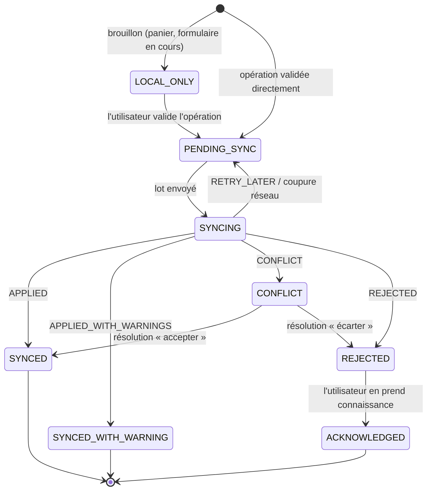
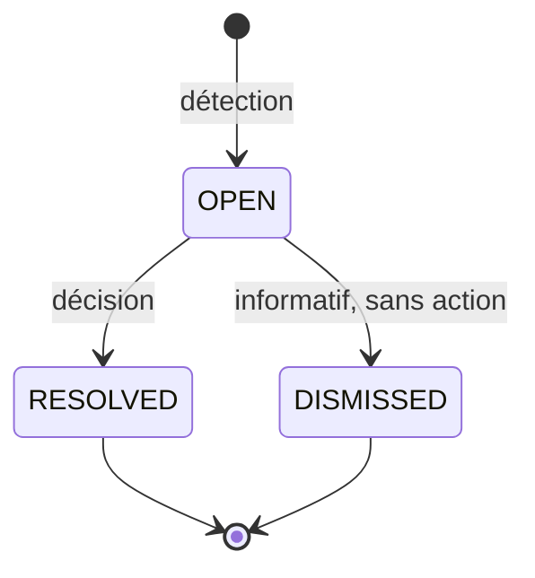
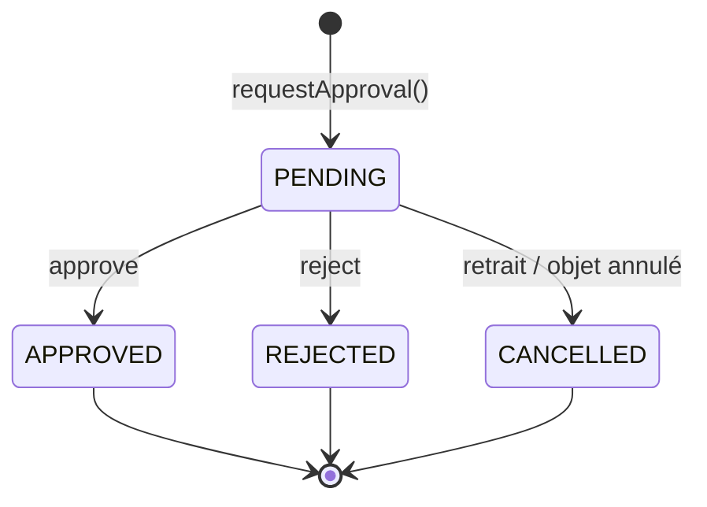
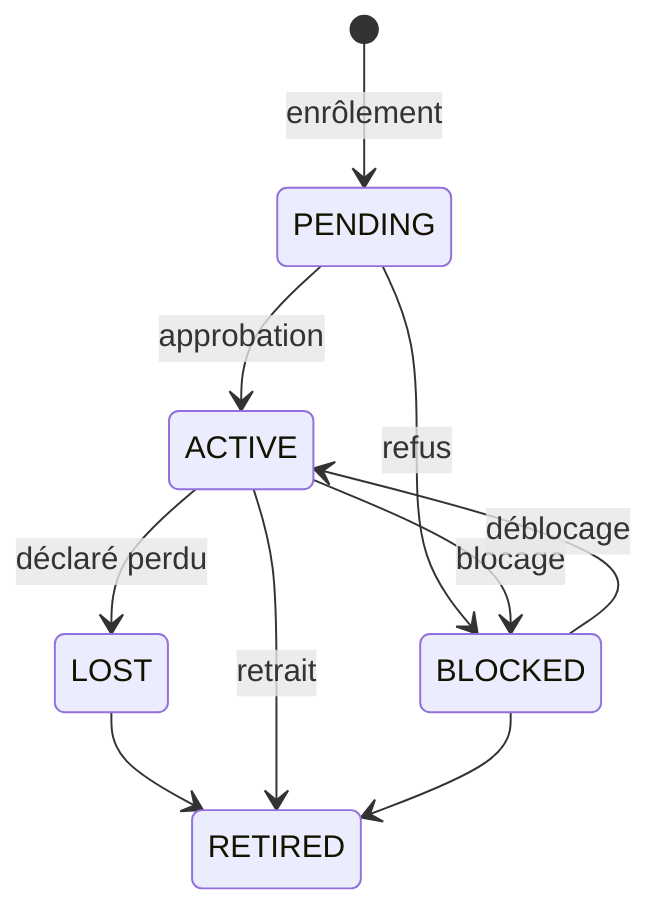
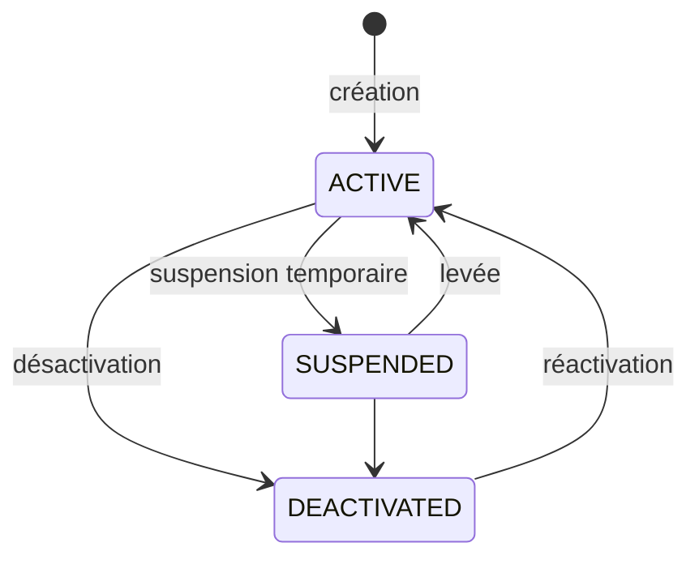
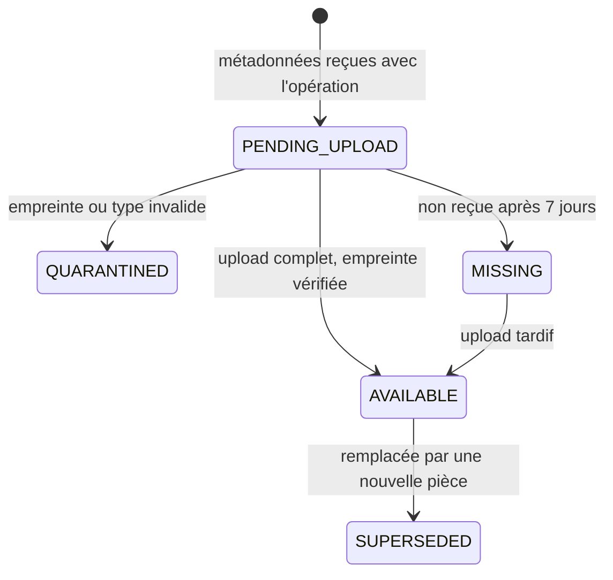
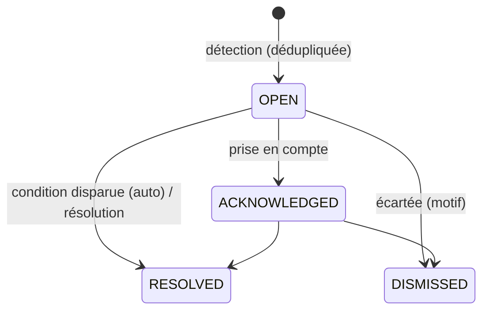
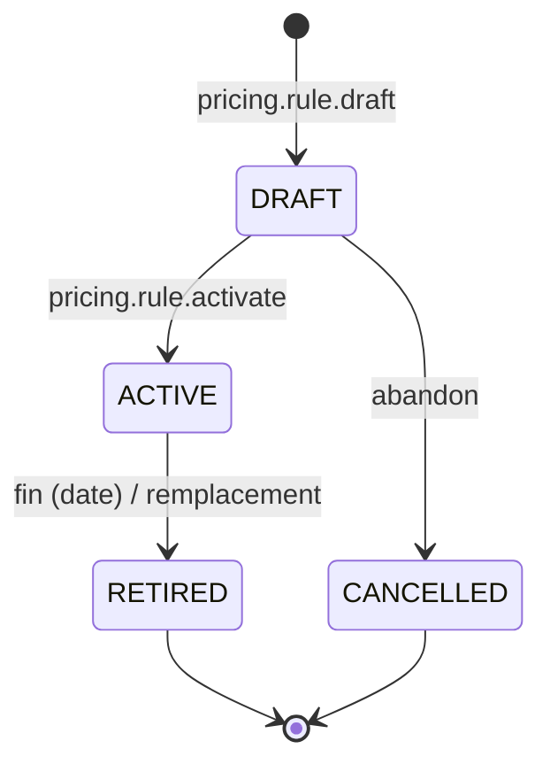
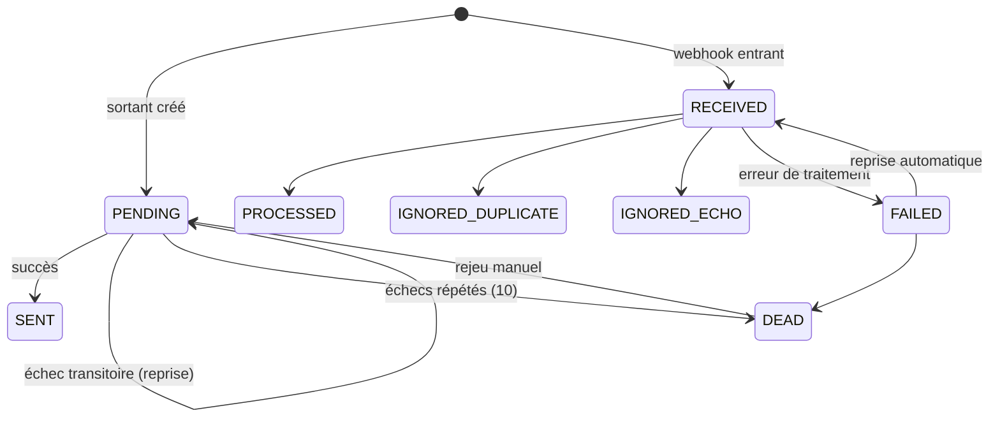

# Machines à états — Transverses

## SM-SYNC-COMMAND — Commande de synchronisation (appareil et serveur)

### Côté appareil (outbox)

| État initial | Action | Condition | Nouvel état | Effets métier | Effets stock | Effets finance | Permission |
|---|---|---|---|---|---|---|---|
| `[*]` / `LOCAL_ONLY` | Validation de l'opération par l'utilisateur | Validations locales passées | `PENDING_SYNC` | `command_id`, `device_seq`, `occurred_at` attribués ; effets locaux appliqués (projection locale) | Solde local et allocation locale mis à jour | Solde local de caisse mis à jour | Permission de l'opération (contrôle local) |
| `PENDING_SYNC` | Envoi du lot | Réseau disponible ; session valide ; dépendances envoyées | `SYNCING` | — | — | — | — |
| `SYNCING` | Réponse `APPLIED` | — | `SYNCED` | Numéro officiel et identifiants serveur enregistrés localement | Projection locale remplacée par les données serveur au prochain téléchargement | — | — |
| `SYNCING` | Réponse `APPLIED_WITH_WARNINGS` | — | `SYNCED_WITH_WARNING` | Avertissement affiché (ex. prix obsolète, stock négatif) | — | — | — |
| `SYNCING` | Réponse `CONFLICT` | — | `CONFLICT` | Effets locaux **annulés** ; message clair ; l'opération reste visible (BR-SYN-009) | Solde local rétabli | Solde local rétabli | — |
| `SYNCING` | Réponse `REJECTED` | — | `REJECTED` | Effets locaux annulés ; motif ; action proposée | Solde local rétabli | Solde local rétabli | — |
| `SYNCING` | `RETRY_LATER`, délai dépassé, coupure | — | `PENDING_SYNC` | Compteur de tentatives ; prochaine tentative calculée (attente progressive) | — | — | — |
| `CONFLICT` | Résolution serveur reçue par téléchargement | — | `SYNCED` / `REJECTED` | Effets serveur reflétés | — | — | — |
| `REJECTED` | Prise de connaissance | — | `ACKNOWLEDGED` | Archivé localement 30 jours | — | — | — |

### Côté serveur (inbox)

| État initial | Action | Condition | Nouvel état | Effets |
|---|---|---|---|---|
| `[*]` | Réception | `command_id` inconnu | `RECEIVED` | Empreinte, écart d'horloge, séquence enregistrés |
| `[*]` | Réception | `command_id` connu, même empreinte | (inchangé) | Résultat enregistré renvoyé |
| `[*]` | Réception | `command_id` connu, empreinte différente | `REJECTED` (`COMMAND_ID_REUSED`) | Alerte de sécurité |
| `RECEIVED` | Application réussie | — | `APPLIED` / `APPLIED_WITH_WARNINGS` | Transaction métier + audit + événements + flux de changements |
| `RECEIVED` | Refus | Invalide, non autorisé, dépendance rejetée | `REJECTED` | Audit `DENIED` / `FAILED` |
| `RECEIVED` | Quarantaine | Version obsolète non fusionnable ; utilisateur ou appareil révoqué à `occurred_at` | `CONFLICT` | `sync_conflicts` ouvert |
| `RECEIVED` | Erreur transitoire | Verrou, indisponibilité | `FAILED_RETRYABLE` | Réponse `RETRY_LATER` |
| `CONFLICT` | `sync.conflict.resolve` (accepter) | Décision tracée | `APPLIED` | Application avec l'état courant |
| `CONFLICT` | `sync.conflict.resolve` (écarter) | Décision tracée | `REJECTED` | — |

---

## SM-CONFLICT — Conflit de synchronisation

| État initial | Action | Condition | Nouvel état | Effets métier | Effets stock | Effets finance | Permission |
|---|---|---|---|---|---|---|---|
| `[*]` | Détection (application d'une commande) | Type de conflit de la matrice | `OPEN` | `SyncConflictDetected` ; alerte au rôle responsable | Selon le type (ex. solde négatif déjà appliqué) | Selon le type | `system` |
| `OPEN` | `sync.conflict.resolve` | Décision parmi `ACCEPT_CLIENT`, `KEEP_SERVER`, `MERGE`, `COMPENSATE` ; motif | `RESOLVED` | `SyncConflictResolved` ; commande en conflit appliquée ou rejetée ; documents compensatoires créés si `COMPENSATE` (ex. inventaire, transfert manquant) | Selon la décision | Selon la décision | `sync.conflict.resolve` (portée du domaine) |
| `OPEN` | `sync.conflict.dismiss` | Conflit informatif (ex. `PRICE_MISMATCH` accepté) | `DISMISSED` | Tracé | — | — | `sync.conflict.resolve` |

---

## SM-APPROVAL — Demande de validation

| État initial | Action | Condition | Nouvel état | Effets métier | Effets stock | Effets finance | Permission |
|---|---|---|---|---|---|---|---|
| `[*]` | API interne `approvals.requestApproval` (dans la transaction du document) | Politique applicable | `PENDING` | Version de politique figée ; routage vers les approbateurs du périmètre ; `ApprovalRequested` | — | — | `system` |
| `PENDING` | `approvals.request.approve` | Approbateur autorisé ; ≠ demandeur (sauf `SELF_APPROVED` Direction) ; pièces requises reçues | `APPROVED` | `ApprovalGranted` → le module demandeur exécute la transition de son document (dans la même transaction, via son API) | Selon le document | Selon le document | Permission `*.approve` du type |
| `PENDING` | `approvals.request.reject` | Motif obligatoire ; décision choisie parmi les issues du type (ex. AV-038) | `REJECTED` | `ApprovalRejected` → transition du document | Selon le document | Selon le document | idem |
| `PENDING` | Retrait du demandeur, ou annulation du document | — | `CANCELLED` | `ApprovalCancelled` | — | — | Demandeur / `system` |
| `PENDING` | Délai de 24 h dépassé | — | `PENDING` (escaladée) | `AlertEscalated` vers le niveau supérieur | — | — | `system` |

**Hors ligne** : aucune décision hors ligne (l'approbateur doit voir l'état à jour).

---

## SM-DEVICE — Appareil

| État initial | Action | Condition | Nouvel état | Effets métier | Effets stock | Effets finance | Permission |
|---|---|---|---|---|---|---|---|
| `[*]` | Première connexion (`/auth/login` avec empreinte d'appareil) | Utilisateur actif | `PENDING` | Code court attribué ; `DeviceEnrollmentRequested` | — | — | Tout utilisateur |
| `PENDING` | `identity.device.approve` | — | `ACTIVE` | `DeviceApproved` ; l'appareil peut pousser des commandes | — | — | `identity.device.approve` |
| `ACTIVE`, `PENDING` | `identity.device.block` | Motif | `BLOCKED` | Sessions révoquées ; commandes postérieures en quarantaine (BR-ADM-006) ; `DeviceBlocked` | Allocations marquées `REVOCATION_PENDING` | — | `identity.device.block` |
| `BLOCKED` | `identity.device.unblock` | — | `ACTIVE` | Tracé | — | — | `identity.device.block` |
| `ACTIVE` | `identity.device.declare_lost` | — | `LOST` | Comme le blocage ; `DeviceDeclaredLost` ; inventaire recommandé des stocks du détenteur | Idem | Caisse utilisateur à contrôler | `identity.device.block` |
| `ACTIVE`, `BLOCKED`, `LOST` | `identity.device.retire` | Outbox vide confirmée, ou décision explicite | `RETIRED` | Code court jamais réattribué | — | — | `identity.device.block` |

---

## SM-USER — Utilisateur

| État initial | Action | Condition | Nouvel état | Effets métier | Effets stock | Effets finance | Permission |
|---|---|---|---|---|---|---|---|
| `[*]` | `identity.user.create` | BR-ADM-001 | `ACTIVE` | `UserCreated` ; emplacement `MOBILE` et caisse utilisateur créés si le rôle l'exige | — | — | `identity.user.manage` |
| `ACTIVE` | `identity.user.suspend` | Motif ; pas le dernier Admin | `SUSPENDED` | Sessions révoquées ; les commandes postérieures à la suspension sont mises en quarantaine | — | — | `identity.user.manage` |
| `SUSPENDED` | `identity.user.reactivate` | — | `ACTIVE` | — | — | — | `identity.user.manage` |
| `ACTIVE`, `SUSPENDED` | `identity.user.deactivate` | Motif ; pas le dernier Admin | `DEACTIVATED` | `UserDeactivated` ; alertes : portefeuille, stock mobile et caisse à régulariser | Stock mobile à retransférer (humain) | Caisse utilisateur à remettre (humain) | `identity.user.manage` |
| `DEACTIVATED` | `identity.user.reactivate` | — | `ACTIVE` | `UserReactivated` | — | — | `identity.user.manage` |

---

## SM-ATTACHMENT — Pièce justificative

| État initial | Action | Condition | Nouvel état | Effets métier | Effets stock | Effets finance | Permission |
|---|---|---|---|---|---|---|---|
| `[*]` | `attachments.attachment.register` (dans l'opération) | Type et taille déclarés valides | `PENDING_UPLOAD` | `AttachmentRegistered` | — | — | Permission de l'opération |
| `PENDING_UPLOAD` | Upload (morceaux) terminé | SHA-256 conforme ; type MIME conforme | `AVAILABLE` | `AttachmentUploaded` ; débloque la validation qui l'attendait (BR-ADM-020) | — | — | Auteur |
| `PENDING_UPLOAD` | Upload terminé | Empreinte ou type non conforme | `QUARANTINED` | `AttachmentUploadFailed` ; nouvel essai demandé | — | — | `system` |
| `PENDING_UPLOAD` | Délai de 7 jours | — | `MISSING` | Alerte `ATTACHMENT_MISSING` | — | — | `system` |
| `AVAILABLE` | Remplacement | Nouvelle pièce `AVAILABLE` | `SUPERSEDED` | L'ancienne reste consultable | — | — | Auteur ou responsable |

---

## SM-ALERT — Alerte

| État initial | Action | Condition | Nouvel état | Effets métier | Effets stock | Effets finance | Permission |
|---|---|---|---|---|---|---|---|
| `[*]` | Détection | Aucune alerte ouverte pour (type, objet) | `OPEN` | Notifications selon la gravité ; `AlertRaised` | — | — | `system` |
| `OPEN`, `ACKNOWLEDGED` | Nouvelle occurrence | Même (type, objet) | inchangé | Compteur et dernière occurrence mis à jour | — | — | `system` |
| `OPEN` | `communication.alert.acknowledge` | Destinataire | `ACKNOWLEDGED` | Escalade stoppée ; `AlertAcknowledged` | — | — | `comm.alert.manage` |
| `OPEN`, `ACKNOWLEDGED` | Condition disparue (alerte d'état) | — | `RESOLVED` | `AlertResolved` | — | — | `system` |
| `OPEN`, `ACKNOWLEDGED` | `communication.alert.resolve` | Commentaire (alerte d'événement) | `RESOLVED` | `AlertResolved` | — | — | `comm.alert.manage` |
| `OPEN`, `ACKNOWLEDGED` | `communication.alert.dismiss` | Motif | `DISMISSED` | Tracé | — | — | `comm.alert.manage` |

---

## SM-PRICE-RULE — Règle tarifaire

« En vigueur » n'est pas un état : c'est la condition `status = ACTIVE ∧ valid_from ≤ t < valid_to`.

| État initial | Action | Condition | Nouvel état | Effets métier | Effets stock | Effets finance | Permission |
|---|---|---|---|---|---|---|---|
| `[*]` | `pricing.rule.draft` | BR-PRX-001 | `DRAFT` | `PriceRuleDrafted` | — | — | `pricing.rule.draft` |
| `DRAFT` | `pricing.rule.activate` | Pas de conflit (BR-PRX-006) ; `valid_from` non rétroactif | `ACTIVE` | Règle remplacée : `valid_to` fixé ; téléchargement vers les appareils ; note optionnelle ; `PriceRuleActivated` (+ `PriceRuleSuperseded`) | — | Prix futurs des ventes | `pricing.rule.activate` |
| `DRAFT` | `pricing.rule.cancel` | — | `CANCELLED` | — | — | — | `pricing.rule.draft` |
| `ACTIVE` | `pricing.rule.end` | Nouvelle `valid_to` ≥ maintenant | `ACTIVE` puis `RETIRED` à échéance (tâche planifiée) | `PriceRuleEnded` | — | — | `pricing.rule.activate` |
| `ACTIVE` | Remplacement par une nouvelle règle activée | — | `RETIRED` à la date de fin | `PriceRuleSuperseded` | — | — | `system` |

---

## SM-INTEGRATION-MESSAGE — Message d'intégration (Kommo)

| État initial | Action | Condition | Nouvel état | Effets métier | Effets stock | Effets finance | Permission |
|---|---|---|---|---|---|---|---|
| `[*]` | Événement GIC consommé par l'intégration | Entité liée à Kommo | `PENDING` | Clé d'idempotence | — | — | `system` |
| `PENDING` | Appel Kommo réussi | — | `SENT` | Empreinte échangée mémorisée | — | — | `system` |
| `PENDING` | Échec | Tentatives < 10 | `PENDING` | Prochaine tentative : 30 s × 2^n, plafond 1 h | — | — | `system` |
| `PENDING` | Échec | Tentatives = 10 | `DEAD` | Alerte `KOMMO_SYNC_FAILED` | — | — | `system` |
| `DEAD` | `integrations.kommo.replay` | — | `PENDING` | Tracé | — | — | `integrations.kommo.manage` |
| `[*]` | Webhook reçu et authentifié | — | `RECEIVED` | Charge brute journalisée | — | — | `system` |
| `RECEIVED` | Traitement | Clé déjà traitée | `IGNORED_DUPLICATE` | — | — | — | `system` |
| `RECEIVED` | Traitement | Empreinte = dernière empreinte envoyée par GIC | `IGNORED_ECHO` | — | — | — | `system` |
| `RECEIVED` | Traitement | Succès | `PROCESSED` | Création ou mise à jour selon BR-KOM-002 et 003 | — | — | `system` |
