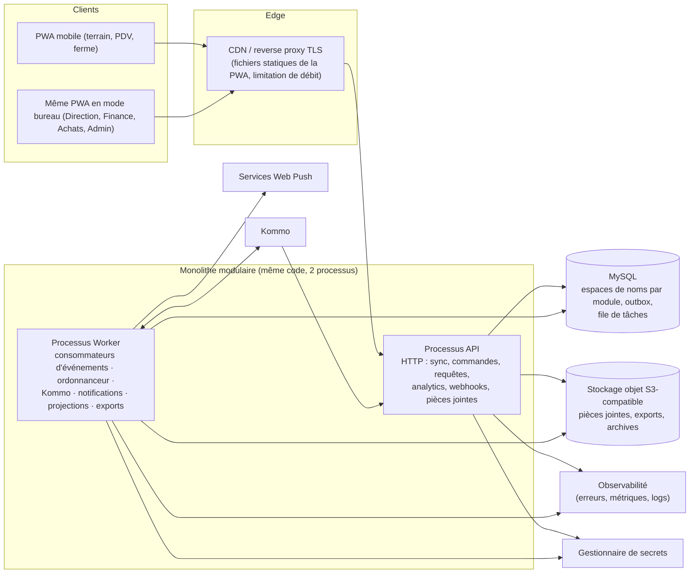
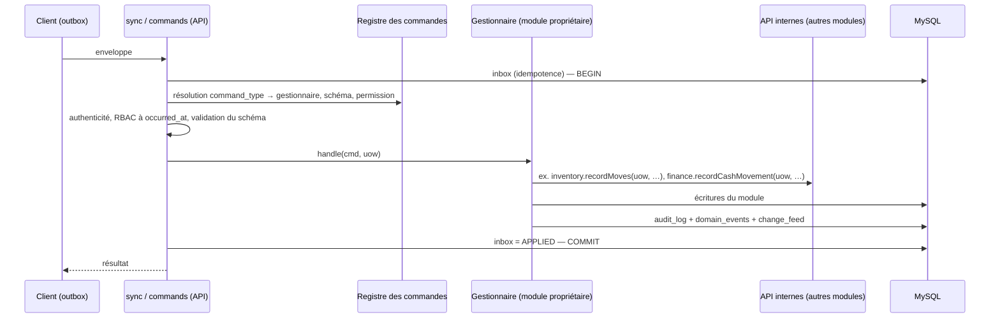

# Architecture logicielle (Livrable n°11)

> Section 25 du format final (PM §48). Rédigée **après** le modèle métier et relationnel (PM §34). Décision : ADR-011. La stack concrète est recommandée à la fin, dans [`05-stack.md`](05-stack.md) (PM §46).

---

## 1. Options évaluées

| Option | Avantages | Inconvénients pour GIC AGROPELC | Verdict |
|---|---|---|---|
| **Microservices** (un service par domaine) | Déploiements indépendants, mise à l'échelle fine | Transactions distribuées : une vente touche le stock, la caisse, les créances et le CRM ; il faudrait des sagas partout pour ce qui est ici **une** transaction ACID. Exploitation lourde pour une petite équipe (AV-084). Aucun besoin de mise à l'échelle indépendante (H-06). | **Écarté** (PM §34) |
| **Monolithe non structuré** | Démarrage rapide | Couplage libre : tout module écrit dans toutes les tables. Contraire à la source de vérité unique (CM §59) et à l'évolutivité | **Écarté** |
| **Monolithe modulaire** (un déployable, des modules à frontières strictes) | Transactions ACID locales pour les invariants critiques ; simplicité d'exploitation ; frontières explicites (schémas, API internes, règles d'import) ; extraction future d'un module possible | Discipline nécessaire (contrôles automatiques de dépendances) | **Retenu** |
| **BFF** (backend dédié à la PWA) | API taillée pour l'écran | Inutile : l'API de synchronisation **est** déjà le contrat de la PWA ; un seul client principal | Non retenu (pas de couche supplémentaire) |

## 2. Vue des composants



| Composant | Rôle | Choix d'architecture |
|---|---|---|
| **API** | Point d'entrée HTTP ; gestionnaires de commandes ; requêtes ; synchronisation | Sans état (mise à l'échelle horizontale possible) ; une transaction par commande |
| **Worker** | Traitements asynchrones | Même code et mêmes modules que l'API, démarré en mode worker ; plusieurs instances possibles (verrous `SKIP LOCKED`) |
| **File de messages** | Événements métier, tâches différées | **MySQL** (ADR-023) : outbox `platform.domain_events` + table de tâches maison consommée avec `SELECT … FOR UPDATE SKIP LOCKED`. Pas de RabbitMQ, Kafka ni Redis au MVP : un seul système de persistance, et des transactions qui couvrent l'écriture métier et la publication |
| **Ordonnanceur** | Tâches planifiées : clôtures à 23:59, alertes quotidiennes, créances échues, vérification de l'audit, instantanés, purges | Intégré au worker ; chaque tâche prend un verrou consultatif pour ne s'exécuter qu'une fois ; horaires en `Africa/Douala` |
| **Stockage de fichiers** | Photos, justificatifs, exports, archives d'audit | Stockage objet S3-compatible, privé ; URL signées ; verrou d'objet pour les ancres d'audit |
| **Cache** | Droits effectifs, référentiels chauds | En mémoire du processus, avec invalidation par événement ; pas de cache distribué au MVP. Redis seulement si plusieurs instances d'API rendent l'invalidation coûteuse (seuil de revue) |
| **Notifications** | In-app (table) ; Web Push (VAPID) | Envoi par le worker ; regroupement anti-tempête (D13 §14) |
| **Intégrations** | Kommo | Adaptateur dans le module `integrations`, exécuté par le worker ; webhooks reçus par l'API puis traités par le worker |
| **Analytics** | Tableaux de bord, explorateur | Voir §6 |

## 3. Structure interne d'un module

```text
module/
  api/            adaptateurs HTTP (requêtes), déclaration des commandes du module
  application/    gestionnaires de commandes, services de requête, gestionnaires d'événements,
                  API interne publique du module (interfaces appelées par les autres modules)
  domain/         entités, règles, états (en grande partie dans la bibliothèque partagée)
  infrastructure/ dépôts SQL (schéma du module uniquement), adaptateurs externes
```

Règles :

1. Un module n'importe **que** l'API publique (`application/public`) des modules dont il dépend (graphe [`03-graphe-dependances.md`](03-graphe-dependances.md)). Aucun accès aux dépôts, tables ou modèles internes d'un autre module. Règle vérifiée automatiquement en CI (analyse des imports) et au niveau base : un rôle de base par module, avec écriture sur son seul schéma.
2. Un gestionnaire de commande ouvre **l'unité de travail** (transaction). Les API internes des modules appelés participent à la même transaction : l'unité de travail est passée explicitement.
3. Les réactions asynchrones passent par les événements ; les effets indispensables à la cohérence restent synchrones (catalogue d'événements §1).
4. Les validations et calculs métier réutilisables hors ligne vivent dans la **bibliothèque partagée** (`packages/domain`) : schémas de commandes, moteur de prix, évaluation des politiques, calculs de disponibilité et d'allocation, conversions d'unités, arrondis. Le serveur et la PWA exécutent **le même code** (ADR-021).
5. Les décisions de validation sont exécutées de manière synchrone : chaque module enregistre auprès d'`approvals` un gestionnaire pour ses types d'opération. `approvals` l'appelle dans la transaction de la décision (inversion de dépendance, ADR-018).

## 4. Traitement d'une commande



## 5. Frontières transactionnelles (exemples)

| Commande | Écritures dans la **même** transaction |
|---|---|
| `sales.sale.record` | `sales.sales`, `sale_lines`, `customer_payments`, `payment_allocations` ; `inventory.stock_moves`, `stock_balances`, `stock_allocation_entries` ; `finance.cash_movements` ; `crm.customers` (conversion, dernière vente) ; `audit_log`, `domain_events`, `change_feed`, `command_inbox` |
| `procurement.receipt.record` | `goods_receipts`, lignes ; `inventory.stock_moves`, `stock_balances`, `product_valuations`, `stock_lots` ; `purchase_order_lines` (reliquats) ; audit, événements, flux |
| `production.mortality.record` | `inventory.loss_declarations`, `stock_moves` (ou `V_PENDING_LOSS`), `stock_balances` ; `approvals.approval_requests` (si requis) ; audit, événements, flux |
| `approvals.request.approve` (perte) | `approval_requests` ; `inventory.loss_declarations` (statut), `stock_moves` (confirmation) ; audit, événements |

## 6. Stratégie analytique

| Palier | Déclencheur | Mise en œuvre |
|---|---|---|
| **P1 (MVP)** | Volumétrie H-06 | Vues SQL `analytics.f_*` sur les tables transactionnelles, avec index dédiés (`business_date`, dimensions) ; RLS ; tableaux de bord servis par des requêtes agrégées sur 1 à 90 jours ; instantanés personnels (`kpi_snapshots`) calculés par le worker toutes les 15 min |
| **P2** | p95 des tableaux de bord > 3 s, ou > 20 millions de lignes de faits | Tables d'agrégats journaliers (`analytics.agg_daily_*`) maintenues de façon incrémentale par le worker à partir des événements et des mouvements, avec recalcul du jour J et J−7 pour absorber les opérations tardives |
| **P3** | Charge analytique qui gêne l'OLTP | Réplique en lecture MySQL dédiée aux requêtes analytiques et aux exports (si l'offre Hostinger le permet, sinon fournisseur managé dédié) |
| **P4** (hors horizon) | Besoins de BI avancée | Export vers un entrepôt externe |

Les agrégats sont **recalculables** et n'ont jamais valeur de vérité (catégorie `PROJ`).

## 7. Préoccupations transverses

| Préoccupation | Solution |
|---|---|
| Temps | Service d'horloge injecté (tests déterministes) ; `occurred_at` fourni par l'appareil ; calculs de jour métier en `Africa/Douala` |
| Identifiants | Générateur UUIDv7 partagé (serveur et appareil) |
| Argent et quantités | Types dédiés de la bibliothèque partagée (entiers XAF ; quantités décimales à 3 chiffres ; arrondis centralisés) |
| Erreurs | Catalogue de codes stables (API §2) ; messages en français |
| Internationalisation | Clés de traduction dès le départ (AV-079) |
| Configuration | Paramètres métier en base (`system_settings`) ; paramètres techniques en variables d'environnement ; secrets dans le gestionnaire de secrets |
| Migrations | Scripts SQL versionnés, compatibles avec le déploiement « expand / contract » (voir déploiement) |

## 8. Évolutions prévues de l'architecture (sans les construire)

| Évolution | Seuil de déclenchement |
|---|---|
| Plusieurs instances d'API | Plus de 60 % de CPU soutenu, ou besoin de haute disponibilité |
| Cache distribué | Plusieurs instances + invalidations fréquentes des droits |
| Réplique en lecture | Palier analytique P3 |
| Extraction d'un module (ex. intégrations, analytics) | Charge ou rythme de livraison distincts, démontrés |
| Enveloppe native (Capacitor) | Besoin de GPS natif, de détection de faux GPS ou de synchronisation en arrière-plan fiable (F-18) |
