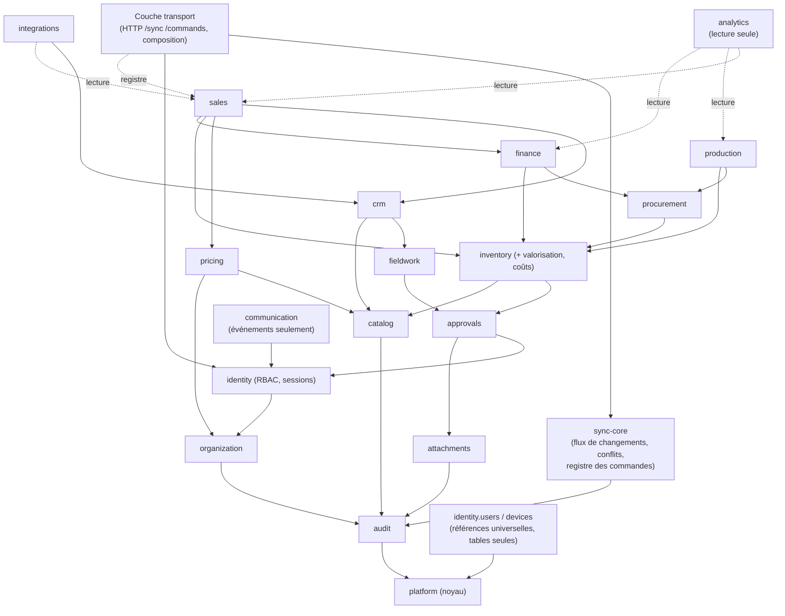

# Graphe de dépendances entre modules (Livrable n°16)

> Section 33 du format final (PM §48). Une flèche `A --> B` signifie « A appelle l'API publique de B, ou lit ses tables par clé étrangère ». Le graphe est **acyclique** ; il est vérifié automatiquement en CI (analyse des imports) et en base (droits par schéma).

---

## 1. Graphe

Pour la lisibilité, le diagramme omet les dépendances transitives vers `platform`, `audit`, `identity` (droits), `org`, `sync-core` (écriture du flux de changements) et les références universelles : **tout** module métier en dispose.

Notes :

1. **Références universelles** : `identity.users` et `identity.devices` sont référencées par clé étrangère depuis tous les schémas (`created_by`, détenteurs). Il n'y a aucun appel de code vers `identity` depuis les couches inférieures (modèle relationnel §3).
2. **`sync` en deux parties** : `sync-core` (bas niveau) offre `changeFeed.append`, `conflicts.open` et le **registre** où chaque module enregistre ses gestionnaires. La **couche transport** (HTTP `/sync`, `/commands`) répartit les commandes via ce registre : c'est une inversion de dépendance, donc `sync-core` ne dépend d'aucun module métier.
3. **`approvals`** exécute les décisions via des gestionnaires enregistrés par les modules (inversion ; ADR-018).
4. **`communication`** et **`integrations`** réagissent aux événements ; aucun module métier ne les appelle.
5. **`analytics`** lit via des vues publiées ; personne ne l'appelle, sauf la couche transport.

## 2. Niveaux (ordre de construction possible)

| Niveau | Modules | Prérequis |
|---|---|---|
| N0 | `platform` | — |
| N1 | `audit`, références `identity.users/devices`, `sync-core` | N0 |
| N2 | `organization`, `catalog`, `attachments` | N1 |
| N3 | `identity` (RBAC, sessions, appareils) | N2 (`organization`) |
| N4 | `approvals` | N3 |
| N5 | `fieldwork`, `inventory`, `pricing` | N4 (`pricing` : N2 seulement) |
| N6 | `crm` (dépend de `fieldwork`), `procurement` (dépend d'`inventory`) | N5 |
| N7 | `production`, `finance` | N6 |
| N8 | `sales` | N5, N6, N7 (`finance`) |
| N9 | `communication`, `integrations`, `analytics` | Événements et vues des niveaux inférieurs |

## 3. Modules bloquants et parallélisables

| Module | Bloquant pour | Parallélisable avec |
|---|---|---|
| `platform`, `audit`, `sync-core`, `identity`, `organization` | Tout | — (fondations, phase 0) |
| `catalog` | `pricing`, `inventory`, `crm`, `sales`, `procurement`, `production` | `attachments`, `approvals` |
| `approvals`, `attachments` | Pertes, validations, pièces (stock, finance, achats) | `catalog`, `pricing` |
| `inventory` | `procurement`, `production`, `finance` (coûts), `sales` | `crm` + `fieldwork` (**parallélisables** : ils ne dépendent pas d'`inventory`) |
| `pricing` | `sales` | `inventory`, `crm` |
| `crm`, `fieldwork` | `sales`, `integrations` | `inventory`, `pricing`, `procurement` |
| `finance` (trésorerie) | `sales` (encaissements) | `crm`, `production` |
| `procurement` | `production` (mise en place directe), `finance` (rapprochement) | `sales`, `crm` |
| `production` | — (aucun module métier ne dépend de lui) | `sales`, `finance` (fin) |
| `sales` | `integrations`, une grande partie d'`analytics` | `production`, `procurement` |
| `communication` | — | Tout, incrémentalement |
| `analytics` | — | Tout, incrémentalement |
| `integrations` | — | Après `crm` et `sales` |

Conséquence pour le plan de développement : après la phase 0, deux lignes peuvent avancer en parallèle si l'équipe compte au moins deux développeurs :

1. **stock → approvisionnement → production** ;
2. **CRM et pointage → ventes**.

La jonction se fait sur les **ventes**, qui ont besoin du stock, du CRM, de la tarification et de la trésorerie.
