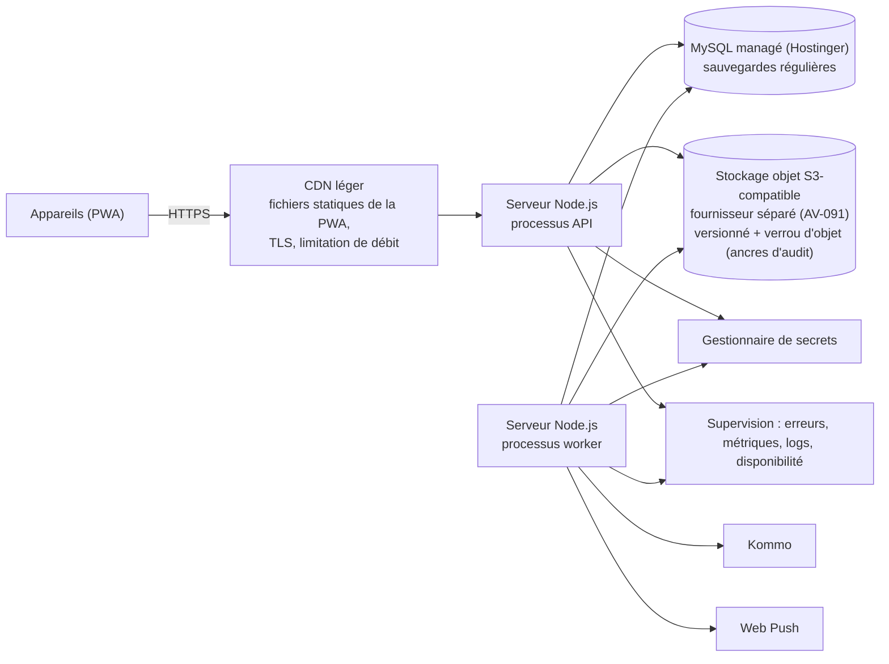

# Architecture de déploiement

> Section 31 du format final (PM §48). Contraintes : coût d'exploitation raisonnable, petite équipe (AV-084), réseau faible côté utilisateurs, hébergement **Hostinger, sans VPS** ([ADR-024](../decisions/ADR-024-hebergement-hostinger.md), AV-073 tranché). Domaine de production cible : `app.gic-agropelc.com`, toujours résolu par variable d'environnement, jamais codé en dur.
> **Aucun élément de ce chapitre ne bloque le développement de P0 à P3** : il est entièrement local et en CI (ADR-024 §5). Ce chapitre prépare la phase de déploiement, sans la déclencher.

---

## 1. Environnements

| Environnement | Usage | Données | Accès | URL de base |
|---|---|---|---|---|
| `dev` (local) | Développement | Jeu de données synthétique (fixtures) | Développeurs | `http://localhost:3000` (variable d'environnement locale) |
| `staging` (recette) | Tests E2E, recette utilisateur, répétition des migrations | Synthétiques ou anonymisées | Équipe, utilisateurs pilotes | À définir (AV-090) ; jamais codée en dur |
| `production` | Exploitation | Réelles | Utilisateurs ; support en lecture seule | `https://app.gic-agropelc.com` |

## 2. Topologie de production (cible MVP)

**Hostinger (ADR-024) héberge le calcul (processus API et worker) et la base MySQL.** Le stockage objet, la supervision, la gestion des secrets et le CDN restent des services indépendants — c'était déjà le cas avant ce recadrage, seul le fournisseur de calcul et de base change. La modalité exacte d'exécution des processus Node.js chez Hostinger sans VPS (conteneur, application Node.js gérée par l'hébergeur, ou plateforme tierce à bas coût en complément) est encore ouverte : **AV-090**, sans impact sur le développement.

| Composant | Dimensionnement initial (H-06) | Évolution |
|---|---|---|
| API | 1 processus ; plusieurs instances dès que la haute disponibilité est exigée, si la modalité retenue (AV-090) le permet | Horizontal (sans état) si la plateforme le permet |
| Worker | 1 processus | Plusieurs instances (`SELECT … FOR UPDATE SKIP LOCKED`) si la plateforme le permet |
| Base MySQL | Instance managée chez Hostinger, dimensionnement à confirmer avec le plan retenu | Montée en gamme verticale ; réplique en lecture (palier analytique P3) si l'offre le permet |
| Stockage objet | Environ 30 Go la première année (photos ≤ 400 Ko), fournisseur S3-compatible séparé (AV-091) | Cycle de vie : archivage froid des pièces de plus de 12 mois |
| CDN | Fichiers statiques de la PWA, en cache long, avec hachage de contenu | — |

Région d'hébergement : celle proposée par Hostinger pour la base et le calcul ; latence et disponibilité vérifiées au moment du déploiement.

## 3. Chaîne CI/CD

| Étape | Contenu | Blocage |
|---|---|---|
| 1. Vérifications | Formatage, lint, typage, contrôle des dépendances entre modules, détection de secrets | Oui |
| 2. Tests | Unitaires, propriétés (invariants), intégration sur **MySQL réel** (conteneur, ex. `mysql:8.0`), contrat des commandes partagées (appareil ⇄ serveur) — entièrement en CI, sans dépendance à Hostinger | Oui |
| 3. Documentation | `python3 docs/_tools/check_refs.py` (références et liens de la doc) | Oui |
| 4. Build | Artefact serveur (image Docker **ou** paquet Node.js selon la modalité retenue par AV-090 ; une seule image/artefact, deux modes : API et worker) ; bundle PWA avec budget de taille (NFR-05) | Oui |
| 5. Staging | Migrations, déploiement, tests E2E (Playwright, réseau hors ligne et dégradé, profil d'appareil modeste) | Oui |
| 6. Production | Déploiement manuel approuvé ; migrations « expand » avant le code, « contract » une version plus tard ; vérification de santé ; retour arrière par artefact précédent | — |

## 4. Règles de déploiement propres à l'offline

1. **Compatibilité ascendante des commandes** : le serveur accepte la version N-1 de chaque `command_type` pendant au moins 30 jours (BR-SYN-016). Un appareil resté hors ligne longtemps peut ainsi toujours vider son outbox.
2. **Migrations expand/contract** : aucune migration ne casse les requêtes de la version précédente (colonnes ajoutées nullables, renommages en deux temps). Chaque migration est une suite d'instructions DDL courtes, chacune atomique (MySQL 8, ADR-023) plutôt qu'un bloc transactionnel unique.
3. **Mise à jour de la PWA** : le nouveau service worker s'installe en arrière-plan et ne s'active qu'**après** vidage de l'outbox, ou au prochain démarrage à froid ; bandeau « nouvelle version disponible ». Une version obsolète déclarée (`UNSUPPORTED_VERSION`) force la mise à jour **après** l'envoi des commandes compatibles.
4. **Jeux de données versionnés** : un changement de forme d'un jeu synchronisé incrémente sa version et provoque un nouveau chargement du jeu.

## 5. Sauvegardes et restauration

Voir NFR-20 à NFR-23 :

- Sauvegardes continues ou à fréquence élevée (RPO ≤ 15 min), selon l'offre managée retenue chez Hostinger ;
- sauvegardes quotidiennes chiffrées, avec copie hors région si l'offre le permet (à vérifier au déploiement) ;
- test de restauration **mensuel** en staging ;
- procédure écrite de reprise après sinistre ;
- stockage objet versionné (fournisseur séparé, AV-091).

## 6. Estimation de coût (ordre de grandeur, AV-084)

L'estimation précédente (services managés génériques : conteneurs + PostgreSQL + S3 + CDN, environ 150 à 400 USD/mois) est **caduque** : Hostinger sans VPS vise un coût nettement inférieur pour le calcul et la base (plans d'hébergement mutualisé ou cloud d'entrée de gamme, généralement de l'ordre de quelques à quelques dizaines de USD par mois), auquel s'ajoutent le stockage objet séparé (AV-091, quelques USD/mois au volume attendu) et le domaine (`gic-agropelc.com`, coût annuel usuel d'un domaine `.com`). **Chiffrage précis différé à la phase de déploiement**, une fois le plan Hostinger et la modalité d'exécution Node.js choisis (AV-090).
