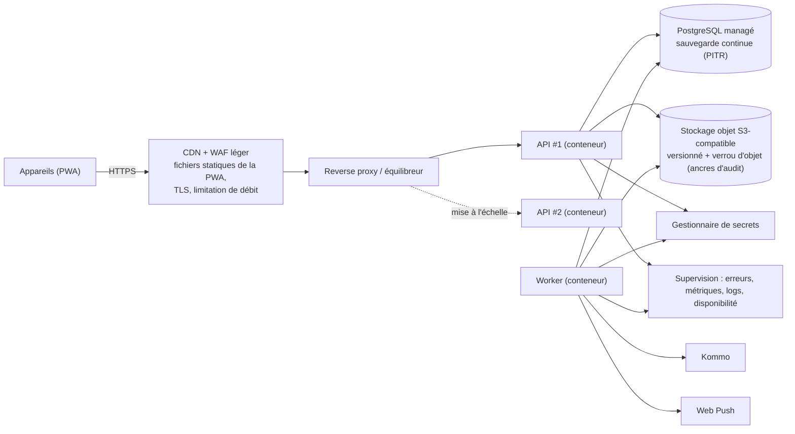

# Architecture de déploiement

> Section 31 du format final (PM §48). Contraintes : coût d'exploitation raisonnable, petite équipe (AV-084), réseau faible côté utilisateurs, hébergement et localisation des données à valider (AV-073).

---

## 1. Environnements

| Environnement | Usage | Données | Accès |
|---|---|---|---|
| `dev` (local) | Développement | Jeu de données synthétique (fixtures) | Développeurs |
| `staging` (recette) | Tests E2E, recette utilisateur, répétition des migrations | Synthétiques ou anonymisées | Équipe, utilisateurs pilotes |
| `production` | Exploitation | Réelles | Utilisateurs ; support en lecture seule |

## 2. Topologie de production (cible MVP)

| Composant | Dimensionnement initial (H-06) | Évolution |
|---|---|---|
| API | 1 conteneur, 1 vCPU / 1 à 2 Go ; 2 conteneurs dès que la haute disponibilité est exigée | Horizontal (sans état) |
| Worker | 1 conteneur, 1 vCPU / 1 Go | Plusieurs instances (`SKIP LOCKED`) |
| PostgreSQL | Instance managée 2 vCPU / 4 Go, 50 Go de SSD, PITR 7 jours minimum, sauvegardes quotidiennes conservées 35 jours | Montée en gamme verticale ; réplique en lecture (palier analytique P3) |
| Stockage objet | Environ 30 Go la première année (photos ≤ 400 Ko) | Cycle de vie : archivage froid des pièces de plus de 12 mois |
| CDN | Fichiers statiques de la PWA, en cache long, avec hachage de contenu | — |

Région d'hébergement : la plus proche en latence du Cameroun parmi les fournisseurs retenus. Le choix final dépend de la validation juridique (AV-073) : régions européennes (environ 90 à 120 ms depuis Douala) ou africaines selon la disponibilité des services managés.

## 3. Chaîne CI/CD

| Étape | Contenu | Blocage |
|---|---|---|
| 1. Vérifications | Formatage, lint, typage, contrôle des dépendances entre modules, détection de secrets | Oui |
| 2. Tests | Unitaires, propriétés (invariants), intégration sur PostgreSQL réel (conteneur), contrat des commandes partagées (appareil ⇄ serveur) | Oui |
| 3. Documentation | `python3 docs/_tools/check_refs.py` (références de la doc) | Oui |
| 4. Build | Image serveur (une seule image, deux modes : API et worker) ; bundle PWA avec budget de taille (NFR-05) | Oui |
| 5. Staging | Migrations, déploiement, tests E2E (Playwright, réseau hors ligne et dégradé, profil d'appareil modeste) | Oui |
| 6. Production | Déploiement manuel approuvé ; migrations « expand » avant le code, « contract » une version plus tard ; vérification de santé ; retour arrière par image précédente | — |

## 4. Règles de déploiement propres à l'offline

1. **Compatibilité ascendante des commandes** : le serveur accepte la version N-1 de chaque `command_type` pendant au moins 30 jours (BR-SYN-016). Un appareil resté hors ligne longtemps peut ainsi toujours vider son outbox.
2. **Migrations expand/contract** : aucune migration ne casse les requêtes de la version précédente (colonnes ajoutées nullables, renommages en deux temps).
3. **Mise à jour de la PWA** : le nouveau service worker s'installe en arrière-plan et ne s'active qu'**après** vidage de l'outbox, ou au prochain démarrage à froid ; bandeau « nouvelle version disponible ». Une version obsolète déclarée (`UNSUPPORTED_VERSION`) force la mise à jour **après** l'envoi des commandes compatibles.
4. **Jeux de données versionnés** : un changement de forme d'un jeu synchronisé incrémente sa version et provoque un nouveau chargement du jeu.

## 5. Sauvegardes et restauration

Voir NFR-20 à NFR-23 :

- PITR continu ;
- sauvegardes quotidiennes chiffrées, avec copie hors région ;
- test de restauration **mensuel** en staging ;
- procédure écrite de reprise après sinistre ;
- stockage objet versionné.

## 6. Estimation de coût (ordre de grandeur, AV-084)

Avec des services managés d'entrée de gamme : environ 150 à 400 USD par mois pour la production (base managée, 2 conteneurs, stockage objet, CDN, supervision), plus environ 50 à 100 USD par mois pour le staging. Valeurs indicatives, à confirmer lors du choix de l'hébergeur.
