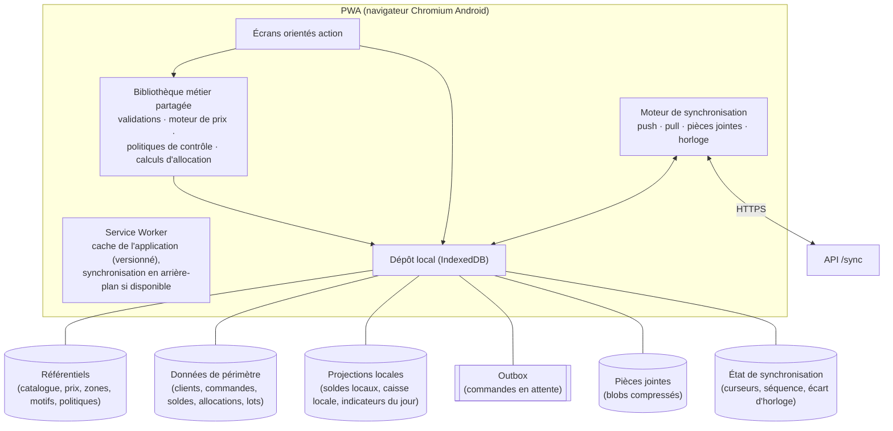

# Architecture offline-first (Livrable n°7, partie 1)

> Section 18 du format final (PM §48). Décisions : ADR-001 (offline-first), ADR-007 (synchronisation), ADR-012 (pièces jointes), ADR-016 (temps).
> Le hors ligne **n'est pas une fonctionnalité ajoutée** : il détermine les identifiants (UUIDv7 client), le chemin d'écriture (commandes idempotentes), les horodatages (`occurred_at`), le stock (allocations), l'audit (contexte hors ligne) et l'UX (états visibles) (PM §5).

---

## 1. Principes

| # | Principe | Conséquence |
|---|---|---|
| O1 | **Un seul chemin d'écriture** : toute écriture est une commande placée dans l'outbox, même en ligne | Pas de double logique en ligne / hors ligne ; le comportement en ligne est un cas particulier (outbox vidée immédiatement) |
| O2 | **Le serveur est l'autorité** | L'appareil applique des effets locaux **provisoires** et le serveur tranche (PM §37). Rejet ou conflit ⇒ retour arrière local |
| O3 | **Réplication partielle par périmètre** | Chaque appareil ne reçoit que ce dont son utilisateur a besoin (PM §29 : « pas de réplication complète ») |
| O4 | **Faits d'abord** | Une opération physique accomplie hors ligne n'est jamais perdue ni rejetée pour une raison d'état (BR-SYN-007) |
| O5 | **Prévention plutôt que réconciliation** pour le stock | Garde exclusive et allocations (ADR-004) |
| O6 | **Même code métier des deux côtés** | Validations, moteur de prix et évaluation des politiques sont une bibliothèque partagée (ADR-021) |
| O7 | **Transparence pour l'utilisateur** | État de synchronisation toujours visible ; rejets expliqués en langage métier |

## 2. Architecture de l'application sur l'appareil

| Magasin local | Contenu | Chiffrement au repos (voir sécurité) |
|---|---|---|
| `ref_*` | Référentiels | Non (données non sensibles) |
| `scope_*` | Données de périmètre (clients, commandes, ventes récentes, soldes, allocations, lots) | Oui pour les données personnelles (clients) |
| `local_projection_*` | Soldes locaux, solde attendu de caisse, indicateurs du jour | Non |
| `outbox` | Commandes | Oui |
| `attachments` | Fichiers en attente d'upload | Oui |
| `sync_state` | Curseurs, `device_seq`, écart d'horloge, `offline_grant_until` | Non |
| `session` | Jetons (chiffrés par une clé dérivée du PIN) | Oui |

## 3. Données locales et jeux téléchargés

### 3.1 Catalogue des jeux de données (`dataset`)

| Code | Contenu | Filtre de périmètre | Volume estimé | Rafraîchissement |
|---|---|---|---|---|
| `me` | Profil, affectations de rôle, droits effectifs, appareil, paramètres visibles | Utilisateur | < 10 Ko | Chaque synchronisation |
| `org` | Sites, emplacements, zones (avec ancêtres et géorepères), équipes, PDV | Périmètre + virtuels | < 100 Ko | Incrémental |
| `catalog` | Produits actifs, unités, conditionnements, catégories, motifs, moyens de paiement, catégories de dépense, canaux, sources, étapes | Global | < 200 Ko | Incrémental |
| `pricing` | Règles actives non terminées (y compris futures), campagnes | Produits vendables × zones (et ancêtres) × sites du périmètre | < 300 Ko | Incrémental ; alerte si > 24 h |
| `policies` | Politiques de contrôle actives | Global | < 20 Ko | Incrémental |
| `customers` | Comptes du portefeuille (équipe pour un responsable ; clients rattachés au PDV), affectations courantes, encours, liens Kommo | `USER`, `TEAM`, `SITE` | ≤ 2 000 comptes ≈ 1 Mo | Incrémental ; `SCOPE_EXIT` sur réaffectation |
| `crm_activity` | Visites et interactions des 90 derniers jours ; objectifs | Idem | < 1 Mo | Incrémental |
| `orders` | Commandes ouvertes du périmètre (commercial, emplacement de préparation) | `USER`, `LOCATION` | < 500 Ko | Incrémental |
| `sales_recent` | Ventes et encaissements des 7 derniers jours de l'utilisateur ou du PDV | `USER`, `SITE` | < 2 Mo | Incrémental ; purge locale au-delà de 7 j |
| `stock` | Soldes, lots en solde, seuils des emplacements du périmètre | `LOCATION` | < 500 Ko | Incrémental (`row_version`) |
| `allocations` | Quotas et réservations de l'appareil | `DEVICE` | < 10 Ko | Chaque synchronisation |
| `transfers` | Transferts ouverts entrants et sortants du périmètre | `LOCATION` | < 200 Ko | Incrémental |
| `counts` | Inventaires ouverts du périmètre | `LOCATION` | < 100 Ko | Incrémental |
| `procurement` | BC livrables sur le site, fournisseurs actifs (liste courte), DA de l'utilisateur | `SITE`, `USER` | < 300 Ko | Incrémental |
| `production` | Lots actifs du site, lots d'incubation en cours, saisies des 30 derniers jours, effectifs de référence | `SITE` | < 1 Mo | Incrémental |
| `cash` | Comptes de trésorerie de l'utilisateur ou du PDV (solde), session ouverte | `USER`, `SITE` | < 10 Ko | Chaque synchronisation |
| `comms` | 50 dernières alertes ouvertes, notifications non lues, notes non expirées, conflits de l'utilisateur, demandes de validation de l'utilisateur | `USER` | < 200 Ko | Chaque synchronisation |
| `kpi` | Instantanés d'indicateurs personnels | `USER` | < 50 Ko | Toutes les 15 min en ligne |

Budget total visé par appareil : **≤ 20 Mo de données + ≤ 50 Mo de pièces en attente** (NFR-06).

### 3.2 Jeux par rôle

| Jeu | DIR | ADM | R.COM | C.TER | C.SED | VEND | R.PROD | R.FERME | MAG | ACH | FIN |
|---|---|---|---|---|---|---|---|---|---|---|---|
| `me`, `org`, `catalog`, `comms`, `kpi` | ● | ● | ● | ● | ● | ● | ● | ● | ● | ● | ● |
| `pricing` | ○ | — | ● | ● | ● | ● | — | ● | — | — | ○ |
| `policies` | — | — | ● | ● | ● | ● | ● | ● | ● | — | ● |
| `customers`, `crm_activity` | — | — | ● (équipe) | ● | ● | ● (PDV) | — | ○ | — | — | — |
| `orders` | — | — | ● | ● | ● | ○ | — | — | ● | — | — |
| `sales_recent` | — | — | ○ | ● | ● | ● | — | ● | — | — | — |
| `stock`, `transfers`, `counts` | — | — | ○ | ● (mobile) | — | ● (PDV) | ● | ● | ● | — | — |
| `allocations` | — | — | — | ○ | — | ● | — | ○ | ● | — | — |
| `procurement` | — | — | — | — | — | — | ○ | ● | ● | ○ | — |
| `production` | — | — | — | — | — | — | ● | ● | — | — | — |
| `cash` | — | — | — | ● | ○ | ● | — | ○ | — | — | ○ |

● = téléchargé ; ○ = téléchargé si l'utilisateur a la permission correspondante ; — = non téléchargé. La Direction, l'Admin, la Finance et les Achats travaillent principalement en ligne (acteurs §2) ; leur application garde un **cache de lecture** du dernier affichage.

## 4. Projections locales et retour arrière

- **Effet local immédiat** : une commande validée met à jour les projections locales (solde local, reste d'allocation, solde attendu de caisse, encours client, liste des ventes). L'effet est enregistré comme **delta attaché à la commande**.
- **Recalcul** : projection locale = état téléchargé (serveur) + Σ deltas des commandes non encore `SYNCED`.
- **Après `SYNCED`** : le delta est retiré quand le pull a ramené l'état serveur qui l'inclut (comparaison de `row_version`), ce qui évite un double comptage.
- **Après `REJECTED` / `CONFLICT`** : le delta est retiré immédiatement, et l'écran concerné affiche l'opération rejetée avec son motif (BR-SYN-009).

## 5. Outbox locale (structure conceptuelle)

| Champ | Rôle |
|---|---|
| `command_id` | UUIDv7, clé d'idempotence |
| `device_seq` | Séquence strictement croissante de l'appareil |
| `command_type`, `command_version` | Ex. `sales.sale.record`, v1 |
| `author_user_id` | Auteur (appareil partagé : BR-SYN-014) |
| `aggregate_type`, `aggregate_id` | Entité principale |
| `base_version` | Pour une modification d'état partagé |
| `depends_on` | Commandes préalables (ex. création du client avant la vente) |
| `occurred_at`, `client_created_at`, `backdated_reason` | Temps (ADR-016) |
| `captured_offline` | État du réseau à la saisie |
| `payload` | Charge (identifiants clients des entités créées inclus) |
| `attachment_ids` | Pièces liées |
| `local_effects` | Deltas de projection (pour le retour arrière) |
| `status` | SM-SYNC-COMMAND |
| `attempts`, `next_attempt_at`, `last_error` | Reprise |
| `server_result` | Numéros officiels, identifiants, avertissements, conflit |

L'outbox est **FIFO par appareil**. Une commande n'est jamais supprimée avant `SYNCED`, ou `REJECTED` + prise de connaissance (BR-SYN-013).

## 6. Cycle de vie d'un appareil

| Étape | Comportement |
|---|---|
| Installation | PWA installée (« Ajouter à l'écran d'accueil ») ; génération de l'identifiant d'appareil (UUIDv7) ; demande de stockage persistant (`navigator.storage.persist()`) |
| Enrôlement | Connexion en ligne (téléphone + mot de passe) ; appareil `PENDING` (AV-006) ; définition du PIN local |
| Approbation | Appareil `ACTIVE` ; code court attribué |
| Chargement initial | Téléchargement de tous les jeux du périmètre (pagination) ; curseurs posés au point haut du flux au **début** du chargement (voir synchronisation §5.4) |
| Usage | Push et pull incrémentaux (BR-SYN-010) |
| Changement d'utilisateur (appareil partagé) | Déverrouillage par le PIN de l'autre utilisateur ; jeux de données de l'appareil (PDV) partagés ; jeux personnels (`me`, `customers` propres, `cash` personnel) cloisonnés par utilisateur |
| Déconnexion | Avertissement s'il reste des commandes en attente ; aucune suppression de l'outbox |
| Révocation (bloqué, perdu) | Au prochain contact, le serveur répond `DEVICE_REVOKED` ; l'application efface ses données locales **sauf** l'outbox chiffrée, qu'elle tente d'envoyer pour quarantaine et enquête (INV-ADM-03) |
| Mise à jour de l'application | Nouveau service worker activé **après** vidage de l'outbox, ou migration du schéma local ; commandes de version N-1 acceptées par le serveur (BR-SYN-016) |

## 7. Performance sur appareils modestes

- Indexation locale limitée aux champs de recherche : téléphone, nom, code produit.
- Aucun chargement complet en mémoire : lecture paginée d'IndexedDB.
- Synchronisation incrémentale ; chargement initial découpé en pages de 500 enregistrements.
- Photos compressées **avant** stockage (1 280 px, JPEG ou WebP qualité 0,7, ≤ 400 Ko).
- Cibles mesurables : NFR-01 à NFR-08.

## 8. Comportement hors ligne prolongé (plusieurs jours)

| Durée depuis la dernière synchronisation réussie | Comportement appareil | Comportement serveur |
|---|---|---|
| 0 à 24 h | Normal ; pastille « hors ligne depuis X h » | — |
| > 24 h | Bandeau « prix peut-être non à jour » (jeu `pricing` > 24 h) | Alerte `SYNC_STALE` au responsable et à l'Admin |
| > 48 h | Bandeau d'avertissement permanent : « Connectez-vous dès que possible » | — |
| Quota d'allocation échu (`valid_until`) | Le quota n'est plus utilisable localement ; les stocks exclusifs restent utilisables | Aucune réattribution avant la libération confirmée par l'appareil |
| > 7 jours (AV-009) | **Lecture seule** : consultation possible, nouvelles opérations bloquées jusqu'à une synchronisation réussie ; l'outbox reste intacte | — |
| Au retour du réseau | WF-16 : push ordonné, rejets et conflits affichés en tête, pull, upload des pièces | Écart d'horloge mesuré ; rapprochements (inventaires, transferts), alertes, fraîcheur mise à jour |
| Curseur plus vieux que la rétention du flux (60 j) | Chargement initial du jeu concerné | `needs_rebootstrap` |
