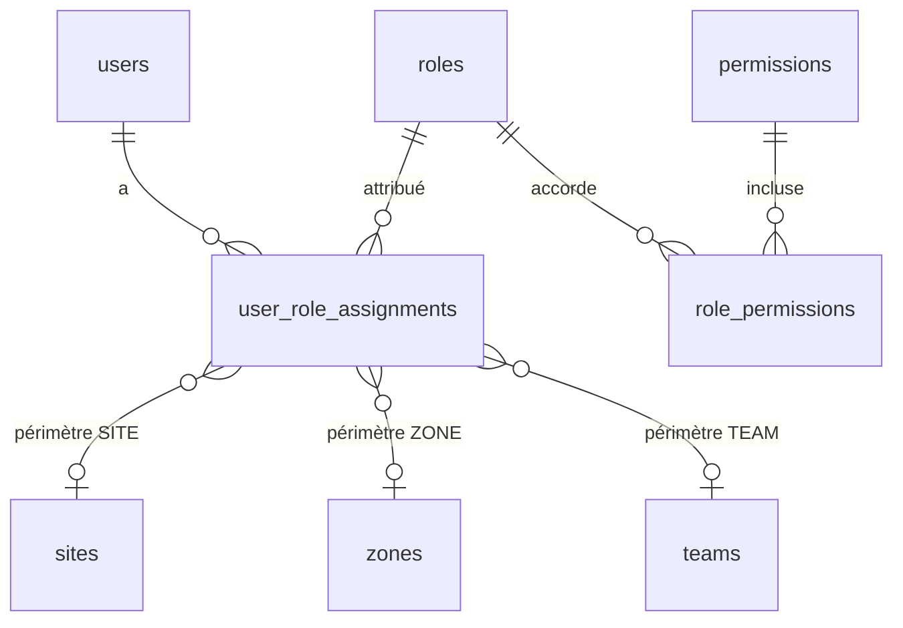

# RBAC — rôles, permissions, portées (Livrable n°8)

> Section 21 du format final (PM §48). Décision : ADR-008. Sources : CM §6, §47, §48 ; PM §17, §31.
> Rôles : les 11 rôles du CM §47 (tension C-01 : la matrice du PM est complétée). Rôle proposé non créé : `OPERATEUR_FERME` (AV-004).

---

## 1. Modèle

| Élément | Définition |
|---|---|
| **Permission** | Droit élémentaire `module.ressource.action` ; déclare ses portées applicables |
| **Rôle** | Ensemble de permissions, chacune avec une **portée maximale** (`OWN` < `TEAM` < `SITE` / `ZONE` < `ALL`) et des **limites** éventuelles (ex. remise maximale) |
| **Affectation** | Rôle × utilisateur × **périmètre concret** (`GLOBAL`, un site, une zone et ses sous-zones, une équipe) × période |
| **Droit effectif** | Pour une action A sur une ressource R à l'instant t : il existe une affectation active à t dont le rôle contient A, et R est dans l'intersection (portée maximale ∩ périmètre de l'affectation) |

Pourquoi pas un simple champ `role` (PM §17) : un même utilisateur cumule plusieurs rôles (CM §6, §47), chacun sur un périmètre différent. Exemple : `RESP_COMMERCIAL` sur l'équipe Douala Nord **et** `COMMERCIAL_TERRAIN` sur la zone Akwa.

## 2. Sémantique des portées

| Portée | Ressource accessible si… | Ressources concernées |
|---|---|---|
| `OWN` | L'utilisateur en est le propriétaire au sens du tableau §3 | Portefeuille, ventes, visites, stock mobile, caisse personnelle, demandes |
| `TEAM` | Le propriétaire est membre (à t) d'une équipe dont l'utilisateur est responsable, ou d'une équipe de l'affectation `TEAM` ; l'utilisateur lui-même est inclus | CRM, ventes, pointage |
| `SITE` | La ressource est rattachée à un site du périmètre de l'affectation (site de l'emplacement, du document, du PDV) | Stock, ventes de PDV, caisse, production, réceptions |
| `ZONE` | La ressource est rattachée à une zone du sous-arbre de la zone de l'affectation (zone du site ou du client) | Prix, clients d'une zone, PDV d'une zone |
| `ALL` | Aucune restriction | Direction, Finance, Admin (configuration) |

Une permission avec la portée maximale `SITE`, attribuée par une affectation `GLOBAL`, donne accès à **tous** les sites. Une affectation `SITE` restreint aux sites désignés.

## 3. Propriété (`OWN`) par ressource

| Ressource | Propriétaire |
|---|---|
| Compte client | Titulaire courant (`owner_user_id`), ou acquéreur tant qu'il n'y a pas d'autre titulaire |
| Visite, interaction | Auteur |
| Commande client | `commercial_user_id` |
| Vente | `seller_user_id` ou `commercial_user_id` |
| Encaissement | `received_by_user_id` |
| Emplacement `MOBILE` et son stock | `custodian_user_id` |
| Compte `CAISSE_UTILISATEUR` | `holder_user_id` |
| Session de travail, pointage | Utilisateur |
| Demande de validation | Demandeur (lecture) |
| Dépense, demande d'achat | Auteur |
| Objectif | Utilisateur cible |

## 4. Règles contextuelles (au-delà de la matrice)

| # | Règle | Référence |
|---|---|---|
| RC-01 | Les droits sont évalués **à `occurred_at`** pour une commande (hors ligne compris) : affectation active, utilisateur actif, appareil actif à cet instant | BR-ADM-004 |
| RC-02 | Toute écriture exige un **appareil `ACTIVE`**, sauf le back-office web authentifié d'un utilisateur `DIRECTION`, `ADMIN`, `FINANCE` ou `RESP_ACHATS`, enregistré comme appareil de type navigateur de bureau | BR-ADM-005, AV-006 |
| RC-03 | **Séparation des tâches** : approbateur ≠ demandeur (sauf `SELF_APPROVED` Direction) ; le rôle `ADMIN` ne détient aucune permission d'approbation métier | AV-010 |
| RC-04 | Les permissions d'approbation s'évaluent sur le **périmètre de l'opération** (site ou zone du document), et non sur celui du demandeur | BR-ADM-018 |
| RC-05 | **Mesures financières** (coûts, marges, valeur de stock) : `inventory.valuation.read` en plus de la permission de lecture de la ressource | BR-ANA-004, CM §48 |
| RC-06 | **Limites paramétriques** portées par `role_permissions.limits` : remise maximale (`sales.price.override`), montant maximal d'une dépense sans validation | AV-026, AV-058 |
| RC-07 | Un commercial ne voit d'un compte hors portefeuille que l'information « existe, suivi par un autre commercial » lors d'un contrôle de doublon | AV-014 |
| RC-08 | Le serveur applique **toujours** les droits ; les droits téléchargés sur l'appareil ne servent qu'à l'affichage | PM §37 |
| RC-09 | Les exports et la lecture du journal d'audit sont eux-mêmes audités | BR-ANA-008, BR-AUD-009 |
| RC-10 | Un appareil partagé n'étend pas les droits : chaque commande est évaluée avec les droits de **son auteur** | BR-SYN-014 |

## 5. Matrice des permissions

Colonnes : **DIR** Direction · **ADM** Administrateur · **RCO** Resp. commercial · **CTE** Commercial terrain · **CSE** Commercial sédentaire · **VEN** Vendeur PDV · **RPR** Resp. production · **RFE** Resp. ferme · **MAG** Magasinier · **ACH** Resp. achats · **FIN** Comptabilité / Finance.

Valeurs : `ALL`, `ZONE`, `SITE`, `TEAM`, `OWN` = portée maximale ; `A·xxx` = permission d'**approbation** avec sa portée ; `RO` = lecture seule (utilisé dans la vue condensée §6) ; `—` = aucune.

### 5.1 Identité, organisation, configuration

| Permission | DIR | ADM | RCO | CTE | CSE | VEN | RPR | RFE | MAG | ACH | FIN |
|---|---|---|---|---|---|---|---|---|---|---|---|
| `identity.user.read` | ALL | ALL | TEAM | — | — | — | SITE | SITE | SITE | — | ALL |
| `identity.user.manage` | — | ALL | — | — | — | — | — | — | — | — | — |
| `identity.role.manage` | — | ALL | — | — | — | — | — | — | — | — | — |
| `identity.role_assignment.manage` | — | ALL | — | — | — | — | — | — | — | — | — |
| `identity.device.read` | ALL | ALL | TEAM | — | — | — | — | SITE | SITE | — | — |
| `identity.device.approve` | — | ALL | A·TEAM | — | — | — | A·SITE | A·SITE | — | — | — |
| `identity.device.block` | ALL | ALL | TEAM | — | — | — | SITE | SITE | — | — | — |
| `identity.session.revoke` | ALL | ALL | — | — | — | — | — | — | — | — | — |
| `org.structure.read` | ALL | ALL | ALL | ZONE | ALL | SITE | ALL | SITE | SITE | ALL | ALL |
| `org.structure.manage` | — | ALL | — | — | — | — | — | — | — | — | — |
| `org.settings.manage` | ALL | ALL | — | — | — | — | — | — | — | — | — |
| `approvals.request.read` | ALL | — | TEAM | OWN | OWN | OWN | ALL | SITE | OWN | ALL | ALL |
| `approvals.policy.manage` | ALL | ALL | — | — | — | — | — | — | — | — | — |
| `catalog.product.read` | ALL | ALL | ALL | ALL | ALL | ALL | ALL | ALL | ALL | ALL | ALL |
| `catalog.product.manage` | — | ALL | — | — | — | — | — | — | — | — | — |
| `catalog.reference.manage` | — | ALL | — | — | — | — | — | — | — | — | — |
| `audit.log.read` | ALL | ALL | — | — | — | — | — | — | — | — | ALL |
| `sync.monitor.read` | ALL | ALL | TEAM | — | — | — | SITE | SITE | SITE | — | — |
| `sync.conflict.resolve` | ALL | ALL | TEAM | — | — | — | ALL | SITE | SITE | ALL | ALL |
| `integrations.kommo.manage` | — | ALL | — | — | — | — | — | — | — | — | — |
| `integrations.kommo.monitor` | ALL | ALL | ALL | — | — | — | — | — | — | — | — |
| `comm.alert.read` | ALL | ALL | TEAM | OWN | OWN | SITE | ALL | SITE | SITE | ALL | ALL |
| `comm.alert.manage` | ALL | ALL | TEAM | OWN | OWN | SITE | ALL | SITE | SITE | ALL | ALL |
| `comm.alert_rule.manage` | ALL | ALL | — | — | — | — | — | — | — | — | — |
| `comm.note.read` | ALL | ALL | ALL | ALL | ALL | ALL | ALL | ALL | ALL | ALL | ALL |
| `comm.note.publish` | ALL | — | — | — | — | — | — | — | — | — | — |

### 5.2 Commercial, pointage, tarification

| Permission | DIR | ADM | RCO | CTE | CSE | VEN | RPR | RFE | MAG | ACH | FIN |
|---|---|---|---|---|---|---|---|---|---|---|---|
| `crm.customer.read` | ALL | — | TEAM | OWN | OWN | SITE | — | SITE | — | — | ALL |
| `crm.customer.create` | — | — | TEAM | OWN | OWN | SITE | — | SITE | — | — | — |
| `crm.customer.update` | — | — | TEAM | OWN | OWN | SITE | — | — | — | — | — |
| `crm.customer.reassign` | ALL | — | TEAM | — | — | — | — | — | — | — | — |
| `crm.customer.mark_lost` | — | — | TEAM | OWN | OWN | — | — | — | — | — | — |
| `crm.customer.merge` | ALL | ALL | TEAM | — | — | — | — | — | — | — | — |
| `crm.customer.credit_manage` | ALL | — | — | — | — | — | — | — | — | — | ALL |
| `crm.visit.record` | — | — | OWN | OWN | — | — | — | — | — | — | — |
| `crm.visit.read` | ALL | — | TEAM | OWN | OWN | — | — | — | — | — | — |
| `crm.interaction.record` | — | — | OWN | OWN | OWN | — | — | — | — | — | — |
| `crm.target.read` | ALL | — | TEAM | OWN | OWN | SITE | — | — | — | — | — |
| `crm.target.manage` | ALL | — | TEAM | — | — | — | — | — | — | — | — |
| `crm.pipeline.configure` | ALL | ALL | — | — | — | — | — | — | — | — | — |
| `fieldwork.checkin.perform` | — | — | OWN | OWN | — | — | — | — | — | — | — |
| `fieldwork.session.read` | ALL | — | TEAM | OWN | — | — | — | — | — | — | — |
| `fieldwork.checkin_override.approve` | A·ALL | — | A·TEAM | — | — | — | — | — | — | — | — |
| `pricing.price.read` | ALL | — | ALL | ZONE | ALL | SITE | — | SITE | — | — | ALL |
| `pricing.rule.draft` | ALL | — | ALL | — | — | — | — | — | — | — | — |
| `pricing.rule.activate` | A·ALL | — | — | — | — | — | — | — | — | — | — |
| `pricing.campaign.manage` | ALL | — | ALL | — | — | — | — | — | — | — | — |

### 5.3 Ventes et encaissements

| Permission | DIR | ADM | RCO | CTE | CSE | VEN | RPR | RFE | MAG | ACH | FIN |
|---|---|---|---|---|---|---|---|---|---|---|---|
| `sales.order.read` | ALL | — | TEAM | OWN | OWN | SITE | — | — | SITE | — | ALL |
| `sales.order.create` | — | — | TEAM | OWN | OWN | — | — | — | — | — | — |
| `sales.order.cancel` | ALL | — | TEAM | OWN | OWN | — | — | — | — | — | — |
| `sales.order.fulfil` | — | — | TEAM | OWN | OWN | SITE | — | — | SITE | — | — |
| `sales.sale.read` | ALL | — | TEAM | OWN | OWN | SITE | — | SITE | — | — | ALL |
| `sales.sale.record` | — | — | OWN | OWN | OWN | SITE | — | SITE | — | — | — |
| `sales.sale.cancel` | — | — | OWN | OWN | OWN | OWN | — | OWN | — | — | — |
| `sales.sale_cancel.approve` | A·ALL | — | A·TEAM (+ PDV de sa zone) | — | — | — | — | A·SITE | — | — | A·ALL |
| `sales.price.override` (limites RC-06) | ALL | — | TEAM (15 %) | OWN (5 %) | OWN (5 %) | — (0 %) | — | SITE (5 %) | — | — | — |
| `sales.price_override.approve` | A·ALL | — | A·TEAM | — | — | — | — | — | — | — | — |
| `sales.credit_sale.record` | — | — | TEAM | OWN | OWN | SITE | — | SITE | — | — | — |
| `sales.credit_limit_exceed.approve` | A·ALL | — | A·TEAM | — | — | — | — | — | — | — | A·ALL |
| `sales.payment.record` | — | — | TEAM | OWN | OWN | SITE | — | SITE | — | — | ALL |
| `sales.payment.read` | ALL | — | TEAM | OWN | OWN | SITE | — | SITE | — | — | ALL |
| `sales.payment.cancel` | A·ALL | — | — | — | — | — | — | — | — | — | A·ALL |
| `sales.receivable.read` | ALL | — | TEAM | OWN | OWN | SITE | — | SITE | — | — | ALL |

### 5.4 Stock, distribution, production

| Permission | DIR | ADM | RCO | CTE | CSE | VEN | RPR | RFE | MAG | ACH | FIN |
|---|---|---|---|---|---|---|---|---|---|---|---|
| `inventory.stock.read` | ALL | — | ALL | OWN | ALL | SITE | ALL | SITE | SITE | ALL | ALL |
| `inventory.valuation.read` | ALL | — | — | — | — | — | ALL | — | — | ALL | ALL |
| `inventory.ledger.read` | ALL | — | ZONE | OWN | — | SITE | ALL | SITE | SITE | — | ALL |
| `inventory.transfer.request` | — | — | — | OWN | — | SITE | ALL | SITE | SITE | — | — |
| `inventory.transfer.dispatch` | — | — | — | OWN | — | SITE | ALL | SITE | SITE | — | — |
| `inventory.transfer.receive` | — | — | — | OWN | — | SITE | ALL | SITE | SITE | — | — |
| `inventory.transfer.cancel` | — | — | — | OWN | — | SITE | ALL | SITE | SITE | — | — |
| `inventory.transfer_discrepancy.approve` | A·ALL | — | — | — | — | — | A·ALL | A·SITE | A·SITE | — | — |
| `inventory.allocation.manage` | ALL | — | ZONE | — | — | — | — | SITE | SITE | — | — |
| `inventory.loss.declare` | — | — | — | OWN | — | SITE | ALL | SITE | SITE | — | — |
| `inventory.loss.approve` | A·ALL | — | A·ZONE (PDV) | — | — | — | A·ALL (fermes) | A·SITE | — | — | — |
| `inventory.count.perform` | — | — | — | OWN | — | SITE | ALL | SITE | SITE | — | ALL |
| `inventory.count.approve` | A·ALL | — | A·ZONE (PDV) | — | — | — | A·ALL (fermes) | A·SITE | — | — | A·ALL |
| `inventory.consumption.record` | — | — | — | — | — | SITE | ALL | SITE | SITE | — | — |
| `inventory.threshold.manage` | ALL | — | ZONE | — | — | — | ALL | SITE | SITE | — | — |
| `inventory.opening.post` | — | ALL | — | — | — | — | — | — | SITE | — | ALL |
| `inventory.cost_entry.record` | — | — | — | — | — | — | — | — | — | — | ALL |
| `production.lot.read` | ALL | — | — | — | — | — | ALL | SITE | — | ALL | ALL |
| `production.lot.manage` | — | — | — | — | — | — | ALL | — | — | — | — |
| `production.daily.record` | — | — | — | — | — | — | ALL | SITE | — | — | — |
| `production.mortality.approve` | A·ALL | — | — | — | — | — | A·ALL | — | — | — | — |
| `production.incubation.record` | — | — | — | — | — | — | ALL | SITE | — | — | — |

### 5.5 Approvisionnement, finance, analytics

| Permission | DIR | ADM | RCO | CTE | CSE | VEN | RPR | RFE | MAG | ACH | FIN |
|---|---|---|---|---|---|---|---|---|---|---|---|
| `procurement.supplier.read` | ALL | — | — | — | — | — | ALL | SITE | ALL | ALL | ALL |
| `procurement.supplier.manage` | — | — | — | — | — | — | — | — | — | ALL | — |
| `procurement.request.create` | ALL | — | — | — | — | — | ALL | SITE | SITE | ALL | ALL |
| `procurement.request.approve` | A·ALL | — | — | — | — | — | — | — | — | A·ALL | — |
| `procurement.order.read` | ALL | — | — | — | — | — | ALL | SITE | SITE | ALL | ALL |
| `procurement.order.manage` | — | — | — | — | — | — | — | — | — | ALL | — |
| `procurement.order.approve` | A·ALL | — | — | — | — | — | — | — | — | — | — |
| `procurement.receipt.record` | — | — | — | — | — | — | ALL | SITE | SITE | — | — |
| `procurement.receipt.cancel` | A·ALL | — | — | — | — | — | — | — | — | A·ALL | — |
| `procurement.receipt_exception.approve` | A·ALL | — | — | — | — | — | — | — | — | A·ALL | — |
| `finance.cash.read` | ALL | — | — | OWN | OWN | SITE | — | OWN | — | — | ALL |
| `finance.cash_account.manage` | — | — | — | — | — | — | — | — | — | — | ALL |
| `finance.cash_session.operate` | — | — | — | — | — | SITE | — | — | — | — | ALL |
| `finance.cash_session.validate` | A·ALL | — | — | — | — | — | — | — | — | — | A·ALL |
| `finance.cash_transfer.record` | — | — | OWN | OWN | OWN | SITE | — | OWN | — | — | ALL |
| `finance.expense.read` | ALL | — | TEAM | OWN | OWN | SITE | ALL | SITE | OWN | ALL | ALL |
| `finance.expense.record` | ALL | — | OWN | OWN | OWN | SITE | ALL | SITE | OWN | ALL | ALL |
| `finance.expense.approve` | A·ALL | — | — | — | — | — | A·ALL (≤ seuil, fermes) | — | — | — | A·ALL |
| `finance.expense.pay` | — | — | — | — | — | — | — | — | — | — | ALL |
| `finance.payable.read` | ALL | — | — | — | — | — | — | — | — | ALL | ALL |
| `finance.supplier_invoice.record` | — | — | — | — | — | — | — | — | — | — | ALL |
| `finance.supplier_invoice.approve` | A·ALL | — | — | — | — | — | — | — | — | — | A·ALL |
| `finance.supplier_payment.record` | — | — | — | — | — | — | — | — | — | — | ALL |
| `finance.supplier_payment.approve` | A·ALL | — | — | — | — | — | — | — | — | — | — |
| `analytics.dashboard.direction` | ALL | — | — | — | — | — | — | — | — | — | — |
| `analytics.dashboard.commercial` | ALL | — | TEAM | OWN | OWN | — | — | — | — | — | ALL |
| `analytics.dashboard.distribution` | ALL | — | ZONE | — | — | SITE | — | — | SITE | — | ALL |
| `analytics.dashboard.stock` | ALL | — | — | — | — | — | ALL | SITE | SITE | ALL | ALL |
| `analytics.dashboard.production` | ALL | — | — | — | — | — | ALL | SITE | — | — | ALL |
| `analytics.dashboard.finance` | ALL | — | — | — | — | — | — | — | — | — | ALL |
| `analytics.explore` | ALL | — | TEAM | — | — | — | ALL | — | — | ALL | ALL |
| `analytics.view.share` | ALL | — | TEAM | — | — | — | ALL | — | — | ALL | ALL |
| `analytics.export` | ALL | — | TEAM | — | — | — | ALL | — | — | ALL | ALL |

Remarques :

- `DIRECTION` n'a pas, par défaut, les permissions d'**exécution** opérationnelle (vente, réception, saisie de production). Si un dirigeant vend, il reçoit en plus un rôle opérationnel (cumul).
- `ADMIN` a `crm.customer.merge` pour le dédoublonnage technique, mais aucune permission `A·` (RC-03).
- `FINANCE` a `sales.payment.record` `ALL` pour enregistrer les virements et encaissements reçus au siège.

## 6. Vue condensée par domaine (lecture rapide)

| Domaine | DIR | ADM | RCO | CTE | CSE | VEN | RPR | RFE | MAG | ACH | FIN |
|---|---|---|---|---|---|---|---|---|---|---|---|
| Identité et organisation | RO·ALL | ALL | RO·TEAM | — | — | — | RO·SITE | RO·SITE | RO·SITE | — | RO·ALL |
| CRM | RO·ALL + A | technique | TEAM + A | OWN | OWN | SITE | — | SITE | — | — | RO·ALL + crédit |
| Pointage | RO·ALL + A | — | TEAM + A | OWN | — | — | — | — | — | — | — |
| Tarification | A·ALL | — | brouillons ALL | RO·ZONE | RO·ALL | RO·SITE | — | RO·SITE | — | — | RO·ALL |
| Ventes | RO·ALL + A | — | TEAM + A | OWN | OWN | SITE | — | SITE | RO·SITE (commandes) | — | RO·ALL + A |
| Stock | RO·ALL + A | ouverture | RO + A PDV | OWN | RO·ALL | SITE | ALL + A | SITE + A | SITE + A écarts | RO·ALL | RO·ALL + A |
| Production | RO·ALL + A | — | — | — | — | — | ALL + A | SITE | — | RO | RO·ALL |
| Approvisionnement | RO·ALL + A | — | — | — | — | — | DA + réception | DA + réception | DA + réception | ALL + A | RO·ALL |
| Finance | RO·ALL + A | — | RO·TEAM | OWN | OWN | SITE (caisse) | dépenses | OWN / SITE | — | RO dettes | ALL + A |
| Analytics | ALL | — | TEAM | OWN | OWN | SITE | ALL | SITE | SITE | ALL | ALL |
| Audit | RO·ALL | RO·ALL | — | — | — | — | — | — | — | — | RO·ALL |

## 7. Rôle proposé `OPERATEUR_FERME` (AV-004, non créé)

`production.lot.read` SITE, `production.daily.record` SITE (les déclarations au-dessus des seuils partent en validation comme pour tout déclarant), `inventory.stock.read` SITE, `inventory.consumption.record` SITE, `inventory.loss.declare` SITE, `catalog.product.read` ALL, `comm.note.read`, `comm.alert.read` OWN.

## 8. Exemples d'affectations

| Utilisateur | Affectations | Effet |
|---|---|---|
| Paul (démarrage commercial) | `RESP_COMMERCIAL` / `TEAM` Douala Nord ; `COMMERCIAL_TERRAIN` / `ZONE` Akwa | Voit son équipe ; a son portefeuille ; prend service à Akwa ; ne peut pas approuver ses propres remises (RC-03) |
| Awa | `VENDEUR_PDV` / `SITE` PDV Mboppi | Vend, encaisse, reçoit et déclare au PDV Mboppi uniquement |
| Jean | `RESP_FERME` / `SITE` Ferme Nkometou ; `MAGASINIER` / `SITE` Ferme Nkometou | Saisies de production, réceptions et stock de sa ferme |
| Mme la Directrice | `DIRECTION` / `GLOBAL` ; `ADMIN` / `GLOBAL` | Pilotage, validations (marquées `SELF_APPROVED` si elle est aussi l'auteur), configuration |

## 9. Tests dérivés

La matrice est encodée comme **données de référence** (fichier de seed versionné). Des tests générés vérifient pour chaque couple (rôle, permission) :

1. l'accès attendu dans la portée ;
2. le refus hors portée (anti-IDOR) ;
3. le refus sans permission.

Voir le plan de tests §5.
