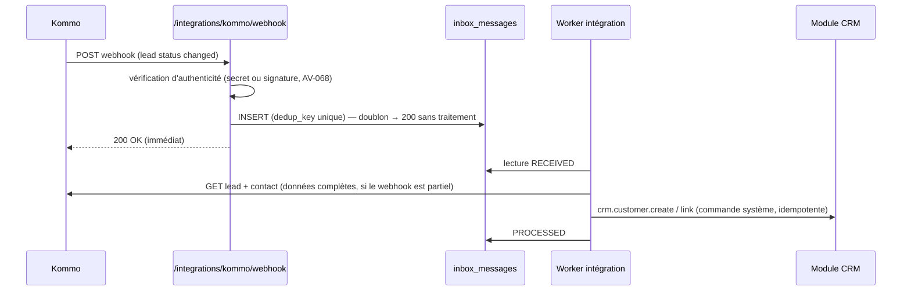

# Intégration Kommo (spécification technique)

> Section 24 du format final (PM §48). Règles fonctionnelles : D15 (BR-KOM-*). Décision : ADR-009. Répond au PM §16.
> Hypothèse technique à vérifier (AV-068) : Kommo expose une API REST (v4) authentifiée par jeton OAuth 2 d'intégration, et des webhooks configurables sur les leads et les contacts. **Aucun appel n'est codé avant cette vérification sur le compte réel.**

---

## 1. Partage des responsabilités

| Kommo (source de vérité) | GIC AGROPELC (source de vérité) |
|---|---|
| Leads digitaux, conversations, WhatsApp, pipeline relationnel, relances, nurturing, automatisations CRM (CM §44 ; PM §16) | Clients opérationnels, produits, commandes, ventes, prix, production, stock, paiements, performance (CM §45) |

## 2. Entités synchronisées

| Entité GIC | Entité Kommo | Sens | Source de vérité | Identifiant externe | Déclencheur |
|---|---|---|---|---|---|
| Compte client (identité : nom, téléphone, e-mail, adresse) | Contact | GIC ⇄ Kommo | **GIC** (BR-KOM-003) | `external_links(CUSTOMER → contact)` | `ProspectCreated`, `CustomerUpdated` (GIC) ; webhook de modification de contact (Kommo) |
| Compte client (stade, titulaire, indicateurs) | Champs personnalisés du contact et du lead | GIC → Kommo | **GIC** | idem | `CustomerConverted`, `CustomerReassigned`, `SaleConfirmed`, `SaleCancelled`, `PaymentReceived`, `ProspectLost` |
| — (création) | Lead qualifié | Kommo → GIC | **Kommo** (lead) | `external_links(CUSTOMER → lead)` | Webhook de changement de statut vers un statut configuré (AV-069) |
| Commande client | Lead (champs : statut de commande, montant) | GIC → Kommo | **GIC** | `external_links(SALES_ORDER → lead)` | `OrderConfirmed`, `OrderFulfilled`, `OrderCancelled` |
| Utilisateur | Utilisateur Kommo | Correspondance administrée | Chacun | `external_links(USER → user)` | Configuration (AV-071) |
| Produits, prix | — | Non synchronisés au MVP | GIC | — | — |
| Conversations, messages | — | **Jamais** synchronisés | Kommo | — | — |

## 3. Flux entrants (Kommo → GIC)

| Événement Kommo | Traitement GIC |
|---|---|
| Lead passé au statut « qualifié » configuré | BR-KOM-002 : rapprochement (lien, puis téléphone) ou création du prospect ; source `KOMMO` ; titulaire mappé ; `KommoLeadQualifiedReceived` |
| Contact modifié | BR-KOM-003 : application champ par champ si le champ n'a pas été modifié dans GIC depuis le dernier échange ; sinon `KOMMO_FIELD_CONFLICT` et renvoi de la valeur GIC |
| Lead supprimé ou perdu dans Kommo | Aucune suppression dans GIC ; mémorisation du statut Kommo sur le lien (information) |
| Webhook non authentifié | Rejet 401 ; audit `integration.kommo.webhook_rejected` |

Clé de déduplication (BR-KOM-006) : `{entité}:{id Kommo}:{type d'événement}:{horodatage de modification Kommo}`.

## 4. Flux sortants (GIC → Kommo)

| Événement GIC | Appel Kommo (logique) | Charge (valeurs absolues) |
|---|---|---|
| `ProspectCreated` (source ≠ KOMMO, si l'option « créer les contacts terrain dans Kommo » est active) | `contact.upsert` | nom, téléphone, e-mail, champ « ID GIC » |
| `CustomerUpdated` (compte lié) | `contact.update` | champs partagés modifiés |
| `CustomerConverted`, `ProspectLost` | `contact.update_fields` | stade |
| `CustomerReassigned` | `contact.update` (responsable) | utilisateur Kommo mappé |
| `SaleConfirmed`, `SaleCancelled`, `PaymentReceived` | `contact.update_fields` | nombre de commandes, CA cumulé, date de la dernière vente, total encaissé (CM §46 : « Client actif, 14 commandes, CA cumulé 745 000 FCFA ») |
| `OrderConfirmed`, `OrderFulfilled`, `OrderCancelled` (commande d'origine Kommo) | `lead.update_fields` | statut de commande GIC, montant |

Les valeurs cumulées sont **recalculées** à partir de GIC au moment de l'envoi (pas d'incrément), ce qui rend chaque message rejouable (BR-KOM-007).

## 5. Anti-boucle (BR-KOM-005)

1. Chaque lien mémorise `last_outbound_hash` (empreinte des champs partagés envoyés) et `last_inbound_hash`.
2. Un webhook dont l'empreinte des champs partagés = `last_outbound_hash` est un **écho** : `IGNORED_ECHO`.
3. Une modification appliquée depuis Kommo met à jour `last_inbound_hash`, et l'événement `CustomerUpdated` qui en résulte porte `origin = KOMMO` : il n'est pas renvoyé vers Kommo.
4. Les champs d'enrichissement écrits par GIC (indicateurs) ne sont jamais relus depuis Kommo.

## 6. Idempotence, reprise, erreurs

| Aspect | Règle |
|---|---|
| Entrant | `UNIQUE (system, dedup_key)` ; traitement idempotent (lien existant ⇒ mise à jour, sinon création) |
| Sortant | `idempotency_key` = `{entité}:{id}:{type d'opération}:{row_version}` ; les opérations sont des remplacements absolus |
| Reprise | 10 tentatives, 30 s × 2^n, plafond 1 h ; puis `DEAD`, alerte et rejeu manuel (SM-INTEGRATION-MESSAGE) |
| Limitation de débit Kommo | Respect des en-têtes et des codes de limitation ; file lissée (au plus N requêtes par seconde, N paramétrable) |
| Kommo indisponible | Aucun impact sur GIC (BR-KOM-009) ; accumulation dans l'outbox ; alerte si plus de 100 messages ou plus d'1 h d'attente |
| Erreur de mapping (champ absent, utilisateur non mappé) | Message `DEAD` immédiat avec cause claire (non retentable) ; alerte |
| Secrets | Jeton d'API dans le gestionnaire de secrets ; rotation documentée |

## 7. Configuration (`integrations.integration_settings`)

| Clé | Contenu |
|---|---|
| `qualified_status_ids` | Statuts Kommo déclenchant la création côté GIC (AV-069) |
| `pipeline_ids` | Pipelines surveillés |
| `field_map.*` | Identifiants des champs personnalisés Kommo (stade, CA cumulé, nombre de commandes, ID GIC, statut de commande) |
| `user_map` | Utilisateurs GIC ↔ Kommo (AV-071) |
| `create_contacts_for_field_prospects` | Booléen (défaut : faux) |
| `rate_limit_per_second` | Débit sortant maximal |

## 8. Risques propres à l'intégration

Voir RISK-14 dans le registre des risques. Le principal risque est une double responsabilité sur l'identité client. Il est traité par la règle « GIC prévaut » et par la détection de conflit champ par champ.
